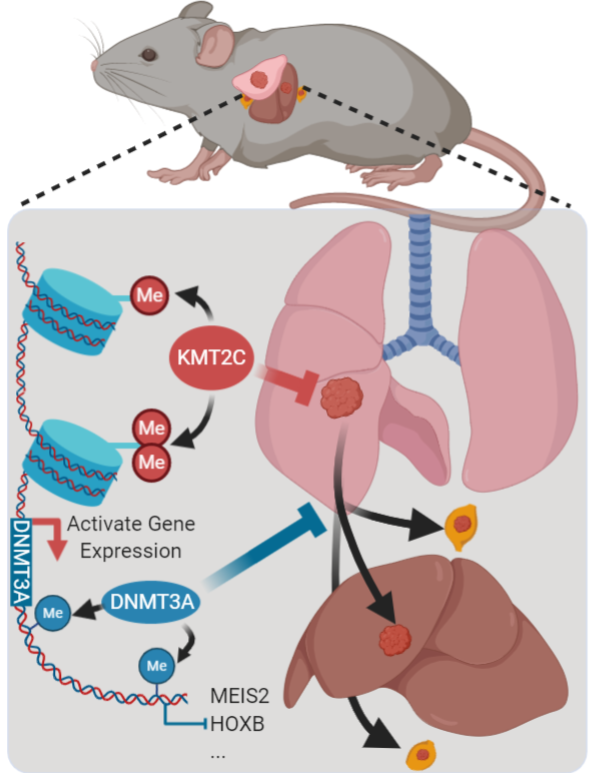

# **Concordant Histone and DNA Hypomethylation Promotes Small Cell Lung Cancer Metastasis**

As we know, there were little omics data about SCLC patients and even murine SCLC. Therefore, we accumulated attainability omics data and pre-processed them to make it easier to use. And we also hope this page could be real-time maintained. If you have submitted SCLC data we haven’t recorded or mentioned in list, you could contact us anytime and we would like to integrate your resource in this resource. 

To increase analyzing reproducibility of omics analysis mentioned in our paper, we will record and submit all scripts, raw data and processed data for sharing our bioinformatics tools and academic principles. We have submitted all processed data on [Figshare](https://figshare.com/account/projects/92384/articles/13206338) and you could download them followed according agreements. Raw data also had been submitted on GEO database and you could be accessible by clicking [GSE161570]( https://www.ncbi.nlm.nih.gov/geo/query/acc.cgi?acc=GSE161570). Besides, we also recorded our codes and figures in Markdown files regarded as tutorials for beginner of omics analysis. And detail description you could get in following pages.

In this project, we have modified a lot of function formulas from perfect packages to better use in our data analysis and visualizations. And we also be happy to share them to help you improve your work efficiency in omics data analysis and visualizations.

# **All SCLC patients’ data files**

This page recorded all omics data about SCLC patients that were mentioned and analyzed in our paper. And the detail list was displayed as following:

| Source_of_Data  | Data_type                                          | File_type | Species | Disease | Doi_number                                                   |                     Clinical_info                     | Normal_samples | ID          |
| --------------- | -------------------------------------------------- | --------- | ------- | ------- | ------------------------------------------------------------ | :---------------------------------------------------: | :------------: | ----------- |
| Nature Genetics | 42WES                                              | .csv      | HUMAN   | SCLC    | [10.1038/ng.2405](https://www.nature.com/articles/ng.2405)   |                          No                           |       No       | SCLC_DATA_1 |
| Nature Genetics | 29 WES/ 2WGS/   15RNA-seq                          | .csv      | HUMAN   | SCLC    | [10.1038/ng.2396](https://www.nature.com/articles/ng.2396)   |                          Yes                          |       No       | SCLC_DATA_2 |
| Nature          | 110 WGS/       81 RNA-seq                          | .csv      | HUMAN   | SCLC    | [10.1038/nature14664](https://www.nature.com/articles/nature14664) |                          Yes                          |       No       | SCLC_DATA_3 |
| PLOS Genetics   | 86 RNA-seq                                         | .csv      | HUMAN   | SCLC    | [10.1371/journal.pgen.1005895](https://journals.plos.org/plosgenetics/article?id=10.1371/journal.pgen.1005895) | Yes (but only part of patients matches to omics data) |      Yes       | SCLC_DATA_4 |
| Nature Cancer   | 8 scRNA-seq (but we only get the 7 scRNA-seq data) | .rds      | HUMAN   | SCLC    | [10.5281/zenodo.3574846](https://www.nature.com/articles/s43018-020-0046-2) |                          No                           |       No       | SCLC_DATA_5 |
| Nature Cancer   | 90RNA-seq                                          | .csv      | HUMAN   | SCLC    | [10.1038/s43018-019-0020-z](https://www.nature.com/articles/s43018-019-0020-z) |                          Yes                          |       No       | SCLC_DATA_6 |

The tree map showed the files detail as following: 

~~~shell
.
├── SCLC_DATA_1
│   ├── SCLC_NG_SOX2_Clinical_Normal.csv
│   ├── SCLC_NG_SOX2_Clinical_Tumor.csv
│   └── SCLC_NG_SOX2_Mut.csv
├── SCLC_DATA_2
│   ├── SCLC_NG1_Clnical.csv
│   ├── SCLC_NG1_Mut.csv
│   └── SCLC_NG1_RNA.csv
├── SCLC_DATA_3
│   ├── SCLC_Nature_Clinical.csv
│   ├── SCLC_Nature_Mut.csv
│   └── SCLC_Nature_RNA.csv
├── SCLC_DATA_4
│   └── ALL_tumor_vs_normal_tpm.csv
├── SCLC_DATA_5
│   └── scRNA_SCLC_CTC.rds
└── SCLC_DATA_6
    ├── CDX_data.csv
    └── CDX_META_INFO.csv
6 directories, 13 files
~~~

And if you want to use these SCLC patients data, you could follow our pipelines by clicking [here](SCLC_Patients_usage.md).

And if you want to use modified function formulas mentioned in our paper, you could see the source codes by clicking [here](MyBestFunction_scRNA.md).

# **All raw data files**

The tree map showed the files detail as following: 

~~~R
.
├── ATAC-seq
│   ├── PRM1_R1.fq.gz
│   ├── PRM1_R2.fq.gz
│   ├── PRM2_R1.fq.gz
│   ├── PRM2_R2.fq.gz
│   ├── PRMK1_R1.fq.gz
│   ├── PRMK1_R2.fq.gz
│   ├── PRMK2_R1.fq.gz
│   ├── PRMK2_R2.fq.gz
│   ├── PRM_Liver1_R1.fq.gz
│   ├── PRM_Liver1_R2.fq.gz
│   ├── PRM_Liver2_R1.fq.gz
│   └── PRM_Liver2_R2.fq.gz
├── RNA-seq
│   ├── RNAseq1_Lung1_R1.fq.gz
│   ├── RNAseq1_Lung1_R2.fq.gz
│   ├── RNAseq1_Lung2_R1.fq.gz
│   ├── RNAseq1_Lung2_R2.fq.gz
│   ├── RNAseq1_Lung3_R1.fq.gz
│   ├── RNAseq1_Lung3_R2.fq.gz
│   ├── RNAseq1_PRM_1_R1.fq.gz
│   ├── RNAseq1_PRM_1_R2.fq.gz
│   ├── RNAseq1_PRM_2_R1.fq.gz
│   ├── RNAseq1_PRM_2_R2.fq.gz
│   ├── RNAseq1_PRM_3_R1.fq.gz
│   ├── RNAseq1_PRM_3_R2.fq.gz
│   ├── RNAseq2_PRM_2_R1.fq.gz
│   ├── RNAseq2_PRM_2_R2.fq.gz
│   ├── RNAseq2_PRM_3_R1.fq.gz
│   ├── RNAseq2_PRM_3_R2.fq.gz
│   ├── RNAseq2_PRMK_1_R1.fq.gz
│   ├── RNAseq2_PRMK_1_R2.fq.gz
│   ├── RNAseq2_PRMK_2_R1.fq.gz
│   ├── RNAseq2_PRMK_2_R2.fq.gz
│   ├── RNAseq2_PRMK_3_R1.fq.gz
│   ├── RNAseq2_PRMK_3_R2.fq.gz
│   ├── RNAseq3_sgMeis2_1_R1.fq.gz
│   ├── RNAseq3_sgMeis2_1_R2.fq.gz
│   ├── RNAseq3_sgMeis2_2_R1.fq.gz
│   ├── RNAseq3_sgMeis2_2_R2.fq.gz
│   ├── RNAseq3_sgMeis2_3_R1.fq.gz
│   ├── RNAseq3_sgMeis2_3_R2.fq.gz
│   ├── RNAseq3_sgScr_1_R1.fq.gz
│   ├── RNAseq3_sgScr_1_R2.fq.gz
│   ├── RNAseq3_sgScr_2_R1.fq.gz
│   ├── RNAseq3_sgScr_2_R2.fq.gz
│   ├── RNAseq3_sgScr_3_R1.fq.gz
│   └── RNAseq3_sgScr_3_R2.fq.gz
├── scRNA-seq
│   ├── Abdominal_LN_R1.fastq.gz
│   ├── Abdominal_LN_R2.fastq.gz
│   ├── Left_lung_R1.fastq.gz
│   ├── Left_lung_R2.fastq.gz
│   ├── Liver_R1.fastq.gz
│   ├── Liver_R2.fastq.gz
│   ├── Thoracic_LN_R1.fastq.gz
│   └── Thoracic_LN_R2.fastq.gz
└── WGBS
    ├── PRM_1_clean_R1.fq.gz
    ├── PRM_1_clean_R2.fq.gz
    ├── PRM_2_clean_R1.fq.gz
    ├── PRM_2_clean_R2.fq.gz
    ├── PRMK_1_clean_R1.fq.gz
    ├── PRMK_1_clean_R2.fq.gz
    ├── PRMK_2_clean_R1.fq.gz
    └── PRMK_2_clean_R2.fq.gz
4 directories, 62 files
~~~

And if you want to use our data, you could download them  by clicking [GSE161570](https://www.ncbi.nlm.nih.gov/geo/query/acc.cgi?acc=GSE161570).

# **All processed data files**

In our paper, we used bulk omics data to deeply illustrate academic principles about SCLC metastasis, including bulk RNA-seq, bulk ATAC-seq and bulk WGBS-seq. To increase the reproducibility, we would like to share all processed files that you could download from GEO and figshare.The detail information of each processed file were displayed by tree map. And analysis codes of bulk omics data were recorded and collected that would help you understand how’s the processed files meaning and how’s them could be used in your study. 

And you could get the access of these processed data files by clicking [here](https://figshare.com/account/projects/92384/articles/13206338). 

Overview of All processed  files and modified codes

~~~shell
.
├── ATAC-seq
│   ├── gappedPeak_files
│   └── RData_files
├── modified_codes
│   └── MyBestFunction_scRNA.R
├── RNA-seq
│   ├── csv_files
│   └── RData_files
├── SCLC_Patient_data
│   ├── SCLC_DATA_1
│   ├── SCLC_DATA_2
│   ├── SCLC_DATA_3
│   ├── SCLC_DATA_4
│   ├── SCLC_DATA_5
│   └── SCLC_DATA_6
├── sc-RNAseq
│   ├── Chapter1
│   └── Chapter2
└── WGBS
    ├── DMR_files
    ├── DMS_files
    ├── for_plot_files
    └── viewBS_files
22 directories, 1 file
~~~

## Bulk RNA-seq processed data files

All the RNA-seq processed data files were listed in the tree map as following:

~~~SHELL
.
├── csv_files
│   ├── 1_RNAseq1_PRM_VS_Lung_result_all.csv
│   ├── 1_RNAseq1_PRM_VS_Lung_result_DEGs.csv
│   ├── 1_RNAseq2_PRMK_VS_PRM_result_all.csv
│   ├── 1_RNAseq2_PRMK_VS_PRM_result_DEGs.csv
│   ├── 1_RNAseq3_sgMeis2_VS_sgScr_result_all.csv
│   ├── 1_RNAseq3_sgMeis2_VS_sgScr_result_DEGs.csv
│   ├── RNAseq1_sampleTable.csv
│   ├── RNAseq2_sampleTable.csv
│   └── RNAseq3_sampleTable.csv
└── RData_files
    ├── ebg_GRCm38.RData
    ├── RNAseq1_se.RData
    ├── RNAseq2_se.RData
    ├── RNAseq3_se.RData
    └── txdb_GRCm38.RData
2 directories, 14 files
~~~

## Bulk ATAC-seq processed data files

All the ATAC-seq processed data files were listed in the tree map as following:

~~~shell
.
├── gappedPeak_files
│   ├── all_PRM1_peaks.gappedPeak
│   ├── all_PRM2_peaks.gappedPeak
│   ├── all_PRMK1_peaks.gappedPeak
│   ├── all_PRMK2_peaks.gappedPeak
│   ├── all_PRM_liver1_peaks.gappedPeak
│   └── all_PRM_liver2_peaks.gappedPeak
└── RData_files
    ├── 1_meta_PRM_vs_PRM.rds
    ├── 1_met_PRM_VS_pri_PRM_res_symbol.rds
    ├── 1_pri_PRMK_VS_pri_PRM_res_symbol.rds
    ├── 1_PRMK_vs_PRM.rds
    ├── atacDDS.rds
    ├── countsFromATAC.RData
    ├── met_PRM_VS_pri_PRM_res_symbol.rds
    └── pri_PRMK_VS_pri_PRM_res_symbol.rds
2 directories, 14 files
~~~

## Bulk WGBS-seq processed data files

All the WGBS-seq processed data files were listed in the tree map as following:

~~~shell
.
├── DMR_files
│   ├── 1_PRMK_vs_PRM_DMR_all_cpgs_anno.csv
│   ├── 1_PRMK_vs_PRM_DMR_all_gene_anno.csv
│   └── 1_result_all_matrix_CG.txt
├── DMS_files
│   └── 1_PRMK_vs_PRM_DMS_all.csv
├── for_plot_files
│   └── all_matrix.tar.gz
└── viewBS_files
    └── annots_mm10_cpgs_ViewBS.bed
4 directories, 6 files
~~~

## Single cell RNA-seq processed data files

Besides, we also used single cell RNA-seq(scRNA-seq) data to revel our main logic conclusions and academic principles. As we known, analysis of scRNA-seq sometimes were really complicated which integrated many steps, such as normalization, batch effect reducing, cells clustering, cluster identification, cluster-specific signatures identification, trajectory constructing, dynamics expressing genes detecting, biology pathways enrichments and so on. As new technologies were into explosive era, there were thousands of algorithms and methods to deal with one part of them mentioned above, which caused benchmark report of these methods were not comprehensive. Hence, it’s really difficult to conclude our analysis pipeline and methods were perfect, but our analysis workflow sufficiently supported our main logic conclusions and academic principles definitely. For increasing our data reproducibility, we recorded and collected all processed data and codes files which also had been submitted on github, figshare and GEO. 

And the detail lists were displayed as following:

~~~SHELL
.
├── Chapter1
│   ├── cellranger_out_files
│   │   ├── Abdominal_LN
│   │   │   └── filtered_feature_bc_matrix
│   │   │       ├── barcodes.tsv.gz
│   │   │       ├── features.tsv.gz
│   │   │       └── matrix.mtx.gz
│   │   ├── Left_lung
│   │   │   └── filtered_feature_bc_matrix
│   │   │       ├── barcodes.tsv.gz
│   │   │       ├── features.tsv.gz
│   │   │       └── matrix.mtx.gz
│   │   ├── Liver
│   │   │   └── filtered_feature_bc_matrix
│   │   │       ├── barcodes.tsv.gz
│   │   │       ├── features.tsv.gz
│   │   │       └── matrix.mtx.gz
│   │   └── Thoracic_LN
│   │       └── filtered_feature_bc_matrix
│   │           ├── barcodes.tsv.gz
│   │           ├── features.tsv.gz
│   │           └── matrix.mtx.gz
│   ├── Others_processed
│   │   ├── all_genes_signatures.svg
│   │   ├── Ascl1_Lineage_tranje.png
│   │   ├── Ascl1_Lineage_tranje_split.png
│   │   ├── CDX_META_INFO.csv
│   │   ├── cox_meta_vs_prima.svg
│   │   ├── CTX_Metastasis_UP_map.png
│   │   ├── DGE_Meta_Prima_heatmap.pdf
│   │   ├── FinalCDXDataTable.csv
│   │   ├── Neurod1_Lineage_tranje_GO_BP.svg
│   │   ├── SCLC_ASCL1_pseudotime_with_anno.pdf
│   │   ├── SCLC_ASCL1_pseudotime_with_Nature_Patients_survival_clu1.svg
│   │   ├── SCLC_ASCL1_pseudotime_with_Nature_Patients_survival_clu2.svg
│   │   ├── SCLC_ASCL1_pseudotime_with_SCLC_CDX_BARPLOT.svg
│   │   ├── SCLC_map.png
│   │   ├── SCLC_Nature_Clinical.csv
│   │   └── SCLC_Nature_RNA.csv
│   └── rds_files
│       ├── 1_Metastasis1_path.rds
│       ├── All_cells_markes.rds
│       ├── all_merge_by_nothing.rds
│       ├── Ascl1_pos_SCLC.rds
│       ├── CTX_Metastasis_UP.rds
│       ├── final_Metastasis_vs_primary.rds
│       ├── SCLC_ASCL1_peudotime_genes.rds
│       ├── SCLC_ASCL1_pseudotime_annotation_row1.rds
│       ├── SCLC_ASCL1_pseudotime_heatmap_anno.rds
│       ├── SCLC_ASCL1_pseudotime_heatmap_matrix.rds
│       ├── SCLC_Neurod1_pseudotime_GO.rds
│       ├── SCLC_Neurod1_pseudotime_heatmap_anno.rds
│       └── V2_all_merge_by_nothing1.rds
└── Chapter2
    ├── cellranger_out_files
    │   ├── KMT2C_KO
    │   │   └── filtered_feature_bc_matrix
    │   │       ├── barcodes.tsv.gz
    │   │       ├── features.tsv.gz
    │   │       └── matrix.mtx.gz
    │   └── scramble
    │       └── filtered_feature_bc_matrix
    │           ├── barcodes.tsv.gz
    │           ├── features.tsv.gz
    │           └── matrix.mtx.gz
    ├── Others_processed
    │   └── only_sub_sc_both_pseudotime_all1.pdf
    └── rds_files
        ├── CTX_Metastasis_UP.rds
        ├── only_sub_sc_0123_30_sub.rds
        ├── only_sub_sc1_both_lineage.rds
        ├── only_sub_sc_both_pseudotime_heatmap_anno_all.rds
        └── only_sub_sc_both_pseudotime_heatmap_matrix_all.rds
20 directories, 53 files
~~~

**`.bam`** files were so large to submit on database, if you need further information requests for resources and reagents, you should connect the lead contact. 

# **Codes of analyzing and visualization**

## Codes of Single cell RNA-seq analysis

To show how we analysis scRNA-seq steps by steps, we collected detail processed information in Markdown files that recorded the quality control, batch effect reducing, dimension reducing, cells clustering, pseudo time constructing, dynamics expression genes identification and pathways enrichments.

Consideration our single cell data were composed by two major parts, including SCLC data with primary sample and metastasis sample and lung organoids data with scramble sample and Kmt2c knocking out sample. Hence, we divide our analysis code into two chapters.

[Chapter1](scRNA-seq_Chapter1.md) is the codes for SCLC data with primary sample and metastasis sample. And you could access this code by click [here](scRNA-seq_Chapter1.md).

[Chapter2](scRNA-seq_Chapter2.md) is the codes for lung organoids data with scramble sample and Kmt2c knocking out sample. And you could access this code by click [here](scRNA-seq_Chapter2.md).

## Codes of Bulk RNA-seq analysis

[Bulk_RNA ](bulk_RNA.md) is the codes for Bulk RNA-seq analysis in SCLC data.  And you could access this code by click [here](bulk_RNA.md).

## Codes of Bulk ATAC-seq analysis

[Bulk_ATAC ](bulk_ATAC.md) is the codes for Bulk RNA-seq analysis in SCLC data.  And you could access this code by click [here](bulk_ATAC.md).

## Codes of Bulk WGBS-seq analysis

[Bulk_WGBS ](bulk_WGBS.md) is the codes for Bulk RNA-seq analysis in SCLC data.  And you could access this code by click [here](bulk_WGBS.md).

# **Citation**

Our paper has been published on XXXXX

You could downloaded raw data from [GEO Database GSE161570](https://www.ncbi.nlm.nih.gov/geo/query/acc.cgi?acc=GSE161570)

You could downloaded processed data from [Figshare Database](https://figshare.com/account/projects/92384/articles/13206338)

