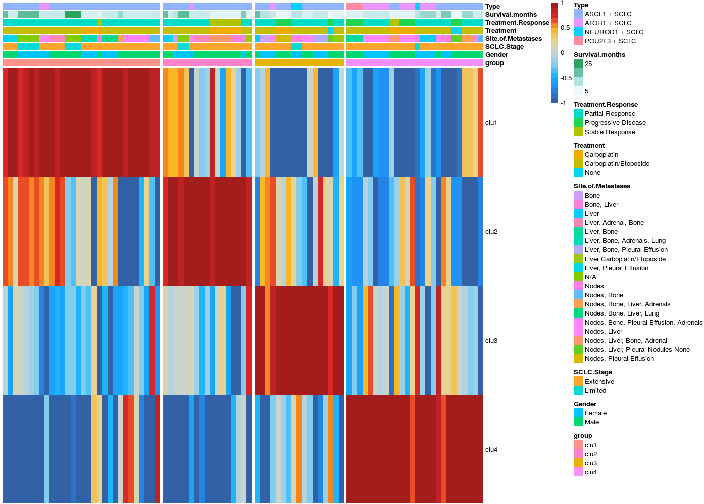
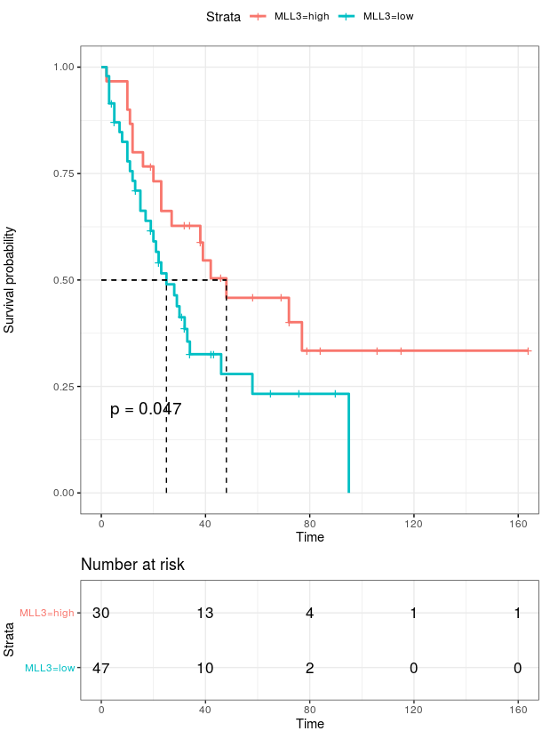
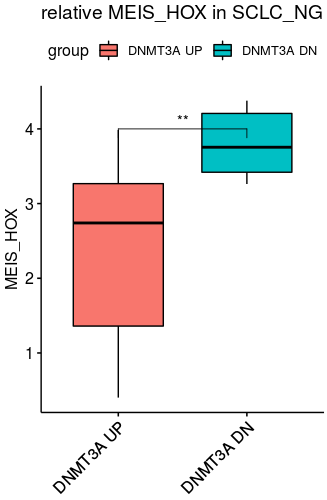

# **How to use SCLC patients’ data collected in our paper**

For deeply analyzing SCLC data for **```SCLC_DATA_X```**, we show the code examples that display how’s the data processing and visualization, including transcriptome data and clinical information.

## Part1. we should load the packages we need for following analysis

~~~R
suppressPackageStartupMessages({
  library(dplyr)
  library(Seurat)
  library(Matrix)
  library(proxy)
  library(gplots)
  library(Rtsne)
  library(densityClust)
  library(irlba)
  library(monocle)
  library(plyr)
  library(DOSE)
  library(clusterProfiler)
  library(topGO)
  library(pathview)
  library(AnnotationDbi)
  library(cowplot)
  library(ggplot2)
  library(velocyto.R)
  library(trqwe)
  library(Rsamtools)
  library(GenomicFeatures)
  library(GenomicAlignments)
  library(BiocParallel)
  library(pheatmap)
  library(RColorBrewer)
  library(PoiClaClu)
  library(org.Mm.eg.db)
  library(org.Hs.eg.db)
  library(DESeq2)
  library(data.table)
  library(stringr)
  library(iTALK)
  library(nichenetr)
  library(tidyr)
})
source("/mnt/data/user_data/xiangyu/programme/R_PACKAGES/my_code/MyBestFunction_scRNA.R")
source("/mnt/data/user_data/xiangyu/programme/R_PACKAGES/my_code/Pseudo_CNV_series.R")
library(future)
library(future.apply)
options(future.globals.maxSize = 300 * 1024^3)
plan("multiprocess", workers = 15)
plan()
library(scales)
library(BuenColors)
~~~

## Part2. we use SCLC_DATA_6 as an example to show how to stratify patients by specific molecular signatures.

~~~R
#Firstly, we need to identify our molecular signatures that would be used to stratify patients 
annotation_row1 <- mcreadRDS(file="/mnt/data/user_data/xiangyu/workshop/scRNA/SCLC/metastasisi/merge_all/SCLC_ASCL1_pseudotime_annotation_row1.rds",mc.cores=20)
annotation_row1$gene <- rownames(annotation_row1)
clu1 <- subset(annotation_row1,Cluster==1)
clu2 <- subset(annotation_row1,Cluster==2)
clu3 <- subset(annotation_row1,Cluster==3)
clu4 <- subset(annotation_row1,Cluster==4)
library(iTALK)
library(nichenetr)
library(tidyr)
clu1 = clu1 %>% mutate(from = convert_mouse_to_human_symbols(gene), to = convert_mouse_to_human_symbols(gene)) %>% drop_na()
clu2 = clu2 %>% mutate(from = convert_mouse_to_human_symbols(gene), to = convert_mouse_to_human_symbols(gene)) %>% drop_na()
clu3 = clu3 %>% mutate(from = convert_mouse_to_human_symbols(gene), to = convert_mouse_to_human_symbols(gene)) %>% drop_na()
clu4 = clu4 %>% mutate(from = convert_mouse_to_human_symbols(gene), to = convert_mouse_to_human_symbols(gene)) %>% drop_na()

#Secondly, we need pre-process our data, such as matching the ID in clinical information and omics data and divide patients in different sub-molecular groups by paper reported.
CDX_META_INFO <- read.csv("./SCLC_DATA_6/CDX_META_INFO.csv")
CDX_META_INFO$CDX.No. <- paste0("CDX",CDX_META_INFO$CDX.No.)
CDX_META_INFO$CDX.No. <- gsub("CDX33P","CDX33/33P",CDX_META_INFO$CDX.No.)
all_tmp_data <- future_lapply(CDX_META_INFO$CDX.No.,function(x){
  sel_meta <- subset(CDX_META_INFO,CDX.No.==x)
  id_t <- unlist(strsplit(sel_meta$CDX.No.,split="/"))
  if (length(id_t)==1) {
    sel_meta <- do.call(rbind,list(sel_meta,sel_meta,sel_meta,sel_meta,sel_meta,sel_meta))
    sel_meta$id <- c(rep(id_t[1],6))
    sel_meta$new_id <- paste0(sel_meta$CDX.No.,c("",".1",".2",".3",".4",".5"))
  } else {
    sel_meta <- do.call(rbind,list(sel_meta,sel_meta,sel_meta,sel_meta,sel_meta,sel_meta,
      sel_meta,sel_meta,sel_meta,sel_meta,sel_meta,sel_meta))
    sel_meta$id <- c(rep(id_t[1],6),rep(paste0("CDX",id_t[2]),6))
    sel_meta$new_id <- c(paste0(id_t[1],c("",".1",".2",".3",".4",".5")),paste0("CDX",id_t[2],c("",".1",".2",".3",".4",".5")))
  }
  return(sel_meta)
  })
all_tmp <- do.call(rbind,all_tmp_data)
all_tmp$new_id <- gsub("CDX0","CDX",all_tmp$new_id)
all_tmp$id <- gsub("CDX0","CDX",all_tmp$id)
rownames(all_tmp) <- all_tmp$new_id

names <- c("CDX8","CDX38","CDX8P","CDX29","CDX25","CDX17P","CDX17","CDX30P","CDX33","CDX33P","CDX15P","CDX20P","CDX7","CDX12","CDX45","CDX18P","CDX15PP","CDX46","CDX3","CDX3P","CDX14P","CDX22P","CDX42","CDX32P","CDX4","CDX42P","CDX18","CDX34","CDX10","CDX35","CDX9","CDX26","CDX40","CDX2","CDX1","CDX20","CDX39P","CDX41P","CDX13")
names <- gsub("CDX0","CDX",names)
group <- c("NEUROD1","ASCL1","NEUROD1","NEUROD1","ATOH1","ATOH1","ATOH1","ATOH1","ASCL1","ASCL1","ASCL1","ASCL1","ASCL1","ASCL1","ASCL1","ASCL1","ASCL1","ASCL1","ASCL1","ASCL1","ASCL1","ASCL1","ASCL1","ASCL1","ASCL1","ASCL1","ASCL1","ASCL1","ASCL1","ASCL1","ASCL1","ASCL1","ASCL1","ASCL1","ASCL1","ASCL1","ASCL1","ASCL1","POU2F3")
names(group) <- names
all_tmp$Type <- group[all_tmp$id]
all_tmp$Type <- paste0(all_tmp$Type," + SCLC")

#Then, we need to load our trnascriptome data.
CDXData <- read.csv("/mnt/data/user_data/xiangyu/workshop/DATABASE/SCLC_Patient_data/SCLC_CTC/bulk_RNA/counts_table/FinalCDXDataTable.csv")
CDXData <- CDXData[!duplicated(CDXData$gene_name),]
rownames(CDXData) <- CDXData$gene_name
CDXData <- CDXData[,-c(1,2,3)]
CDXData <- log(CDXData+1,2)
CDXData <- as.data.frame(t(CDXData))
rownames(CDXData) <- gsub("CDX","CDX",rownames(CDXData))
both_id <- intersect(rownames(CDXData),rownames(all_tmp))
all_tmp <- all_tmp[both_id,]
CDXData <- CDXData[both_id,]
sel_gene_CDXData <- data.frame(clu1=as.character(apply(CDXData[,intersect(colnames(CDXData),unique(clu1$from))],1,mean)),
clu2=as.character(apply(CDXData[,intersect(colnames(CDXData),unique(clu2$from))],1,mean)),
clu3=as.character(apply(CDXData[,intersect(colnames(CDXData),unique(clu3$from))],1,mean)),
clu4=as.character(apply(CDXData[,intersect(colnames(CDXData),unique(clu4$from))],1,mean)),
SOX2=as.character(CDXData[,"SOX2"]),
ASCL1=as.character(CDXData[,"ASCL1"]),
row.names=rownames(CDXData))
sel_gene_CDXData$clu1 <- as.numeric(as.character(scale(as.numeric(as.character(sel_gene_CDXData$clu1)))))
sel_gene_CDXData$clu2 <- as.numeric(as.character(scale(as.numeric(as.character(sel_gene_CDXData$clu2)))))
sel_gene_CDXData$clu3 <- as.numeric(as.character(scale(as.numeric(as.character(sel_gene_CDXData$clu3)))))
sel_gene_CDXData$clu4 <- as.numeric(as.character(scale(as.numeric(as.character(sel_gene_CDXData$clu4)))))
sel_gene_CDXData$SOX2 <- as.numeric(as.character(scale(as.numeric(as.character(sel_gene_CDXData$SOX2)))))
sel_gene_CDXData$ASCL1 <- as.numeric(as.character(scale(as.numeric(as.character(sel_gene_CDXData$ASCL1)))))
sel_gene_CDXData_g <- sel_gene_CDXData

#Now, we began to stratify patients by specific molecular signatures
sel_gene_CDXData <- sel_gene_CDXData[,c(1:4)]
sel_gene_CDXData$group <- unlist(future_lapply(1:nrow(sel_gene_CDXData),function(x){
    sel_tmp <- sel_gene_CDXData[x,]
    group_n <- colnames(sel_tmp)[which(sel_tmp==max(sel_tmp))]
    return(group_n)
    }))

#To visualize the results by heatmap with standard normalization
chonglai_zscore_1 <- t(apply(sel_gene_CDXData[,-ncol(sel_gene_CDXData)], 1, function(x) (x-mean(x))/sd(x)))
chonglai_zscore_1[chonglai_zscore_1>1] <- 1
chonglai_zscore_1[chonglai_zscore_1< -1] <- -1
bks <- seq(-1, 1, by = 0.1)
library(scales)
library(BuenColors)
library(pheatmap)
aa <- jdb_palette("solar_extra",, type = c("continuous"))[1:length(jdb_palette("solar_extra",, type = c("continuous")))]
hmcols <- colorRampPalette(aa)(length(bks) - 1)
annotation_col <- data.frame(group=sel_gene_CDXData[,ncol(sel_gene_CDXData)],
  Gender=all_tmp$Gender,
  SCLC.Stage=all_tmp$SCLC.Stage,
  Site.of.Metastases=all_tmp$Site.s..of.Metastases,
  Treatment=all_tmp$X1st.Line.Treatment,
  Treatment.Response=all_tmp$Treatment.Response,
  Survival.months=all_tmp$Survival..months.,
  Type=all_tmp$Type,
  row.names=rownames(sel_gene_CDXData))
annotation_col1 <- annotation_col[order(annotation_col$group),]
order <- as.data.frame(table(annotation_col1$group))
chonglai_zscore_1 <- chonglai_zscore_1[rownames(annotation_col1),]
ph_res <- pheatmap(t(chonglai_zscore_1), useRaster = T, cluster_cols = FALSE,
    cluster_rows = F, show_rownames = TRUE,
    show_colnames = FALSE,
    clustering_method = NULL, cutree_rows = 0,gaps_col =c(order$Freq[1],order$Freq[1]+order$Freq[2],order$Freq[1]+order$Freq[2]+order$Freq[3]),
    annotation_col = annotation_col1, 
    treeheight_row = 20, breaks = bks, color = hmcols,
    border_color = NA, silent = TRUE, filename = NA)
~~~



## Part3. we use SCLC_DATA_3 as an example to show how to calculate and quantify the survival results.

~~~R
#Firstly, we need pre-process our data, such as matching the ID in clinical information and omics data and divide patients in different sub-molecular groups by paper reported.
library("survival")
library("survminer")
SCLC_Nature_RNA <- fread("./SCLC_DATA_3/SCLC_Nature_RNA.csv")
SCLC_Nature_RNA <- as.data.frame(SCLC_Nature_RNA)
SCLC_Nature_RNA <- SCLC_Nature_RNA[!duplicated(SCLC_Nature_RNA$gene),]
rownames(SCLC_Nature_RNA) <- SCLC_Nature_RNA$gene
SCLC_Nature_RNA <- SCLC_Nature_RNA[,c(-1,-2)]
SCLC_Nature_Clinical <- fread("./SCLC_DATA_3/SCLC_Nature_Clinical.csv")
SCLC_Nature_Clinical <- as.data.frame(SCLC_Nature_Clinical)
rownames(SCLC_Nature_Clinical) <- SCLC_Nature_Clinical$'Sample-ID'
both_id <- intersect(colnames(SCLC_Nature_RNA),rownames(SCLC_Nature_Clinical))
SCLC_Nature_Clinical_SEL <- SCLC_Nature_Clinical[both_id,]
table(SCLC_Nature_Clinical_SEL$'primary tumor/metastasis')
colnames(SCLC_Nature_Clinical_SEL)[21] <- "primary_tumor_metastasis"
SCLC_Nature_RNA <- log(SCLC_Nature_RNA+1,2)
SCLC_Nature_RNA <- as.data.frame(t(SCLC_Nature_RNA))
~~~

~~~R
#Secondly, we calculate and quantify molecular signatures and specific genes in all patients.
annotation_row1 <- mcreadRDS(file="/mnt/data/user_data/xiangyu/workshop/scRNA/SCLC/metastasisi/merge_all/SCLC_ASCL1_pseudotime_annotation_row1.rds",mc.cores=20)
annotation_row1$gene <- rownames(annotation_row1)
clu1 <- subset(annotation_row1,Cluster==1)
clu2 <- subset(annotation_row1,Cluster==2)
clu3 <- subset(annotation_row1,Cluster==3)
clu4 <- subset(annotation_row1,Cluster==4)
library(iTALK)
library(nichenetr)
library(tidyr)
clu1 = clu1 %>% mutate(from = convert_mouse_to_human_symbols(gene), to = convert_mouse_to_human_symbols(gene)) %>% drop_na()
clu2 = clu2 %>% mutate(from = convert_mouse_to_human_symbols(gene), to = convert_mouse_to_human_symbols(gene)) %>% drop_na()
clu3 = clu3 %>% mutate(from = convert_mouse_to_human_symbols(gene), to = convert_mouse_to_human_symbols(gene)) %>% drop_na()
clu4 = clu4 %>% mutate(from = convert_mouse_to_human_symbols(gene), to = convert_mouse_to_human_symbols(gene)) %>% drop_na()
sel_gene_SCLC_Nature_RNA <- data.frame(clu1=as.character(apply(SCLC_Nature_RNA[,intersect(colnames(SCLC_Nature_RNA),unique(clu1$from))],1,mean)),
clu2=as.character(apply(SCLC_Nature_RNA[,intersect(colnames(SCLC_Nature_RNA),unique(clu2$from))],1,mean)),
clu3=as.character(apply(SCLC_Nature_RNA[,intersect(colnames(SCLC_Nature_RNA),unique(clu3$from))],1,mean)),
clu4=as.character(apply(SCLC_Nature_RNA[,intersect(colnames(SCLC_Nature_RNA),unique(clu4$from))],1,mean)),
MLL3=as.character(SCLC_Nature_RNA[,"MLL3"]),
DNMT3A=as.character(SCLC_Nature_RNA[,"DNMT3A"]),
row.names=rownames(SCLC_Nature_RNA))
sel_gene_SCLC_Nature_RNA$clu1 <- as.numeric(as.character(scale(as.numeric(as.character(sel_gene_SCLC_Nature_RNA$clu1)))))
sel_gene_SCLC_Nature_RNA$clu2 <- as.numeric(as.character(scale(as.numeric(as.character(sel_gene_SCLC_Nature_RNA$clu2)))))
sel_gene_SCLC_Nature_RNA$clu3 <- as.numeric(as.character(scale(as.numeric(as.character(sel_gene_SCLC_Nature_RNA$clu3)))))
sel_gene_SCLC_Nature_RNA$clu4 <- as.numeric(as.character(scale(as.numeric(as.character(sel_gene_SCLC_Nature_RNA$clu4)))))
sel_gene_SCLC_Nature_RNA$MLL3 <- as.numeric(as.character(scale(as.numeric(as.character(sel_gene_SCLC_Nature_RNA$MLL3)))))
sel_gene_SCLC_Nature_RNA$DNMT3A <- as.numeric(as.character(scale(as.numeric(as.character(sel_gene_SCLC_Nature_RNA$DNMT3A)))))
~~~

~~~R
#Then, we will find an appropriate cutoff of molecular signatures or specific genes in patients that divide them into higher regulated group and lower regulated group.
library("survival")
library("survminer")
SCLC_Nature_Clinical_SEL1 <- SCLC_Nature_Clinical_SEL[,c("overall_survival (months)","Status (at time of last follow-up)")]
colnames(SCLC_Nature_Clinical_SEL1) <- c("dead_date","status")
all_case_and_info <- cbind(sel_gene_SCLC_Nature_RNA,SCLC_Nature_Clinical_SEL1[,c("dead_date","status")])
all_case_and_info <- na.omit(all_case_and_info)
case_info_ALL <- all_case_and_info
case_info_ALL <- case_info_ALL[order(case_info_ALL$dead_date,decreasing=TRUE),]
event <- gsub("alive",0,case_info_ALL$status)
event <- gsub("dead",1,event)
case_info_ALL$event <- as.numeric(event)
all_case_and_info <- na.omit(case_info_ALL)
case_info_ALL <- all_case_and_info
case_info_ALL.cut <- surv_cutpoint(
   case_info_ALL,
   time = "dead_date",
   event = "event",
   variables = c("MLL3"),
   progressbar=TRUE,
   minprop=0.3
)
summary(case_info_ALL.cut)
plot(case_info_ALL.cut, "MLL3")
case_info_ALL.cut.cat <- surv_categorize(case_info_ALL.cut) 
library(survival)
fit <- survfit(Surv(dead_date, event) ~ MLL3, data = case_info_ALL.cut.cat)
ggsurvplot(fit, data = case_info_ALL.cut.cat,
surv.median.line = "hv",
pval = TRUE,
ggtheme = theme_bw(),
risk.table=TRUE)
~~~



## Part4. we use SCLC_DATA_2 as an example to show how to compare expression levels of X gene in two groups that are divided by expression levels of molecular signatures or specific genes.

~~~R
#Firstly, we need pre-process our data, such as log2-transformation from FPKM data.
SCLC_NG_RNA <- as.data.frame(fread(file = "/mnt/data/user_data/xiangyu/workshop/DATABASE/SCLC_Patient_data/SCLC_NG1_RNA.csv"))
SCLC_NG_RNA <- na.omit(SCLC_NG_RNA)
SCLC_NG_RNA <- SCLC_NG_RNA[!duplicated(SCLC_NG_RNA$Gene),]
rownames(SCLC_NG_RNA) <- SCLC_NG_RNA$Gene
SCLC_NG_RNA <- SCLC_NG_RNA[,-c(1,2)]
SCLC_NG_RNA <- log(SCLC_NG_RNA+1,2)
SCLC_NG_RNA_sEL <- SCLC_NG_RNA[c("MLL3","TET2","HOXB7","MEIS2",
  grep("*DNMT",rownames(SCLC_NG_RNA),value=TRUE)),]
SCLC_NG_RNA_sEL <- as.data.frame(t(SCLC_NG_RNA_sEL))
SCLC_NG_RNA_sEL <- data.frame(MEIS_HOX=apply(SCLC_NG_RNA[c(grep("*HOXB",rownames(SCLC_NG_RNA),value=TRUE)),],2,mean),
  HOX=apply(SCLC_NG_RNA[c("MEIS2",grep("*HOXB",rownames(SCLC_NG_RNA),value=TRUE)),],2,mean),
  SCLC_NG_RNA_sEL)
library(scales)
library(BuenColors)
library(ggpubr)
~~~

~~~R
SCLC_NG_RNA_sEL_tmp <- SCLC_NG_RNA_sEL
SCLC_NG_RNA_sEL_tmp$group <- ifelse(SCLC_NG_RNA_sEL_tmp$DNMT3A>= median(SCLC_NG_RNA_sEL_tmp$DNMT3A),"DNMT3A UP","DNMT3A DN")
ggboxplot(SCLC_NG_RNA_sEL_tmp, x = "group", y = "MEIS_HOX", fill="group",
  title="relative MEIS_HOX in SCLC_NG", outlier.shape = NA,notch = FALSE) +
  rotate_x_text(angle = 45)+ stat_compare_means(comparisons=list(c("DNMT3A UP","DNMT3A DN")),
    label = "p.signif", method = "wilcox.test",label.y=4)
~~~

