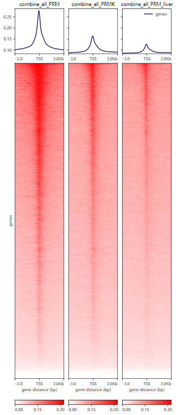
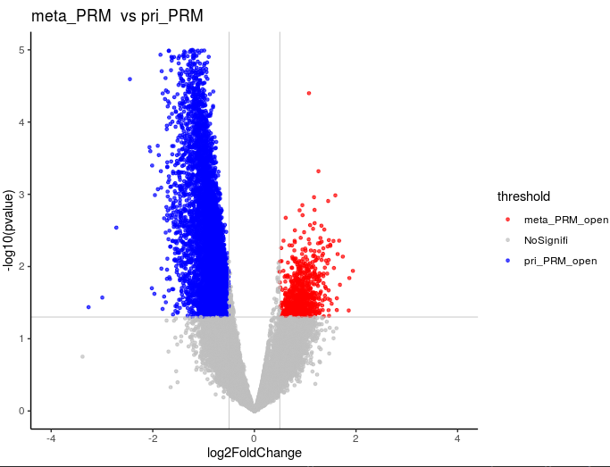
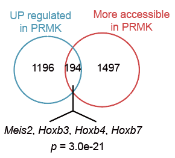
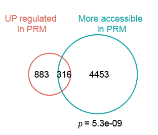

# Bulk ATAC-seq analysis

In this pipeline, we showed the detail codes of visualization of ATAC-seq data.

~~~shell
# draw the heatmap of ATAC-seq
computeMatrix reference-point --referencePoint TSS -b 3000 -a 3000 \
-R mm10.ucsc.refseq.bed  \
-S combine_all_PRM.bw combine_all_PRMK.bw  combine_all_PRM_liver.bw \
--skipZeros --numberOfProcessors 25 \
-o combine_all_TSS.mat.gz 
plotHeatmap -m combine_all_TSS.mat.gz -out combine_all_TSS.svg \
 --colorList  'white,red' 'white,red' 'white,red'
~~~

~~~R
library(ChIPseeker)
library(clusterProfiler)
library(ChIPpeakAnno)
library(dplyr)
library(limma)
library(Rsubread)
library(DESeq2)
library(ggplot2)
library(tidyr)
library(ggthemes)
library(ggrepel)
library(BSgenome.Mmusculus.UCSC.mm10)
library(tracktables)
library(trqwe)
library(future.apply)
library(VennDiagram)
library(eulerr)
require(gmp)
library(TxDb.Mmusculus.UCSC.mm10.knownGene)
txdb <- TxDb.Mmusculus.UCSC.mm10.knownGene

files <- list.files( pattern = "_peaks.gappedPeak$", full.names = TRUE)
name <- gsub("_peaks.gappedPeak","",basename(files))
promoter <- getPromoters(TxDb=txdb, upstream=3000, downstream=3000)
tagMatrixList <- future_lapply(files, getTagMatrix, windows=promoter)
names(tagMatrixList) <- name
all_myPeaks <- future_lapply(files, ChIPQC:::GetGRanges, simple = TRUE)
names(all_myPeaks) <- name
consensusToCount <- XY_runConsensusRegions(GRangesList(all_myPeaks), "none")
bamsToCount <- dir( full.names = TRUE, pattern = "*.\\.bam$")
regionsToCount <- data.frame(GeneID = paste("ID", seqnames(consensusToCount), 
    start(consensusToCount), end(consensusToCount), sep = "_"), Chr = seqnames(consensusToCount), 
    Start = start(consensusToCount), End = end(consensusToCount), Strand = strand(consensusToCount))
fcResults <- featureCounts(bamsToCount, annot.ext = regionsToCount, isPairedEnd = TRUE, 
    countMultiMappingReads = FALSE, maxFragLength = 100,nthreads=20)
myCounts <- fcResults$counts
save(myCounts, file = "countsFromATAC.RData")
load("countsFromATAC.RData")
Group <- factor(c("all.PRM", "all.PRM", "all.PRMK", "all.PRMK", "all.PRM.liver", "all.PRM.liver"))
metaData <- data.frame(Group, row.names = colnames(myCounts))
metaData$type <- rownames(metaData)
atacDDS <- DESeqDataSetFromMatrix(myCounts, metaData, ~Group, rowRanges = consensusToCount)
atacDDS <- DESeq(atacDDS,parallel=T)
mcsaveRDS(atacDDS,"atacDDS.rds")
atacDDS <- mcreadRDS("atacDDS.rds",mc.cores=20)
atacDDS_Sel <- atacDDS[,c(1:6)]
meta_PRM_vs_PRM_res <- results(atacDDS_Sel, c("Group", "all.PRM.liver", "all.PRM"), format = "GRanges",parallel=T)
mcsaveRDS(meta_PRM_vs_PRM_res,"1_meta_PRM_vs_PRM.rds")
PRMK_vs_PRM <- results(atacDDS_Sel, c("Group", "all.PRMK", "all.PRM"), format = "GRanges",parallel=T)
mcsaveRDS(PRMK_vs_PRM,"1_PRMK_vs_PRM.rds")

meta_PRM_vs_PRM <- mcreadRDS("1_meta_PRM_vs_PRM.rds")
PRMK_vs_PRM <- mcreadRDS("1_PRMK_vs_PRM.rds")
meta_PRM_vs_PRM <- as.data.frame(meta_PRM_vs_PRM)
meta_PRM_vs_PRM_p <- subset(meta_PRM_vs_PRM,pvalue < 0.05)
meta_PRM_vs_PRM_p_up <- subset(meta_PRM_vs_PRM_p,log2FoldChange > 0.5)
meta_PRM_vs_PRM_p_down <- subset(meta_PRM_vs_PRM_p,log2FoldChange < -0.5)
meta_PRM_vs_PRM <- as.data.frame(meta_PRM_vs_PRM)
MA_lot <- meta_PRM_vs_PRM
MA_lot$threshold = as.factor(ifelse(MA_lot$pvalue < 0.05 & abs(MA_lot$log2FoldChange) > 0.5, ifelse(MA_lot$log2FoldChange < -0.5 ,'pri_PRM_open','meta_PRM_open'),'NoSignifi'))
range(-log10(MA_lot$pvalue))
range(MA_lot$log2FoldChange)
table(MA_lot$threshold)
ggplot(data = MA_lot, aes(x = log2FoldChange, y = -log10(pvalue), colour=threshold)) +
geom_point(size=1,alpha=.7) +
geom_vline(xintercept = c(-0.5, 0.5), color = 'grey', size = 0.3) +
geom_hline(yintercept = -log(0.05, 10), color = 'grey', size = 0.3) +
scale_color_manual(values=c("red","grey","blue"))  + ggtitle("meta_PRM  vs pri_PRM") + 
theme(plot.title = element_text(lineheight=.8, face="bold")) + xlim(-4,4)+ylim(0,5)+theme_bw() +theme(panel.grid.major=element_line(colour=NA),
            panel.background = element_rect(fill = "transparent",colour = NA),
            plot.background = element_rect(fill = "transparent",colour = NA),
            panel.grid.minor = element_blank())+theme_classic()
~~~

~~~R
pri_PRMK_VS_pri_PRM <- mcreadRDS("1_PRMK_vs_PRM.rds",mc.cores=20)
met_PRM_VS_pri_PRM <- mcreadRDS("1_meta_PRM_vs_PRM.rds",mc.cores=20)
pri_PRMK_VS_pri_PRM_NEW <- annotatePeak(pri_PRMK_VS_pri_PRM, tssRegion=c(-3000, 3000),TxDb=TxDb.Mmusculus.UCSC.mm10.knownGene, annoDb="org.Mm.eg.db")
pri_PRMK_VS_pri_PRM_NEW_t <- as.data.frame(as.GRanges(pri_PRMK_VS_pri_PRM_NEW))
mcsaveRDS(pri_PRMK_VS_pri_PRM_NEW_t,"1_pri_PRMK_VS_pri_PRM_res_symbol.rds")
met_PRM_VS_pri_PRM_NEW <- annotatePeak(met_PRM_VS_pri_PRM, tssRegion=c(-3000, 3000),TxDb=TxDb.Mmusculus.UCSC.mm10.knownGene, annoDb="org.Mm.eg.db")
met_PRM_VS_pri_PRM_NEW_t <- as.data.frame(as.GRanges(met_PRM_VS_pri_PRM_NEW))
mcsaveRDS(met_PRM_VS_pri_PRM_NEW_t,"1_met_PRM_VS_pri_PRM_res_symbol.rds")
pri_PRMK_VS_pri_PRM_NEW_t_P <- subset(pri_PRMK_VS_pri_PRM_NEW_t,pvalue < 0.05)
PRMK_VS_PRM_PRMK_open <- subset(pri_PRMK_VS_pri_PRM_NEW_t_P,log2FoldChange > 0.5)
PRMK_VS_PRM_PRM_open <- subset(pri_PRMK_VS_pri_PRM_NEW_t_P,log2FoldChange < -0.5)
dim(PRMK_VS_PRM_PRMK_open)
dim(PRMK_VS_PRM_PRM_open)
met_PRM_VS_pri_PRM_NEW_t_P <- subset(met_PRM_VS_pri_PRM_NEW_t,pvalue < 0.05)
met_PRM_VS_pri_PRM_Meta_open <- subset(met_PRM_VS_pri_PRM_NEW_t_P,log2FoldChange >0.5)
met_PRM_VS_pri_PRM_pri_open <- subset(met_PRM_VS_pri_PRM_NEW_t_P,log2FoldChange < -0.5)
dim(met_PRM_VS_pri_PRM_Meta_open)
dim(met_PRM_VS_pri_PRM_pri_open)

PRMK_vs_PRM <- read.csv("1_RNAseq2_PRMK_VS_PRM_result_DEGs.csv")
PRMK_up <- subset(PRMK_vs_PRM,PRMK_VS_PRM_log2FoldChange > 0)
PRM_up <- subset(PRMK_vs_PRM,PRMK_VS_PRM_log2FoldChange < 0)
T<-venn.diagram(list(PRMK_VS_PRM_PRMK_open=na.omit(as.character(unique(PRMK_VS_PRM_PRMK_open$SYMBOL))),PRMK_up=na.omit(as.character(unique(PRMK_up$symbol)))),
filename=NULL,
lwd=1,                         #圈线粗度
lty=1,                         #圈线类型
col=c('#0099CC','#FF6666'),    #圈线颜色
fill=c('#0099CC','#FF6666'),   #填充颜色
cat.col=c('#0099CC','#FF6666'),#A和B的颜色
cat.cex = 2.5,                 #A和B的大小
rotation.degree = 45,          #旋转角度
main = "PRMK_VS_PRM_PRMK_open & PRMK_up",                  #主标题内容
main.cex = 2,                  #主标题大小
sub = "",        #亚标题内容
sub.cex = 1,                   #亚标题字大小
cex=1.5,                       #里面交集字的大小
alpha = 0.5,                   #透明度
reverse=TRUE)
grid.draw(T)

fit1 <- euler(c("PRMK_VS_PRM_PRMK_open" = 1497, "PRMK_up" = 1196,
                "PRMK_VS_PRM_PRMK_open&PRMK_up" = 194))
plot(fit1,quantities = TRUE )

enrich_pvalue <- function(N, A, B, k)
{
    m <- A + k
    n <- B + k
    i <- k:min(m,n)

    as.numeric( sum(chooseZ(m,i)*chooseZ(N-m,n-i))/chooseZ(N,n) )
}
enrich_pvalue(24223, 1497, 1196, 194) #2.99318e-21
~~~

~~~R
T<-venn.diagram(list(PRMK_VS_PRM_PRM_open=na.omit(as.character(unique(PRMK_VS_PRM_PRM_open$SYMBOL))),PRM_up=na.omit(as.character(unique(PRM_up$symbol)))),
filename=NULL,
lwd=1,                         #圈线粗度
lty=1,                         #圈线类型
col=c('#0099CC','#FF6666'),    #圈线颜色
fill=c('#0099CC','#FF6666'),   #填充颜色
cat.col=c('#0099CC','#FF6666'),#A和B的颜色
cat.cex = 2.5,                 #A和B的大小
rotation.degree = 45,          #旋转角度
main = "PRMK_VS_PRM_PRM_open & PRM_up",                  #主标题内容
main.cex = 2,                  #主标题大小
sub = "",        #亚标题内容
sub.cex = 1,                   #亚标题字大小
cex=1.5,                       #里面交集字的大小
alpha = 0.5,                   #透明度
reverse=TRUE)
grid.draw(T)
fit1 <- euler(c("PRMK_VS_PRM_PRM_open" = 4453, "PRM_up" = 883,
                "PRMK_VS_PRM_PRM_open&PRM_up" = 316))
plot(fit1,quantities = TRUE )
enrich_pvalue(24223, 4453, 883, 316) #5.346462e-09
~~~

