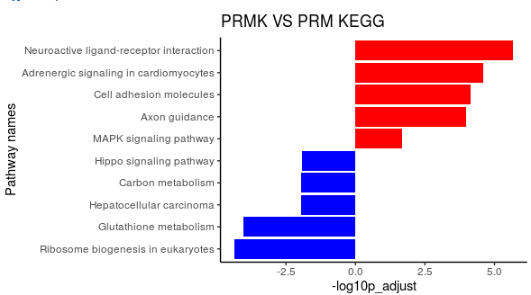

# Bulk RNA-seq analysis 

In this pipeline, we showed the detail codes of visualization of RNA-seq data.

## Part1. RNA-seq1 (PRM vs Lung) analysis

~~~R
require(Rsamtools)
require(GenomicFeatures)
require(GenomicAlignments)
require(BiocParallel)
require(pheatmap)
require(RColorBrewer)
require(PoiClaClu)
require(org.Mm.eg.db)
require(AnnotationDbi)
require(DOSE)
require(clusterProfiler)
require(topGO)
require(pathview)
require(org.Hs.eg.db)
require(AnnotationDbi)
require(DOSE)
require(clusterProfiler)
require(topGO)
require(ggplot2)
require(DESeq2)
require(Seurat)
require(ggpubr)
require(future)
require(future.apply)
options(future.globals.maxSize = 200 * 1024^3)
plan("multiprocess", workers = 20)
plan()
organism = "mmu"
if (organism %in% c("mmu")) {
anno_data=org.Mm.eg.db
print("organism is mouse")
load(file="txdb_GRCm38.RData")
load(file="ebg_GRCm38.RData")
} else {
anno_data=org.Hs.eg.db
print("organism is human")
load(file="txdb_GRCh38.RData")
load(file="ebg_GRCh38.RData")
}
sampleTable <- read.csv("RNAseq1_sampleTable.csv", row.names = 1)
sampleTable
filenames <- file.path( paste0(sampleTable$samplenames))
file.exists(filenames)
bamfiles <- BamFileList(filenames, yieldSize=2000000)
seqinfo(bamfiles[1])
register(MulticoreParam(workers=8))
registered()
se <- summarizeOverlaps(features=ebg, reads=bamfiles,
                        mode="Union",
                        singleEnd=FALSE,
                        ignore.strand=TRUE,fragments=TRUE)
save(se,file="RNAseq1_se.RData")
load("RNAseq1_se.RData")

colData(se) <- DataFrame(sampleTable)
dds <- DESeqDataSet(se, design = ~ deal)
exons <- as.data.frame(ebg)
exon_length_tmp <- future_lapply(1:nrow(assay(se)),function(i){
	exonsfromgene <- exons[which(exons$group==i),]
	length <- sum(exonsfromgene$width)
	gene_name <- exonsfromgene[1,2]
	exon_length <- data.frame(gene_name=gene_name,length=length)
	return(exon_length)
	})
exon_length <- as.data.frame(data.table::rbindlist(exon_length_tmp))
#求出每个样本的总read数（百万）
whole_length <- as.data.frame(round(colSums(assay(dds))/1e6,1))
#计算FPKM矩阵
countM <- as.data.frame(assay(se))
FPKM <- countM
FPKM_tmp <- future_lapply(1:nrow(FPKM),function(x){
	sel_data <- FPKM[x,]
	gene <- rownames(sel_data)
	length <- as.numeric(exon_length[which(exon_length$gene_name==gene),]$length)
	data_tmp <- future_lapply(1:ncol(sel_data),function(yy){
		tmp_data <- sel_data[,yy]/(whole_length[yy,]*length*0.001)
		return(tmp_data)
	})
	data_tmp <- as.data.frame(data_tmp)
	colnames(data_tmp) <- colnames(sel_data)
	data_tmp$id <- rownames(sel_data)
	return(data_tmp)
	})
FPKM <- as.data.frame(data.table::rbindlist(FPKM_tmp))
rownames(FPKM) <- FPKM$id
FPKM <- FPKM[,-ncol(FPKM)]
fpkmToTpm <- function(FPKM){
  exp(log(FPKM) - log(sum(FPKM)) + log(1e6))
}
tpm <- fpkmToTpm(FPKM)
count <- assay(dds)
colnames(tpm) <- paste("tpm",sampleTable$name,sep="_")
colnames(count) <- paste("count",sampleTable$name,sep="_")
count_and_tpm <- cbind(count,tpm)

dds <- DESeq(dds,parallel=TRUE)
RNAseq1_result <- results(dds, contrast=c("deal","PRM","Lung"))
colnames(RNAseq1_result) = paste(paste("PRM","Lung",sep="_VS_"),colnames(RNAseq1_result),sep="_")
RNAseq1_result$symbol <- mapIds(x = anno_data,
                        keys = rownames(RNAseq1_result),
						keytype ="ENSEMBL",
						column ="SYMBOL",
						multiVals="first")
RNAseq1_result$entrez <- mapIds(x = anno_data,
                        keys = rownames(RNAseq1_result),
						keytype ="ENSEMBL",
						column ="ENTREZID",
						multiVals="first")
RNAseq1_result_all <- cbind(count_and_tpm,RNAseq1_result)
RNAseq1_result_all <- as.data.frame(RNAseq1_result_all)
RNAseq1_result_all_p <- subset(RNAseq1_result_all,PRM_VS_Lung_pvalue < 0.05)
RNAseq1_result_all_p_up <- subset(RNAseq1_result_all_p,PRM_VS_Lung_log2FoldChange > 1)
RNAseq1_result_all_p_down <- subset(RNAseq1_result_all_p,PRM_VS_Lung_log2FoldChange < -1)
RNAseq1_result_all_p_up <- RNAseq1_result_all_p_up[order((RNAseq1_result_all_p_up$PRM_VS_Lung_log2FoldChange),decreasing = TRUE),]
RNAseq1_result_all_p_down <- RNAseq1_result_all_p_down[order((RNAseq1_result_all_p_down$PRM_VS_Lung_log2FoldChange),decreasing = FALSE),]
RNAseq1_result_DEGs <- rbind(RNAseq1_result_all_p_up,RNAseq1_result_all_p_down)
write.csv(RNAseq1_result_all,file="1_RNAseq1_PRM_VS_Lung_result_all.csv")
write.csv(RNAseq1_result_DEGs,file="1_RNAseq1_PRM_VS_Lung_result_DEGs.csv")

SCLC_marker <- c("Ascl1","Chga","Ddc","Dll3","Sox1","Ina","Stmn3","Calca","Syp","Uchl1","Ncam1","Myc","Dll4","Mycl","Sox2","Ccne1","Nfib","E2f2","Dll1")
NSCLC_marker <- c("Ros1","Met","Erbb2","Vegfa","Egfr","Pdgfra","Src","Ddr2","Fos","Ctnnb1","Pik3ca","Braf","Stat3")
RNAseq1_result_all <- read.csv(file="1_RNAseq1_PRM_VS_Lung_result_all.csv")

data = RNAseq1_result_all[,c(8:13,20)]
colnames(data)<-c("lung1","lung2","lung3","PRM1","PRM2","PRM3","symbol")
##根据基因取数据
Ndata<-data.frame("lung1"=c(0),"lung2"=c(0),"lung3"=c(0),"PRM1"=c(0),"PRM2"=c(0),"PRM3"=c(0),"symbol"=c(0))
for(i in NSCLC_marker){
    Ndata<-rbind(Ndata,data[which(data$symbol==i),])
}
Ndata<-Ndata[-1,]
rownames(Ndata)<-Ndata$symbol
Ndata<-Ndata[,-7]
Sdata<-data.frame("lung1"=c(0),"lung2"=c(0),"lung3"=c(0),"PRM1"=c(0),"PRM2"=c(0),"PRM3"=c(0),"symbol"=c(0))
for(i in SCLC_marker){
    Sdata<-rbind(Sdata,data[which(data$symbol==i),])
}
Sdata<-Sdata[-1,]
rownames(Sdata)<-Sdata$symbol
Sdata<-Sdata[,-7]
##做ccfold
for(i in 1:nrow(Ndata)){
    for(j in 1:ncol(Ndata)){
        Ndata[i,j]<-Ndata[i,j]+0.01
    }
}
CC_Ndata<-Ndata
for(i in 1:nrow(CC_Ndata)){
    for(j in 1:ncol(CC_Ndata)){
        CC_Ndata[i,j]<-logb(Ndata[i,j]/mean(as.vector(as.matrix(Ndata[i,1:3]))),2)
    }
}
for(i in 1:nrow(Sdata)){
    for(j in 1:ncol(Sdata)){
        Sdata[i,j]<-Sdata[i,j]+0.01
    }
}
CC_Sdata<-Sdata
for(i in 1:nrow(CC_Sdata)){
    for(j in 1:ncol(CC_Sdata)){
        CC_Sdata[i,j]<-logb(Sdata[i,j]/mean(as.vector(as.matrix(Sdata[i,1:3]))),2)
    }
}
CC_Ndata$order <- c(1:13)
CC_Ndata <- CC_Ndata[order(CC_Ndata$order,decreasing = TRUE),]
CC_Ndata <- CC_Ndata[,1:6]
all <- rbind(CC_Sdata,CC_Ndata)
library(pheatmap)
break1=seq(-7, 0, length.out=25)
break2=seq(0, 13, length.out=26)
the_break<-c(break1,break2[-1])
pheatmap(all,border_color=NA,cluster_cols=F,cluster_row=F,cellwidth=30,cellheight=9.5,fontsize=8,color = colorRampPalette(c("navy", "white","firebrick3"))(50),breaks=the_break)
~~~

## Part2. RNA-seq2 (PRMK vs PRM) analysis

~~~R
require(Rsamtools)
require(GenomicFeatures)
require(GenomicAlignments)
require(BiocParallel)
require(pheatmap)
require(RColorBrewer)
require(PoiClaClu)
require(org.Mm.eg.db)
require(AnnotationDbi)
require(DOSE)
require(clusterProfiler)
require(topGO)
require(pathview)
require(org.Hs.eg.db)
require(AnnotationDbi)
require(DOSE)
require(clusterProfiler)
require(topGO)
require(ggplot2)
require(DESeq2)
require(Seurat)
require(future)
require(future.apply)
options(future.globals.maxSize = 200 * 1024^3)
plan("multiprocess", workers = 20)
plan()
organism = "mmu"
if (organism %in% c("mmu")) {
anno_data=org.Mm.eg.db
print("organism is mouse")
load(file="txdb_GRCm38.RData")
load(file="ebg_GRCm38.RData")
} else {
anno_data=org.Hs.eg.db
print("organism is human")
load(file="txdb_GRCh38.RData")
load(file="ebg_GRCh38.RData")
}
sampleTable <- read.csv("RNAseq2_sampleTable.csv", row.names = 1)
sampleTable
filenames <- file.path( paste0(sampleTable$samplenames))
file.exists(filenames)
bamfiles <- BamFileList(filenames, yieldSize=2000000)
seqinfo(bamfiles[1])
register(MulticoreParam(workers=8))
registered()
se <- summarizeOverlaps(features=ebg, reads=bamfiles,
                        mode="Union",
                        singleEnd=FALSE,
                        ignore.strand=TRUE,fragments=TRUE)
save(se,file="RNAseq2_se.RData")
load("RNAseq2_se.RData")

colData(se) <- DataFrame(sampleTable)
dds <- DESeqDataSet(se, design = ~ deal1)
exons <- as.data.frame(ebg)
exon_length_tmp <- future_lapply(1:nrow(assay(se)),function(i){
	exonsfromgene <- exons[which(exons$group==i),]
	length <- sum(exonsfromgene$width)
	gene_name <- exonsfromgene[1,2]
	exon_length <- data.frame(gene_name=gene_name,length=length)
	return(exon_length)
	})
exon_length <- as.data.frame(data.table::rbindlist(exon_length_tmp))
#求出每个样本的总read数（百万）
whole_length <- as.data.frame(round(colSums(assay(dds))/1e6,1))
#计算FPKM矩阵
countM <- as.data.frame(assay(se))
FPKM <- countM
FPKM_tmp <- future_lapply(1:nrow(FPKM),function(x){
	sel_data <- FPKM[x,]
	gene <- rownames(sel_data)
	length <- as.numeric(exon_length[which(exon_length$gene_name==gene),]$length)
	data_tmp <- future_lapply(1:ncol(sel_data),function(yy){
		tmp_data <- sel_data[,yy]/(whole_length[yy,]*length*0.001)
		return(tmp_data)
	})
	data_tmp <- as.data.frame(data_tmp)
	colnames(data_tmp) <- colnames(sel_data)
	data_tmp$id <- rownames(sel_data)
	return(data_tmp)
	})
FPKM <- as.data.frame(data.table::rbindlist(FPKM_tmp))
rownames(FPKM) <- FPKM$id
FPKM <- FPKM[,-ncol(FPKM)]
fpkmToTpm <- function(FPKM){
  exp(log(FPKM) - log(sum(FPKM)) + log(1e6))
}
tpm <- fpkmToTpm(FPKM)
count <- assay(dds)
colnames(tpm) <- paste("tpm",sampleTable$name,sep="_")
colnames(count) <- paste("count",sampleTable$name,sep="_")
count_and_tpm <- cbind(count,tpm)

dds <- DESeq(dds,parallel=TRUE)
RNAseq2_result <- results(dds, contrast=c("deal1","PRMK","PRM"))
colnames(RNAseq2_result) = paste(paste("PRMK","PRM",sep="_VS_"),colnames(RNAseq2_result),sep="_")
RNAseq2_result$symbol <- mapIds(x = anno_data,
                        keys = rownames(RNAseq2_result),
						keytype ="ENSEMBL",
						column ="SYMBOL",
						multiVals="first")
RNAseq2_result$entrez <- mapIds(x = anno_data,
                        keys = rownames(RNAseq2_result),
						keytype ="ENSEMBL",
						column ="ENTREZID",
						multiVals="first")
RNAseq2_result_all <- cbind(count_and_tpm,RNAseq2_result)
RNAseq2_result_all <- as.data.frame(RNAseq2_result_all)
RNAseq2_result_all_p <- subset(RNAseq2_result_all,PRMK_VS_PRM_pvalue < 0.05)
RNAseq2_result_all_p_up <- subset(RNAseq2_result_all_p,PRMK_VS_PRM_log2FoldChange > 1)
RNAseq2_result_all_p_down <- subset(RNAseq2_result_all_p,PRMK_VS_PRM_log2FoldChange < -1)
RNAseq2_result_all_p_up <- RNAseq2_result_all_p_up[order((RNAseq2_result_all_p_up$PRMK_VS_PRM_log2FoldChange),decreasing = TRUE),]
RNAseq2_result_all_p_down <- RNAseq2_result_all_p_down[order((RNAseq2_result_all_p_down$PRMK_VS_PRM_log2FoldChange),decreasing = FALSE),]
RNAseq2_result_DEGs <- rbind(RNAseq2_result_all_p_up,RNAseq2_result_all_p_down)
write.csv(RNAseq2_result_all,file="1_RNAseq2_PRMK_VS_PRM_result_all.csv")
write.csv(RNAseq2_result_DEGs,file="1_RNAseq2_PRMK_VS_PRM_result_DEGs.csv")

fpkm <- RNAseq2_result_all[,c(7:12,14,17,19)]
fpkm <- as.data.frame(fpkm)
fpkm_p <- subset(fpkm,PRMK_VS_PRM_pvalue < 0.05)
fpkm_p_up <- subset(fpkm_p,PRMK_VS_PRM_log2FoldChange > 1)
fpkm_p_down <- subset(fpkm_p,PRMK_VS_PRM_log2FoldChange < -1)
fpkm_p_up <- fpkm_p_up[order((fpkm_p_up$PRMK_VS_PRM_log2FoldChange),decreasing = TRUE),]
fpkm_p_down <- fpkm_p_down[order((fpkm_p_down$PRMK_VS_PRM_log2FoldChange),decreasing = FALSE),]
all_data <- rbind(fpkm_p_up,fpkm_p_down)
all_data <- all_data[order((all_data$PRMK_VS_PRM_log2FoldChange),decreasing = TRUE),]
all_data2 <- all_data[,c(1:6,9)]
all_data2 <- na.omit(all_data2)
all_data2=all_data2[!duplicated(all_data2[,c("symbol")]),]
rownames(all_data2) <- all_data2$symbol
all_data2 <- all_data2[,-7]
heatmap_resdeal_all_1_zscore <- t(apply(all_data2, 1, function(x) (x-mean(x))/sd(x)))
heatmap_resdeal_all_1_zscore <- na.omit(heatmap_resdeal_all_1_zscore)
source("/mnt/data/user_data/xiangyu/programme/R_PACKAGES/my_code/MyBestFunction_scRNA.R")
MLL3_RNA <- CreateSeuratObject(counts = heatmap_resdeal_all_1_zscore, project = "SCLC")
MLL3_RNA$cluster <- c("PRM","PRM","PRM","PRMK","PRMK","PRMK")
all_gene <- c("Meis2","Hoxb2","Hoxb3","Hoxb4","Hoxb5","Hoxb6","Hoxb7")
mark_gene <- intersect(rownames(MLL3_RNA),all_gene)
XY_heatmap(seurat_obj=MLL3_RNA,group="cluster",genes=rownames(MLL3_RNA),all_num=FALSE,new_names=NULL,labels_rot=90,
  assay_sel="RNA",color=colorRampPalette(c("firebrick3", "white", "navy"))(50),min_and_max_cut=2,show_row_names=FALSE,mark_gene=mark_gene,label_size=0)
~~~

~~~R
upres_1 <- RNAseq2_result_all_p_up
downres_1 <- RNAseq2_result_all_p_down
ee	<-as.matrix(upres_1$entrez)
	dd <- as.vector(ee)
KEGGupres_1 <- enrichKEGG(gene =dd, 
					organism = organism, 
					keyType = "ncbi-geneid",
					 pvalueCutoff = 0.05,
				       pAdjustMethod = "BH", 
				       minGSSize = 10, 
				       maxGSSize = 500,
				       qvalueCutoff = 0.2, 
				       use_internal_data = FALSE)
ee	<-as.matrix(downres_1$entrez)
	dd <- as.vector(ee)
KEGGdownres_1 <- enrichKEGG(gene =dd, 
					organism = organism, 
					keyType = "ncbi-geneid",
					 pvalueCutoff = 0.05,
				       pAdjustMethod = "BH", 
				       minGSSize = 10, 
				       maxGSSize = 500,
				       qvalueCutoff = 0.2, 
				       use_internal_data = FALSE)

KEGGupres_1uporder <- KEGGupres_1[order((KEGGupres_1$Count),decreasing = TRUE),]
KEGGdownres_1downorder <- KEGGdownres_1[order((KEGGdownres_1$Count),decreasing = TRUE),]
down_kegg<-KEGGdownres_1downorder[KEGGdownres_1downorder$p.adjust<0.05,];
down_kegg$group=-1
up_kegg<-KEGGupres_1uporder[KEGGupres_1uporder$p.adjust<0.05,];
up_kegg$group=1
down_kegg1 <- down_kegg[2:6,]
up_kegg1 <- up_kegg[1:5,]
  dat=rbind(up_kegg1,down_kegg1)
  colnames(dat)
    dat$p.adjust = -log10(dat$p.adjust)
  dat$p.adjust=dat$p.adjust*dat$group 
  dat=dat[order(dat$p.adjust,decreasing = F),]
  library("ggplot2")
  g_kegg<- ggplot(dat, aes(x=reorder(Description,order(p.adjust, decreasing = F)), y=p.adjust, fill=group)) + 
    geom_bar(stat="identity") + 
    scale_fill_gradient(low="blue",high="red",guide = FALSE) + 
    scale_x_discrete(name ="Pathway names") +
    scale_y_continuous(name ="-log10p_adjust") +
    coord_flip() +theme_classic() +
    ggtitle("PRMK VS PRM KEGG ")
  print(g_kegg)
~~~

## Part3. RNA-seq3 (sgMeis2 vs sgScr ) analysis

~~~R
#load the packages 
require(Rsamtools)
require(GenomicFeatures)
require(GenomicAlignments)
require(BiocParallel)
require(pheatmap)
require(RColorBrewer)
require(PoiClaClu)
require(org.Mm.eg.db)
require(AnnotationDbi)
require(DOSE)
require(clusterProfiler)
require(topGO)
require(pathview)
require(org.Hs.eg.db)
require(AnnotationDbi)
require(DOSE)
require(clusterProfiler)
require(topGO)
require(ggplot2)
require(DESeq2)
require(Seurat)
require(ggpubr)
require(future)
require(future.apply)
options(future.globals.maxSize = 200 * 1024^3)
plan("multiprocess", workers = 20)
plan()
organism = "mmu"
if (organism %in% c("mmu")) {
anno_data=org.Mm.eg.db
print("organism is mouse")
load(file="txdb_GRCm38.RData")
load(file="ebg_GRCm38.RData")
} else {
anno_data=org.Hs.eg.db
print("organism is human")
load(file="txdb_GRCh38.RData")
load(file="ebg_GRCh38.RData")
}
sampleTable <- read.csv("RNAseq3_sampleTable.csv", row.names = 1)
sampleTable
filenames <- file.path( paste0(sampleTable$samplenames))
file.exists(filenames)
bamfiles <- BamFileList(filenames, yieldSize=2000000)
seqinfo(bamfiles[1])
register(MulticoreParam(workers=8))
registered()
se <- summarizeOverlaps(features=ebg, reads=bamfiles,
                        mode="Union",
                        singleEnd=FALSE,
                        ignore.strand=TRUE,fragments=TRUE)
save(se,file="RNAseq3_se.RData")
load("RNAseq3_se.RData")

colData(se) <- DataFrame(sampleTable)
dds <- DESeqDataSet(se, design = ~ deal)
exons <- as.data.frame(ebg)
exon_length_tmp <- future_lapply(1:nrow(assay(se)),function(i){
	exonsfromgene <- exons[which(exons$group==i),]
	length <- sum(exonsfromgene$width)
	gene_name <- exonsfromgene[1,2]
	exon_length <- data.frame(gene_name=gene_name,length=length)
	return(exon_length)
	})
exon_length <- as.data.frame(data.table::rbindlist(exon_length_tmp))
#求出每个样本的总read数（百万）
whole_length <- as.data.frame(round(colSums(assay(dds))/1e6,1))
#计算FPKM矩阵
countM <- as.data.frame(assay(se))
FPKM <- countM
FPKM_tmp <- future_lapply(1:nrow(FPKM),function(x){
	sel_data <- FPKM[x,]
	gene <- rownames(sel_data)
	length <- as.numeric(exon_length[which(exon_length$gene_name==gene),]$length)
	data_tmp <- future_lapply(1:ncol(sel_data),function(yy){
		tmp_data <- sel_data[,yy]/(whole_length[yy,]*length*0.001)
		return(tmp_data)
	})
	data_tmp <- as.data.frame(data_tmp)
	colnames(data_tmp) <- colnames(sel_data)
	data_tmp$id <- rownames(sel_data)
	return(data_tmp)
	})
FPKM <- as.data.frame(data.table::rbindlist(FPKM_tmp))
rownames(FPKM) <- FPKM$id
FPKM <- FPKM[,-ncol(FPKM)]
fpkmToTpm <- function(FPKM){
  exp(log(FPKM) - log(sum(FPKM)) + log(1e6))
}
tpm <- fpkmToTpm(FPKM)
count <- assay(dds)
colnames(tpm) <- paste("tpm",sampleTable$name,sep="_")
colnames(count) <- paste("count",sampleTable$name,sep="_")
count_and_tpm <- cbind(count,tpm)

dds <- DESeq(dds,parallel=TRUE)
RNAseq3_result <- results(dds, contrast=c("deal","sgMeis2","sgScr"))
colnames(RNAseq3_result) = paste(paste("sgMeis2","sgScr",sep="_VS_"),colnames(RNAseq3_result),sep="_")
RNAseq3_result$symbol <- mapIds(x = anno_data,
                        keys = rownames(RNAseq3_result),
						keytype ="ENSEMBL",
						column ="SYMBOL",
						multiVals="first")
RNAseq3_result$entrez <- mapIds(x = anno_data,
                        keys = rownames(RNAseq3_result),
						keytype ="ENSEMBL",
						column ="ENTREZID",
						multiVals="first")
RNAseq3_result_all <- cbind(count_and_tpm,RNAseq3_result)
RNAseq3_result_all <- as.data.frame(RNAseq3_result_all)
RNAseq3_result_all_p <- subset(RNAseq3_result_all,sgMeis2_VS_sgScr_pvalue < 0.05)
RNAseq3_result_all_p_up <- subset(RNAseq3_result_all_p,sgMeis2_VS_sgScr_log2FoldChange >= 0.5)
RNAseq3_result_all_p_down <- subset(RNAseq3_result_all_p,sgMeis2_VS_sgScr_log2FoldChange <= -0.5)
RNAseq3_result_all_p_up <- RNAseq3_result_all_p_up[order((RNAseq3_result_all_p_up$sgMeis2_VS_sgScr_log2FoldChange),decreasing = TRUE),]
RNAseq3_result_all_p_down <- RNAseq3_result_all_p_down[order((RNAseq3_result_all_p_down$sgMeis2_VS_sgScr_log2FoldChange),decreasing = FALSE),]
RNAseq3_result_DEGs <- rbind(RNAseq3_result_all_p_up,RNAseq3_result_all_p_down)
write.csv(RNAseq3_result_all,file="1_RNAseq3_sgMeis2_VS_sgScr_result_all.csv")
write.csv(RNAseq3_result_DEGs,file="1_RNAseq3_sgMeis2_VS_sgScr_result_DEGs.csv")

res_2 <- na.omit(RNAseq3_result[,c(1:6)])
res_1_p <- subset(res_2,sgMeis2_VS_sgScr_pvalue < 0.05)
upres_1 <- res_1_p[with(res_1_p,sgMeis2_VS_sgScr_log2FoldChange>=0.5),]
downres_1  <- res_1_p[with(res_1_p,sgMeis2_VS_sgScr_log2FoldChange<=-0.5),]
dim(upres_1)
dim(downres_1)
downres_1$entrez <- mapIds(x = anno_data,
                        keys = rownames(downres_1),
						keytype ="ENSEMBL",
						column ="ENTREZID",
						multiVals="first")						
ee	<-as.matrix(downres_1$entrez)
	dd <- as.vector(ee)
GOdownres_1_all <- enrichGO(gene = dd, 
	           OrgDb = anno_data,
				ont = "all", 
		             pvalueCutoff = 0.01, 
                     pAdjustMethod = "BH", 
                     qvalueCutoff = 0.05,
                     minGSSize = 10, 
                     maxGSSize = 500, 
                     readable = T, 
                     pool = FALSE)
GO_down_RNA <- as.data.frame(GOdownres_1_all)
GO_down_RNA <- subset(GO_down_RNA,ONTOLOGY=="BP")
GO_down_RNA$log10_Pvalue <- -log(GO_down_RNA$pvalue,10)
GO_down_RNA_10 <- head(GO_down_RNA,10)
ggbarplot(GO_down_RNA_10, 
  x = "Description", 
  y = "log10_Pvalue",
  color = "#5B8FCF",            # Set bar border colors to white
  fill ="#5B8FCF",
  sort.val = "asc",          # Sort the value in dscending order
  x.text.angle = 90,           # Rotate vertically x axis texts
  rotate = TRUE,
  title="sgMeis2 down GO")
~~~

