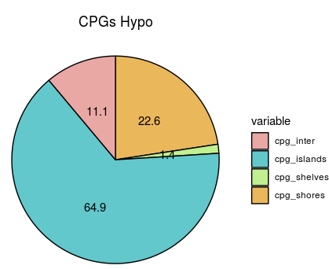
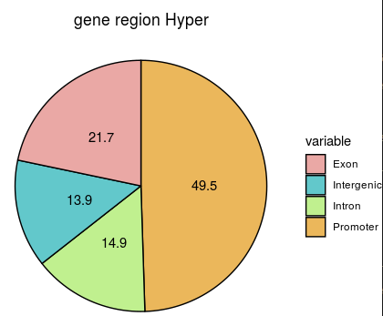
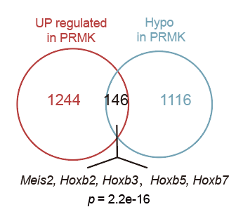
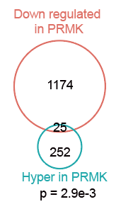
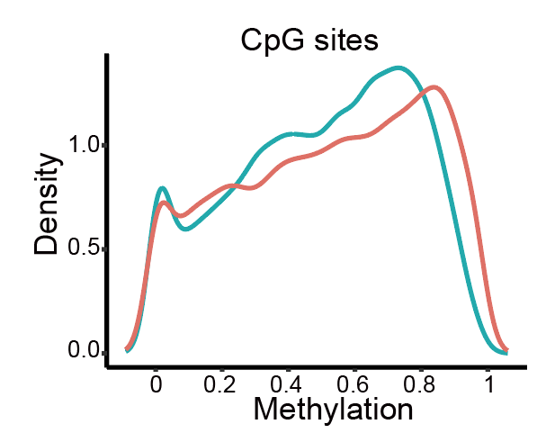
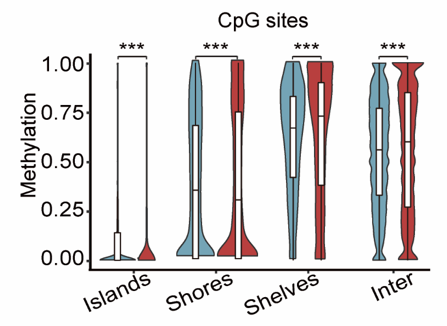

# Bulk WGBS analysis 

In this pipeline, we showed the detail codes of visualization of WGBS-seq data.

~~~R
#DMS
library(methylKit)
library(trqwe)
library(genomation)
library("AnnotationDbi")
library("org.Mm.eg.db")
library(ChIPseeker)
library(GenomicFeatures)
library(clusterProfiler)
library(ReactomePA)
library(TxDb.Mmusculus.UCSC.mm10.knownGene)
txdb<-TxDb.Mmusculus.UCSC.mm10.knownGene
library(bsseq)
library(bsseqData)
require(bsseq)
library(data.table)
library(DSS)
library(ggpubr)
library(cowplot)
library(data.table)
library(scales)
library(BuenColors)
library(ggplot2)
library(matrixStats)
library(annotatr)
file.list=list( c("TRMMLL3_rep1_all.CGmap_2.txt"),c("TRMMLL3_rep2_all.CGmap_2.txt"),c("TRM_rep1_all.CGmap_2.txt"),c("TRM_rep2_all.CGmap_2.txt") )
# read the files to a methylRawList object: myobj
myobj=methRead(file.list,
           sample.id=list("TRMMLL3_1","TRMMLL3_2","TRM_1","TRM_2"),
           assembly="mm10",
           treatment=c(1,1,0,0),
           context="CpG",
           mincov = 1
           )
myobj=filterByCoverage(myobj,lo.count=4,lo.perc=NULL,
                                      hi.count=NULL,hi.perc=NULL)
myobj=unite(myobj,min.per.group=1L)
getCorrelation(myobj,plot=TRUE)
clusterSamples(myobj, dist="correlation", method="ward", plot=TRUE)
hc = clusterSamples(myobj, dist="correlation", method="ward", plot=FALSE)
PCASamples(myobj, screeplot=TRUE)
PCASamples(myobj)
myDiff=calculateDiffMeth(myobj,mc.cores=8)
myDiff20p.hyper=getMethylDiff(myDiff,difference=20,qvalue=0.05,type="hyper")
myDiff20p.hypo=getMethylDiff(myDiff,difference=20,qvalue=0.05,type="hypo")
myDiff20p.hyper <- as.data.frame(myDiff20p.hyper)
myDiff20p.hypo <- as.data.frame(myDiff20p.hypo)
all_DMS <- rbind(myDiff20p.hyper,myDiff20p.hypo)
all_DMS$type <- ifelse(all_DMS$meth.diff >20 ,"Hyper","Hypo")
all_DMS_GR <- as(all_DMS,"GRanges")
b <- annotatePeak(all_DMS_GR, tssRegion=c(-3000, 3000),
                         TxDb=txdb, annoDb="org.Mm.eg.db",verbose=FALSE)
all_DMS_GR_data <- as.data.frame(b)
write.csv(all_DMS_GR_data,file="1_PRMK_vs_PRM_DMS_all.csv")

table(all_DMS_GR_data$type)
haha_data <- data.frame(cluster=c("DMS_hyper","DMS_hypo"),
  ratio=c(7082,13065))
haha_data <- as.data.frame(haha_data)
haha_data$ratio <- as.numeric(as.character(haha_data$ratio))
haha_data$cluster <- factor(haha_data$cluster,levels=c("DMS_hyper","DMS_hypo"))
ggplot(haha_data, aes(x=cluster, y=ratio, fill=cluster)) +
  geom_bar(stat="identity")+theme_classic()
~~~

~~~shell
#DMR
zcat TRMMLL3_rep1_all.CGmap.gz | gawk ' $4 ~ /CG/ ' > TRMMLL3_rep1_all_CG.txt
zcat TRMMLL3_rep2_all.CGmap.gz | gawk ' $4 ~ /CG/ ' > TRMMLL3_rep2_all_CG.txt
zcat TRM_rep1_all.CGmap.gz | gawk ' $4 ~ /CG/ ' > TRM_rep1_all_CG.txt
zcat TRM_rep2_all.CGmap.gz | gawk ' $4 ~ /CG/ ' > TRM_rep2_all_CG.txt
cat TRM*_all_CG.txt | gawk '$8>=4' | cut -f1,3 | sort -u | cgmaptools sort -c 1 -p 2 > ./allCG_index
cgmaptools mergelist tomatrix -i ./allCG_index -f TRMMLL3_rep1_all_CG.txt,TRMMLL3_rep2_all_CG.txt,TRM_rep1_all_CG.txt,TRM_rep2_all_CG.txt -t TRMMLL3_1,TRMMLL3_2,TRM_1,TRM_2 -c 4 -C 200 -o ./all_matrix_CG.txt
metilene --threads 13 -a TRMMLL3 -b TRM all_matrix_CG.txt > 1_result_all_matrix_CG.txt
perl metilene_output.pl -q 1_result_all_matrix_CG.txt -a TRMMLL3 -b TRM
~~~

~~~R
DMR_all <- fread("1_result_all_matrix_CG.txt")
colnames(DMR_all) <- c("chr","start","stop","q_value","mean_difference","CpGs","p_MWU","p_2D_KS","mean_TRMMLL3","mean_TRM")
DMR_filter <- subset(DMR_all,q_value < 0.05)
DMR_filter$type <- ifelse(DMR_filter$mean_difference >0 ,"Hyper","Hypo")
table(DMR_filter$type)
data <- data.frame(ratio=c("16.3","83.7"),variable=c("Hypermethylated","Hypomethylated"))
data$ratio <- as.numeric(as.character(data$ratio))
data <- data %>%
  arrange(desc(variable)) %>%
  mutate(lab.ypos = cumsum(ratio) - 0.5*ratio)
mycols <- c("#EAA8A5", "#62C8CB")
ggplot(data, aes(x = "", y = ratio, fill = variable)) +
  geom_bar(width = 1, stat = "identity", color = "black") +
  coord_polar("y", start = 0)+
  geom_text(aes(y = lab.ypos, label = ratio), color = "black")+
  scale_fill_manual(values = mycols) +
  theme_void()
~~~

~~~R
DMR_filter <- as(DMR_filter,"GRanges")
annots_mm10_cpgs = c('mm10_cpgs')
annots_mm10_cpgs = build_annotations(genome = 'mm10', annotations = annots_mm10_cpgs)
DMR_filter_annots_mm10_cpgs = annotate_regions(
    regions = DMR_filter,
    annotations = annots_mm10_cpgs,
    ignore.strand = TRUE,
    quiet = FALSE)
# A GRanges object is returned
print(DMR_filter_annots_mm10_cpgs)
df_DMR_filter_annots_mm10_cpgs <- as.data.frame(DMR_filter_annots_mm10_cpgs)
write.csv(df_DMR_filter_annots_mm10_cpgs,file="1_PRMK_vs_PRM_DMR_all_cpgs_anno.csv")
df_DMR_filter_annots_mm10_cpgs_hyper <- subset(df_DMR_filter_annots_mm10_cpgs,mean_difference > 0)
df_DMR_filter_annots_mm10_cpgs_hypo <- subset(df_DMR_filter_annots_mm10_cpgs,mean_difference < 0)
table(df_DMR_filter_annots_mm10_cpgs_hyper$annot.type)
table(df_DMR_filter_annots_mm10_cpgs_hypo$annot.type)
round(135/411,4)
round(143/411,4)
round(12/411,4)
round(121/411,4)
round(216/1942,4)
round(1261/1942,4)
round(28/1942,4)
round(437/1942,4)
data <- data.frame(ratio=c("32.9","34.8","2.9","29.4"),variable=c("cpg_inter","cpg_islands","cpg_shelves","cpg_shores"))
data$ratio <- as.numeric(as.character(data$ratio))
data <- data %>%
  arrange(desc(variable)) %>%
  mutate(lab.ypos = cumsum(ratio) - 0.5*ratio)
mycols <- c("#EAA8A5", "#62C8CB", "#c0f08f", "#ebb75b")
ggplot(data, aes(x = "", y = ratio, fill = variable)) +
  geom_bar(width = 1, stat = "identity", color = "black") +
  coord_polar("y", start = 0)+
  geom_text(aes(y = lab.ypos, label = ratio), color = "black")+
  scale_fill_manual(values = mycols) +
  theme_void()+ ggtitle("CPGs Hyper")+ theme(plot.title = element_text(hjust = 0.5))
~~~

~~~R
data <- data.frame(ratio=c("11.1","64.9","1.4","22.6"),variable=c("cpg_inter","cpg_islands","cpg_shelves","cpg_shores"))
data$ratio <- as.numeric(as.character(data$ratio))
data <- data %>%
  arrange(desc(variable)) %>%
  mutate(lab.ypos = cumsum(ratio) - 0.5*ratio)
mycols <- c("#EAA8A5", "#62C8CB", "#c0f08f", "#ebb75b")
ggplot(data, aes(x = "", y = ratio, fill = variable)) +
  geom_bar(width = 1, stat = "identity", color = "black") +
  coord_polar("y", start = 0)+
  geom_text(aes(y = lab.ypos, label = ratio), color = "black")+
  scale_fill_manual(values = mycols) +
  theme_void()+ ggtitle("CPGs Hypo")+ theme(plot.title = element_text(hjust = 0.5))
~~~

~~~R
txdb<-TxDb.Mmusculus.UCSC.mm10.knownGene
b <- annotatePeak(DMR_filter, tssRegion=c(-3000, 3000),
                         TxDb=txdb, annoDb="org.Mm.eg.db",verbose=FALSE)
DMR_filter_gene <- as.data.frame(b)
write.csv(DMR_filter_gene,file="1_PRMK_vs_PRM_DMR_all_gene_anno.csv")
DMR_filter_gene$annotation2 <- gsub(" ","hhhhhh",DMR_filter_gene$annotation)
all_anno_list <- strsplit(DMR_filter_gene$annotation2, split = "hhhhhh")
all_anno_list_filter <- lapply(all_anno_list,function(x){
 aa <- data.frame(anno=x[1])
 return(aa)
 })
all_annofilter <- do.call(rbind,all_anno_list_filter)
DMR_filter_gene$new_anno <- all_annofilter$anno
DMR_filter_gene$new_anno <- gsub("3'","Exon",DMR_filter_gene$new_anno)
DMR_filter_gene$new_anno <- gsub("5'","Exon",DMR_filter_gene$new_anno)
DMR_filter_gene$new_anno <- gsub("Distal","Intergenic",DMR_filter_gene$new_anno)
DMR_filter_gene$new_anno <- gsub("Downstream","Intergenic",DMR_filter_gene$new_anno)
df_DMR_hyper <- subset(DMR_filter_gene,mean_difference > 0)
df_DMR_hypo <- subset(DMR_filter_gene,mean_difference < 0)
table(df_DMR_hyper$new_anno)
table(df_DMR_hypo$new_anno)
round(67/309,4)
round(43/309,4)
round(46/309,4)
round(153/309,4)
round(97/1590,4)
round(79/1590,4)
round(63/1590,4)
round(1351/1590,4)
data <- data.frame(ratio=c("21.7","13.9","14.9","49.5"),variable=c("Exon","Intergenic","Intron","Promoter"))
data$ratio <- as.numeric(as.character(data$ratio))
data <- data %>%
  arrange(desc(variable)) %>%
  mutate(lab.ypos = cumsum(ratio) - 0.5*ratio)
mycols <- c("#EAA8A5", "#62C8CB", "#c0f08f", "#ebb75b")
ggplot(data, aes(x = "", y = ratio, fill = variable)) +
  geom_bar(width = 1, stat = "identity", color = "black") +
  coord_polar("y", start = 0)+
  geom_text(aes(y = lab.ypos, label = ratio), color = "black")+
  scale_fill_manual(values = mycols) +
  theme_void()+ ggtitle("gene region Hyper")+ theme(plot.title = element_text(hjust = 0.5))
~~~

~~~R
data <- data.frame(ratio=c("6.1","4.9","4.0","85.0"),variable=c("Exon","Intergenic","Intron","Promoter"))
data$ratio <- as.numeric(as.character(data$ratio))
data <- data %>%
  arrange(desc(variable)) %>%
  mutate(lab.ypos = cumsum(ratio) - 0.5*ratio)
mycols <- c("#EAA8A5", "#62C8CB", "#c0f08f", "#ebb75b")
ggplot(data, aes(x = "", y = ratio, fill = variable)) +
  geom_bar(width = 1, stat = "identity", color = "black") +
  coord_polar("y", start = 0)+
  geom_text(aes(y = lab.ypos, label = ratio), color = "black")+
  scale_fill_manual(values = mycols) +
  theme_void()+ ggtitle("gene region Hypo")+ theme(plot.title = element_text(hjust = 0.5))
~~~

~~~R
ee	<-as.matrix(df_DMR_hypo$geneId)
	dd <- as.vector(ee)
KEGGdf_DMR_hypo <- enrichKEGG(gene =dd, 
					organism = "mmu", 
					keyType = "ncbi-geneid",
					 pvalueCutoff = 0.05,
				       pAdjustMethod = "BH", 
				       minGSSize = 10, 
				       maxGSSize = 500,
				       qvalueCutoff = 0.2, 
				       use_internal_data = FALSE)
dotplot(KEGGdf_DMR_hypo, showCategory=10)
~~~

~~~R
#Volcanic maps
DMR_all <- fread("1_result_all_matrix_CG.txt")
colnames(DMR_all) <- c("chr","start","stop","q_value","mean_difference","CpGs","p_MWU","p_2D_KS","mean_TRMMLL3","mean_TRM")
DMR_all <- as(DMR_all,"GRanges")
txdb<-TxDb.Mmusculus.UCSC.mm10.knownGene
b <- annotatePeak(DMR_all, tssRegion=c(-3000, 3000),
                         TxDb=txdb, annoDb="org.Mm.eg.db",verbose=FALSE)
b <- as.data.frame(b)
b <- b[,c(6,7,23)]
MA_lot <- na.omit(b)
MA_lot$threshold = as.factor(ifelse(MA_lot$q_value < 0.05 & abs(MA_lot$mean_difference) > 0.1, ifelse(MA_lot$mean_difference < -0.1 ,'Hypomethylated','Hypermethylated'),'NoSignifi'))
range(-log10(MA_lot$q_value))
range(MA_lot$mean_difference)
table(MA_lot$threshold)
MA_lot[which(MA_lot$q_value < 1e-30),'mean_difference'] <- 1e-30
ggplot(data = MA_lot, aes(x = mean_difference, y = -log10(q_value), colour=threshold)) +
geom_point(size=1,alpha=.7) +
geom_vline(xintercept = c(-0.1, 0.1), color = 'grey', size = 0.3) +
geom_hline(yintercept = -log(0.05, 10), color = 'grey', size = 0.3) +
scale_color_manual(values=c("red","blue", "grey"))  + ggtitle("TRMMLL3  vs TRM") + 
theme(plot.title = element_text(hjust = 0.5, face="bold")) + xlim(-1,1)+ylim(0,30)+theme_classic()
~~~

~~~R
#Venn plot
RNA_PRMK_vs_PRM <- read.csv(file="1_RNAseq2_PRMK_VS_PRM_result_DEGs.csv")
RNA_PRMK_up <- subset(RNA_PRMK_vs_PRM,PRMK_VS_PRM_log2FoldChange > 0)
RNA_PRMK_down <- subset(RNA_PRMK_vs_PRM,PRMK_VS_PRM_log2FoldChange < 0)
T<-venn.diagram(list(RNA_PRMK_up=na.omit(as.character(unique(RNA_PRMK_up$symbol))),df_DMR_hypo=na.omit(as.character(unique(df_DMR_hypo$SYMBOL)))),
filename=NULL,
lwd=1,                         #圈线粗度
lty=1,                         #圈线类型
col=c('#0099CC','#FF6666'),    #圈线颜色
fill=c('#0099CC','#FF6666'),   #填充颜色
cat.col=c('#0099CC','#FF6666'),#A和B的颜色
cat.cex = 2.5,                 #A和B的大小
rotation.degree = 45,          #旋转角度
main = "RNA_PRMK_up & DMR_hypo",                  #主标题内容
main.cex = 2,                  #主标题大小
sub = "",        #亚标题内容
sub.cex = 1,                   #亚标题字大小
cex=1.5,                       #里面交集字的大小
alpha = 0.5,                   #透明度
reverse=TRUE)
grid.draw(T)
fit1 <- euler(c("RNA_PRMK_up" = 1244, "DMR_hypo" = 1116,
                "RNA_PRMK_up&DMR_hypo" = 146))
plot(fit1,quantities = TRUE )
enrich_pvalue <- function(N, A, B, k)
{
    m <- A + k
    n <- B + k
    i <- k:min(m,n)

    as.numeric( sum(chooseZ(m,i)*chooseZ(N-m,n-i))/chooseZ(N,n) )
}
enrich_pvalue(24223, 1244, 1116, 146) #2.185462e-16
~~~

~~~R
T<-venn.diagram(list(RNA_PRMK_down=na.omit(as.character(unique(RNA_PRMK_down$symbol))),df_DMR_hyper=na.omit(as.character(unique(df_DMR_hyper$SYMBOL)))),
filename=NULL,
lwd=1,                         #圈线粗度
lty=1,                         #圈线类型
col=c('#0099CC','#FF6666'),    #圈线颜色
fill=c('#0099CC','#FF6666'),   #填充颜色
cat.col=c('#0099CC','#FF6666'),#A和B的颜色
cat.cex = 2.5,                 #A和B的大小
rotation.degree = 45,          #旋转角度
main = "RNA_PRMK_down & DMR_hyper",                  #主标题内容
main.cex = 2,                  #主标题大小
sub = "",        #亚标题内容
sub.cex = 1,                   #亚标题字大小
cex=1.5,                       #里面交集字的大小
alpha = 0.5,                   #透明度
reverse=TRUE)
fit1 <- euler(c("RNA_PRMK_down" = 1174, "DMR_hyper" = 252,
                "RNA_PRMK_down&DMR_hyper" = 25))
plot(fit1,quantities = TRUE )
enrich_pvalue(24223, 1174, 252, 25) #0.002891639
~~~

~~~shell
ViewBS MethOverRegion --region annots_mm10_cpgs_ViewBS.bed \
--sample TRM_all_C.tab.gz,TRM --sample TRMMLL3_all_C.tab.gz,TRMMLL3 \
--prefix cpgs_all_C --context CG
~~~

~~~R
#CpG density
setwd("12_CpG_metilene")
all_CG <- fread(file="all_matrix_CG.txt")
set.seed(123)
all_CG_new <- all_CG[floor(runif(20000, min=1, max=40679131))]
all_CG_new$mean_TRM <- apply(all_CG_new[,c(5:6)],1,mean)
all_CG_new$mean_TRMMLL3 <- apply(all_CG_new[,c(3:4)],1,mean)
data1 <- all_CG_new[,c("chr","pos","mean_TRMMLL3")]
data2 <- all_CG_new[,c("chr","pos","mean_TRM")]
data1 <- na.omit(data1)
data2 <- na.omit(data2)
data1$cluster <- c("TRMMLL3")
data2$cluster <- c("TRM")
colnames(data1)[3] <- c("Meth_ratio")
colnames(data2)[3] <- c("Meth_ratio")
all_data <- rbind(data1,data2)
all_data <- as.data.frame(all_data)
all_data <- na.omit(all_data)
all_data$Meth_ratio <- as.numeric(all_data$Meth_ratio)
ggplot(all_data, aes(x = Meth_ratio)) +
  stat_density(aes(group = cluster, color =cluster),position="identity",geom="line")+ xlim(-0.1,1.1)+theme_classic()
~~~

~~~R
all_CG$end <- all_CG$pos
all_CG <- all_CG[,c(1:2,7,3:6)]
colnames(all_CG)[2] <- c("start")
all_CG <- as(all_CG,"GRanges")
annots_mm10_cpgs = c('mm10_cpgs')
annots_mm10_cpgs = build_annotations(genome = 'mm10', annotations = annots_mm10_cpgs)
all_CG_annots_mm10_cpgs = annotate_regions(
    regions = all_CG,
    annotations = annots_mm10_cpgs,
    ignore.strand = TRUE,
    quiet = FALSE)
print(all_CG_annots_mm10_cpgs)
all_CG_annots_mm10_cpgs = data.frame(all_CG_annots_mm10_cpgs)
all_CG_annots_mm10_cpgs <- all_CG_annots_mm10_cpgs[,c(1:2,6:9,19)]
all_CG_annots_mm10_cpgs$mean_TRMMLL3 <- apply(all_CG_annots_mm10_cpgs[,c(3:4)],1,mean)
all_CG_annots_mm10_cpgs$mean_TRM <- apply(all_CG_annots_mm10_cpgs[,c(5:6)],1,mean)
all_CG_annots_mm10_cpgs_data <- all_CG_annots_mm10_cpgs[,c(7:9)]
all_data1 <- all_CG_annots_mm10_cpgs_data[,c(1:2)]
all_data1$group <- c("TRMMLL3")
all_data2 <- all_CG_annots_mm10_cpgs_data[,c(1,3)]
all_data2$group <- c("TRM")
colnames(all_data1)[2] <- c("B_value")
colnames(all_data2)[2] <- c("B_value")
true_all_data <- rbind(all_data1,all_data2)
true_all_data$group  <- factor(true_all_data$group,levels=c("TRM","TRMMLL3"))
true_all_data$annot.type  <- factor(true_all_data$annot.type,levels=c("mm10_cpg_inter","mm10_cpg_islands","mm10_cpg_shelves","mm10_cpg_shores"))
ggplot(true_all_data, aes(x=annot.type, y=B_value, fill=group)) +
  geom_violin(position=position_dodge(1))
true_all_data$new_group <- paste(true_all_data$group,true_all_data$annot.type)
compare_means(B_value ~ new_group, data = true_all_data)
~~~

~~~R
#C Density
chr10 <- fread(file="all_matrix_chr10.txt")
chr11 <- fread(file="all_matrix_chr11.txt")
chr12 <- fread(file="all_matrix_chr12.txt")
chr13 <- fread(file="all_matrix_chr13.txt")
chr14 <- fread(file="all_matrix_chr14.txt")
chr15 <- fread(file="all_matrix_chr15.txt")
chr16 <- fread(file="all_matrix_chr16.txt")
chr17 <- fread(file="all_matrix_chr17.txt")
chr18 <- fread(file="all_matrix_chr18.txt")
chr19 <- fread(file="all_matrix_chr19.txt")
chr1 <- fread(file="all_matrix_chr1.txt")
chr2 <- fread(file="all_matrix_chr2.txt")
chr3 <- fread(file="all_matrix_chr3.txt")
chr4 <- fread(file="all_matrix_chr4.txt")
chr5 <- fread(file="all_matrix_chr5.txt")
chr6 <- fread(file="all_matrix_chr6.txt")
chr7 <- fread(file="all_matrix_chr7.txt")
chr8 <- fread(file="all_matrix_chr8.txt")
chr9 <- fread(file="all_matrix_chr9.txt")
chrM <- fread(file="all_matrix_chrM.txt")
chrX <- fread(file="all_matrix_chrX.txt")
chrY <- fread(file="all_matrix_chrY.txt")
all_data <- rbind(chr19,chr18)
all_data <- rbind(all_data,chrM)
all_data <- rbind(all_data,chrX)
all_data <- rbind(all_data,chrY)
all_data <- rbind(all_data,chr17)
all_data <- rbind(all_data,chr14)
all_data <- rbind(all_data,chr15)
all_data <- rbind(all_data,chr16)
all_data <- rbind(all_data,chr13)
all_data <- rbind(all_data,chr10)
all_data <- rbind(all_data,chr11)
all_data <- rbind(all_data,chr12)
all_data <- rbind(all_data,chr9)
all_data <- rbind(all_data,chr1)
all_data <- rbind(all_data,chr2)
all_data <- rbind(all_data,chr3)
all_data <- rbind(all_data,chr4)
all_data <- rbind(all_data,chr5)
all_data <- rbind(all_data,chr6)
all_data <- rbind(all_data,chr7)
all_data <- rbind(all_data,chr8)
all_data1 <- all_data
all_data1$sum <- apply(all_data1[,c(3:6)],1,sum)
haha_data2 <- subset(all_data1,sum>0.1)
set.seed(123)
data1 <- haha_data2[floor(runif(100000, min=1, max=269119831)),c("chr","pos","TRMMLL3_1","TRMMLL3_2")]
set.seed(123)
data2 <- haha_data2[floor(runif(100000, min=1, max=269119831)),c("chr","pos","TRM_1","TRM_2")]
data1 <- na.omit(data1)
data2 <- na.omit(data2)
data1$mean_TRMMLL3 <- apply(data1[,c(3:4)],1,mean)
data2$mean_TRM <- apply(data2[,c(3:4)],1,mean)
data1$cluster <- c("TRMMLL3")
data2$cluster <- c("TRM")
colnames(data1)[5] <- c("Meth_ratio")
colnames(data2)[5] <- c("Meth_ratio")
data1 <- data1[,c(1,2,5,6)]
data2 <- data2[,c(1,2,5,6)]
new_data <- rbind(data1,data2)
new_data <- as.data.frame(new_data)
new_data <- na.omit(new_data)
new_data$Meth_ratio <- as.numeric(new_data$Meth_ratio)
ggplot(new_data, aes(x = Meth_ratio)) +
  stat_density(aes(group = cluster, color =cluster),position="identity",geom="line")+ xlim(-0.1,1.1)+theme_classic()
~~~

