scRNA-seq analysis in SCLC with primary samples and metastasis samples

In this pipeline, we showed the detail codes of scRNA-seq analyzing in SCLC with primary samples and metastasis samples, including quality control, dimension reducing, population clustering, differentiation genes expression identifying, trajectory constructing, dynamics expression genes identification and pathways enrichments. To make reproducible results from our code, the raw data and processed data were totally submitted. Besides, we generate Markdowns files to record all steps. 

# Part1. we should load the packages we need for following analysis

~~~R
suppressPackageStartupMessages({
  library(dplyr)
  library(Seurat)
  library(Matrix)
  library(proxy)
  library(gplots)
  library(Rtsne)
  library(densityClust)
  library(irlba)
  library(monocle)
  library(plyr)
  library(DOSE)
  library(clusterProfiler)
  library(topGO)
  library(pathview)
  library(AnnotationDbi)
  library(cowplot)
  library(ggplot2)
  library(velocyto.R)
  library(trqwe)
  library(Rsamtools)
  library(GenomicFeatures)
  library(GenomicAlignments)
  library(BiocParallel)
  library(pheatmap)
  library(RColorBrewer)
  library(PoiClaClu)
  library(org.Mm.eg.db)
  library(org.Hs.eg.db)
  library(DESeq2)
  library(data.table)
  library(stringr)
  library(iTALK)
  library(nichenetr)
  library(tidyr)
})
source("./modified_codes/MyBestFunction_scRNA.R")# modified methods by our effort
library(future)
library(future.apply)
options(future.globals.maxSize = 300 * 1024^3)
plan("multiprocess", workers = 15)
plan()
library(scales)
library(BuenColors)
~~~

# Part2. Load counts data into Seurat workflow

~~~R
# To Load counts with barcode information in Seurat workflow
dir.create("./LL")
setwd("./LL")
left_lung.data <- XY_Read10X("./LL/outs/filtered_feature_bc_matrix")
LL <- CreateSeuratObject(counts = left_lung.data, project = "left_lung", min.cells = 3, min.features = 200)
LL[["percent.mt"]] <- PercentageFeatureSet(LL, pattern = "^mt-")
LL <- subset(LL, subset = nFeature_RNA < 6000 & percent.mt < 10)
LL <- NormalizeData(object = LL)
LL <- FindVariableFeatures(object = LL)
length(x = VariableFeatures(object = LL))
LL <- ScaleData(object = LL, features = rownames(x = LL), vars.to.regress = c("nCount_RNA","percent.mito"))
LL <- RunPCA(object = LL, features = VariableFeatures(object = LL))
LL <- ProjectDim(object = LL)
ElbowPlot(object = LL)
LL <- FindNeighbors(object = LL, dims = 1:15)
LL <- FindClusters(object = LL, resolution = 0.6)
LL <- RunTSNE(object = LL, dims = 1:15)
LL <- RunUMAP(object = LL, dims = 1:15)
saveRDS(LL,"./LL/LL_all_cells.rds")

dir.create("./LT")
setwd("./LT")
liver_tumor.data <- XY_Read10X("./LT/outs/filtered_feature_bc_matrix")
LT <- CreateSeuratObject(counts = liver_tumor.data, project = "liver_tumor", min.cells = 3, min.features = 200)
LT[["percent.mt"]] <- PercentageFeatureSet(LT, pattern = "^mt-")
LT <- subset(LT, subset = nFeature_RNA < 6000 & percent.mt < 10)
LT <- NormalizeData(object = LT)
LT <- FindVariableFeatures(object = LT)
length(x = VariableFeatures(object = LT))
LT <- ScaleData(object = LT, features = rownames(x = LT), vars.to.regress = c("nCount_RNA","percent.mito"))
LT <- RunPCA(object = LT, features = VariableFeatures(object = LT))
LT <- ProjectDim(object = LT)
ElbowPlot(object = LT)
LT <- FindNeighbors(object = LT, dims = 1:15)
LT <- FindClusters(object = LT, resolution = 0.6)
LT <- RunTSNE(object = LT, dims = 1:15)
LT <- RunUMAP(object = LT, dims = 1:15)
saveRDS(LT,"./LT/LT_all_cells.rds")

dir.create("./AN")
setwd("./AN")
Abdominal_lymphomanode.data <- XY_Read10X("./AN/outs/filtered_feature_bc_matrix")
AN <- CreateSeuratObject(counts = Abdominal_lymphomanode.data, project = "Abdominal_lymphomanode", min.cells = 3, min.features = 200)
AN[["percent.mt"]] <- PercentageFeatureSet(AN, pattern = "^mt-")
AN <- subset(AN, subset = nFeature_RNA < 6000 & percent.mt < 10)
AN <- NormalizeData(object = AN)
AN <- FindVariableFeatures(object = AN)
length(x = VariableFeatures(object = AN))
AN <- ScaleData(object = AN, features = rownames(x = AN), vars.to.regress = c("nCount_RNA","percent.mito"))
AN <- RunPCA(object = AN, features = VariableFeatures(object = AN))
AN <- ProjectDim(object = AN)
ElbowPlot(object = AN)
AN <- FindNeighbors(object = AN, dims = 1:15)
AN <- FindClusters(object = AN, resolution = 0.6)
AN <- RunTSNE(object = AN, dims = 1:15)
AN <- RunUMAP(object = AN, dims = 1:15)
saveRDS(AN,"./AN/AN_all_cells.rds")

dir.create("./TN")
setwd("./TN")
Thoracic_lymphomanode.data <- XY_Read10X("./TN/outs/filtered_feature_bc_matrix")
TN <- CreateSeuratObject(counts = Thoracic_lymphomanode.data, project = "Thoracic_lymphomanode", min.cells = 3, min.features = 200)
TN[["percent.mt"]] <- PercentageFeatureSet(TN, pattern = "^mt-")
TN <- subset(TN, subset = nFeature_RNA < 6000 & percent.mt < 10)
TN <- NormalizeData(object = TN)
TN <- FindVariableFeatures(object = TN)
length(x = VariableFeatures(object = TN))
TN <- ScaleData(object = TN, features = rownames(x = TN), vars.to.regress = c("nCount_RNA","percent.mito"))
TN <- RunPCA(object = TN, features = VariableFeatures(object = TN))
TN <- ProjectDim(object = TN)
ElbowPlot(object = TN)
TN <- FindNeighbors(object = TN, dims = 1:15)
TN <- FindClusters(object = TN, resolution = 0.6)
TN <- RunTSNE(object = TN, dims = 1:15)
TN <- RunUMAP(object = TN, dims = 1:15)
saveRDS(TN,"./TN/TN_all_cells.rds")
~~~

# Part3. Mere multiple seurat obj and more analysis 

~~~R
# To Merge multiple seurat obj based on Seurat workflow
LL <- mcreadRDS("./LL/LL_all_cells.rds",mc.cores=20)
LT <- mcreadRDS("./LT/LT_all_cells.rds",mc.cores=20)
AN <- mcreadRDS("./AN/AN_all_cells.rds",mc.cores=20)
TN <- mcreadRDS("./TN/TN_all_cells.rds",mc.cores=20)
LL$group <- "LL"
LT$group <- "LT"
AN$group <- "AN"
TN$group <- "TN"
all_data <- merge(x = LL, y = c(LT,AN,TN))
all_merge <- all_data %>%
    Seurat::NormalizeData(verbose = FALSE) %>%
    FindVariableFeatures(selection.method = "vst", nfeatures = 4000) %>% 
    ScaleData(verbose = TRUE, vars.to.regress = c("nCount_RNA")) %>% 
    RunPCA(pc.genes = all_merge@var.genes, npcs = 30, verbose = FALSE)
all_merge <- ProjectDim(all_merge)
ElbowPlot(object = all_merge)
all_merge <- all_merge %>% 
    RunUMAP(dims = 1:30) %>% 
    RunTSNE(dims = 1:30) %>% 
    FindNeighbors(dims = 1:30) %>% 
    FindClusters(resolution = 0.6) %>% 
    identity()
mcsaveRDS(all_merge,"./merge_all/all_merge_by_nothing.rds")
~~~

# Part4. Mere primary (Left lung) and metastasis sites (liver tumor) samples

~~~R
merge_by_nothing_tumor <- mcreadRDS("/mnt/data/user_data/xiangyu/workshop/scRNA/SCLC/metastasisi/merge_all/all_merge_by_nothing.rds",mc.cores=20)
Idents(merge_by_nothing_tumor) <- merge_by_nothing_tumor$group
Only_LL_LT <- subset(merge_by_nothing_tumor,idents=c("LL","LT"))
library(reticulate)
library(ReductionWrappers)
library(s2a)
Only_LL_LT <- Only_LL_LT %>%
    NormalizeData(verbose = FALSE) %>%
    FindVariableFeatures(selection.method = "vst", nfeatures = 4000) %>% 
#   ScaleData(verbose = TRUE,vars.to.regress = c("nCount_RNA")) %>% 
    ScaleData(verbose = TRUE) %>% 
    RunPCA(pc.genes = Only_LL_LT@var.genes, npcs = 30, verbose = FALSE)
Only_LL_LT <- Only_LL_LT %>% 
    RunUMAP(dims = 1:25) %>% 
    RunTSNE(dims = 1:25) %>% 
    FindNeighbors(dims = 1:25) %>% 
    FindClusters(resolution = c(0.1,0.2,1)) %>%
    DoopenTSNE(reduction_save = "openTSNE",dims_use = 1:25) %>% 
    DoForceAtlas2(reduction_save = "fa2",dims_use = 1:25) %>% 
    DoPHATE(reduction_save = "phate",dims_use = 1:25)

# cluster cell population by PhenoGraph
Only_LL_LT <- DoPhenoGraph(Only_LL_LT,reduction_use = "pca", k = 300,prefix = "PhenoGraph")
table(Only_LL_LT$PhenoGraph300)
Only_LL_LT <- DoPhenoGraph(Only_LL_LT,reduction_use = "pca", k = 400,prefix = "PhenoGraph")
table(Only_LL_LT$PhenoGraph400)
Only_LL_LT <- DoPhenoGraph(Only_LL_LT,reduction_use = "pca", k = 500,prefix = "PhenoGraph")
table(Only_LL_LT$PhenoGraph500)
Only_LL_LT <- DoPhenoGraph(Only_LL_LT,reduction_use = "pca", k = 600,prefix = "PhenoGraph")
table(Only_LL_LT$PhenoGraph600)
Only_LL_LT <- DoPhenoGraph(Only_LL_LT,reduction_use = "pca", k = 700,prefix = "PhenoGraph")
table(Only_LL_LT$PhenoGraph700)
p1 <- DimPlot(object = Only_LL_LT, reduction = "openTSNE",group.by="PhenoGraph400",label=TRUE) +NoLegend()+labs(title="Only_LL_LT_openTSNE")
p2 <- DimPlot(object = Only_LL_LT, reduction = "openTSNE",group.by="PhenoGraph500",label=TRUE) +NoLegend()+labs(title="Only_LL_LT_openTSNE")
p3 <- DimPlot(object = Only_LL_LT, reduction = "openTSNE",group.by="PhenoGraph600",label=TRUE) +NoLegend()+labs(title="Only_LL_LT_openTSNE")
p4 <- DimPlot(object = Only_LL_LT, reduction = "openTSNE",group.by="PhenoGraph300",label=TRUE) +NoLegend()+labs(title="Only_LL_LT_openTSNE")
plot_grid(p1,p2,p3,p4,ncol=4)
mcsaveRDS(Only_LL_LT,"/mnt/data/user_data/xiangyu/workshop/scRNA/SCLC/metastasisi/merge_all/all_merge_by_nothing_Only_LL_LT.rds", mc.cores = 20)
~~~

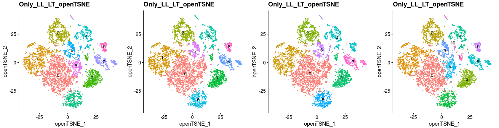

~~~R
# Re-identify each cells cluster by prior molecular signatures
Idents(Only_LL_LT) <- Only_LL_LT$PhenoGraph300
Only_LL_LT_clu_0 <- WhichCells(Only_LL_LT, idents= 0)
Only_LL_LT_clu_1 <- WhichCells(Only_LL_LT, idents= 1)
Only_LL_LT_clu_2 <- WhichCells(Only_LL_LT, idents= 2)
Only_LL_LT_clu_3 <- WhichCells(Only_LL_LT, idents= 3)
Only_LL_LT_clu_4 <- WhichCells(Only_LL_LT, idents= 4)
Only_LL_LT_clu_5 <- WhichCells(Only_LL_LT, idents= 5)
Only_LL_LT_clu_6 <- WhichCells(Only_LL_LT, idents= 6)
Only_LL_LT_clu_7 <- WhichCells(Only_LL_LT, idents= 7)
Only_LL_LT_clu_8 <- WhichCells(Only_LL_LT, idents= 8)
Only_LL_LT_clu_9 <- WhichCells(Only_LL_LT, idents= 9)
Only_LL_LT_clu_10 <- WhichCells(Only_LL_LT, idents= 10)
Only_LL_LT_clu_11 <- WhichCells(Only_LL_LT, idents= 11)
Idents(object = Only_LL_LT,cells = Only_LL_LT_clu_0) <- "SCLC"
Idents(object = Only_LL_LT,cells = Only_LL_LT_clu_1) <- "SCLC"
Idents(object = Only_LL_LT,cells = Only_LL_LT_clu_2) <- "SCLC"
Idents(object = Only_LL_LT,cells = Only_LL_LT_clu_3) <- "B CELL"
Idents(object = Only_LL_LT,cells = Only_LL_LT_clu_4) <- "SCLC"
Idents(object = Only_LL_LT,cells = Only_LL_LT_clu_5) <- "Macrophage"
Idents(object = Only_LL_LT,cells = Only_LL_LT_clu_6) <- "T CELL"
Idents(object = Only_LL_LT,cells = Only_LL_LT_clu_7) <- "SCLC"
Idents(object = Only_LL_LT,cells = Only_LL_LT_clu_8) <- "SCLC"
Idents(object = Only_LL_LT,cells = Only_LL_LT_clu_9) <- "Neutrophil"
Idents(object = Only_LL_LT,cells = Only_LL_LT_clu_10) <- "Fibroblast"
Idents(object = Only_LL_LT,cells = Only_LL_LT_clu_11) <- "B CELL"
Only_LL_LT$Cell_annotation <- Idents(Only_LL_LT)

Idents(Only_LL_LT) <- Only_LL_LT$PhenoGraph300
Only_LL_LT_clu_0 <- WhichCells(Only_LL_LT, idents= 0)
Only_LL_LT_clu_1 <- WhichCells(Only_LL_LT, idents= 1)
Only_LL_LT_clu_2 <- WhichCells(Only_LL_LT, idents= 2)
Only_LL_LT_clu_3 <- WhichCells(Only_LL_LT, idents= 3)
Only_LL_LT_clu_4 <- WhichCells(Only_LL_LT, idents= 4)
Only_LL_LT_clu_5 <- WhichCells(Only_LL_LT, idents= 5)
Only_LL_LT_clu_6 <- WhichCells(Only_LL_LT, idents= 6)
Only_LL_LT_clu_7 <- WhichCells(Only_LL_LT, idents= 7)
Only_LL_LT_clu_8 <- WhichCells(Only_LL_LT, idents= 8)
Only_LL_LT_clu_9 <- WhichCells(Only_LL_LT, idents= 9)
Only_LL_LT_clu_10 <- WhichCells(Only_LL_LT, idents= 10)
Only_LL_LT_clu_11 <- WhichCells(Only_LL_LT, idents= 11)
Idents(object = Only_LL_LT,cells = Only_LL_LT_clu_0) <- "Ascl1_SCLC"
Idents(object = Only_LL_LT,cells = Only_LL_LT_clu_1) <- "Ascl1_SCLC"
Idents(object = Only_LL_LT,cells = Only_LL_LT_clu_2) <- "Neurod1_SCLC"
Idents(object = Only_LL_LT,cells = Only_LL_LT_clu_3) <- "B CELL"
Idents(object = Only_LL_LT,cells = Only_LL_LT_clu_4) <- "Ascl1_SCLC"
Idents(object = Only_LL_LT,cells = Only_LL_LT_clu_5) <- "Macrophage"
Idents(object = Only_LL_LT,cells = Only_LL_LT_clu_6) <- "T CELL"
Idents(object = Only_LL_LT,cells = Only_LL_LT_clu_7) <- "Ascl1_SCLC"
Idents(object = Only_LL_LT,cells = Only_LL_LT_clu_8) <- "Neurod1_SCLC"
Idents(object = Only_LL_LT,cells = Only_LL_LT_clu_9) <- "Neutrophil"
Idents(object = Only_LL_LT,cells = Only_LL_LT_clu_10) <- "Fibroblast"
Idents(object = Only_LL_LT,cells = Only_LL_LT_clu_11) <- "B CELL"
Only_LL_LT$v2_Cell_annotation <- Idents(Only_LL_LT)
mcsaveRDS(Only_LL_LT,"/mnt/data/user_data/xiangyu/workshop/scRNA/SCLC/metastasisi/merge_all/all_merge_by_nothing_Only_LL_LT.rds", mc.cores = 20)
~~~

~~~R
Only_LL_LT <- mcreadRDS("/mnt/data/user_data/xiangyu/workshop/scRNA/SCLC/metastasisi/merge_all/all_merge_by_nothing_Only_LL_LT.rds", mc.cores = 20)
sel_colors <- c("#F2673A","#318bc8","#C878B2","#72C8F1","#359945","#4AC2C5","#4858A7")
names_clu <- c("Ascl1_SCLC", "Neurod1_SCLC", "T CELL", "B CELL", "Macrophage",  "Neutrophil", "Fibroblast")
col <- sel_colors
names(col) <- names_clu
col <- c(col,"#d7d7d7")
names(col)[length(col)] <- "OTS"
aa <- XY_DimPlot(Only_LL_LT, reduction = 'openTSNE', label = FALSE,repel=TRUE, pt.size = .5,group.by="v2_Cell_annotation",cols=col[levels(Only_LL_LT$v2_Cell_annotation)]) + labs(title="LL & LT")
ggsave("/mnt/data/user_data/xiangyu/workshop/scRNA/SCLC/metastasisi/merge_all/Figure_making/v2_SCLC_map.png", plot=aa,width = 8, height = 6,dpi=1080)
~~~

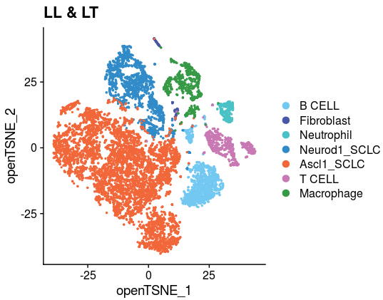

~~~R
# To check the batch effect on open t-SNE map
llibrary(scales)
sel_colors <- c("#F2673A","#318bc8","#C878B2","#72C8F1","#359945","#4AC2C5","#4858A7")
names_clu <- c("Ascl1_SCLC", "Neurod1_SCLC", "T CELL", "B CELL", "Macrophage",  "Neutrophil", "Fibroblast")
col <- sel_colors
names(col) <- names_clu
col <- c(col,"#d7d7d7")
names(col)[length(col)] <- "OTS"
Only_LL_LT$new_anno5 <- Only_LL_LT$v2_Cell_annotation
Only_LL_LT$new_anno5 <- as.character(Only_LL_LT$new_anno5)
Only_LL_LT$new_anno5[which(Only_LL_LT$group!="LL")] <- "OTS"
Only_LL_LT$new_anno5 <- factor(Only_LL_LT$new_anno5,levels=c("OTS","Ascl1_SCLC", "Neurod1_SCLC", "T CELL", "B CELL", "Macrophage",  "Neutrophil", "Fibroblast"))
p1 <- XY_DimPlot(Only_LL_LT, reduction = 'openTSNE', label = FALSE,repel=TRUE, pt.size = .1,group.by="new_anno5",cols=col[levels(Only_LL_LT$new_anno5)]) + labs(title="LL")
Only_LL_LT$new_anno5 <- Only_LL_LT$v2_Cell_annotation
Only_LL_LT$new_anno5 <- as.character(Only_LL_LT$new_anno5)
Only_LL_LT$new_anno5[which(Only_LL_LT$group!="LT")] <- "OTS"
Only_LL_LT$new_anno5 <- factor(Only_LL_LT$new_anno5,levels=c("OTS","Ascl1_SCLC", "Neurod1_SCLC", "T CELL", "B CELL", "Macrophage",  "Neutrophil", "Fibroblast"))
p2 <- XY_DimPlot(Only_LL_LT, reduction = 'openTSNE', label = FALSE,repel=TRUE, pt.size = .1,group.by="new_anno5",cols=col[levels(Only_LL_LT$new_anno5)]) + labs(title="LT")
a <- plot_grid(p1,p2,nrow=1)
ggsave("/mnt/data/user_data/xiangyu/workshop/scRNA/SCLC/metastasisi/merge_all/Figure_making/v2_batch_effect_all_cells.png", plot=a,width = 11, height = 4,dpi=1080)
~~~

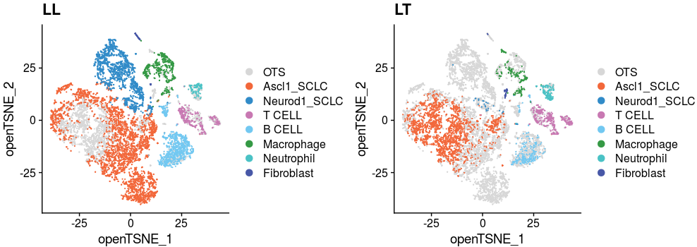

~~~R
library(scales)
sel_colors <- c("#F2673A", "#C878B2","#72C8F1","#359945","#4AC2C5","#4858A7")
names_clu <- c("SCLC",  "T CELL", "B CELL", "Macrophage",  "Neutrophil", "Fibroblast")
col <- sel_colors
names(col) <- names_clu
col <- c(col,"#d7d7d7")
names(col)[length(col)] <- "OTS"
Only_LL_LT$new_anno5 <- Only_LL_LT$Cell_annotation
Only_LL_LT$new_anno5 <- as.character(Only_LL_LT$new_anno5)
Only_LL_LT$new_anno5[which(Only_LL_LT$group!="LL")] <- "OTS"
Only_LL_LT$new_anno5 <- factor(Only_LL_LT$new_anno5,levels=c("OTS","SCLC", "T CELL", "B CELL", "Macrophage",  "Neutrophil", "Fibroblast"))
p1 <- XY_DimPlot(Only_LL_LT, reduction = 'openTSNE', label = FALSE,repel=TRUE, pt.size = .1,group.by="new_anno5",cols=col[levels(Only_LL_LT$new_anno5)]) + labs(title="LL")
Only_LL_LT$new_anno5 <- Only_LL_LT$Cell_annotation
Only_LL_LT$new_anno5 <- as.character(Only_LL_LT$new_anno5)
Only_LL_LT$new_anno5[which(Only_LL_LT$group!="LT")] <- "OTS"
Only_LL_LT$new_anno5 <- factor(Only_LL_LT$new_anno5,levels=c("OTS","SCLC", "T CELL", "B CELL", "Macrophage",  "Neutrophil", "Fibroblast"))
p2 <- XY_DimPlot(Only_LL_LT, reduction = 'openTSNE', label = FALSE,repel=TRUE, pt.size = .1,group.by="new_anno5",cols=col[levels(Only_LL_LT$new_anno5)]) + labs(title="LT")
a <- plot_grid(p1,p2,nrow=1)
ggsave("/mnt/data/user_data/xiangyu/workshop/scRNA/SCLC/metastasisi/merge_all/Figure_making/v3_batch_effect_all_cells.png", plot=a,width = 11, height = 4,dpi=1080)

~~~

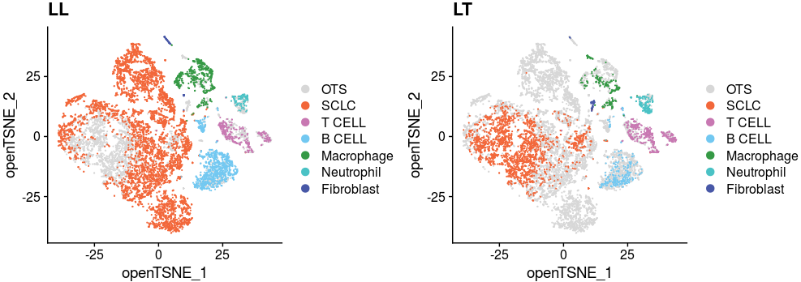

~~~R
# Display signatures genes in each cells subtypes
Only_LL_LT <- mcreadRDS("/mnt/data/user_data/xiangyu/workshop/scRNA/SCLC/metastasisi/merge_all/all_merge_by_nothing_Only_LL_LT.rds", mc.cores = 20)
Idents(Only_LL_LT) <- Only_LL_LT$Cell_annotation
Only_LL_LT.markers <- FindAllMarkers(object = Only_LL_LT, only.pos = TRUE, min.pct = 0.1,thresh.use = 0.1)
mcsaveRDS(Only_LL_LT.markers,"/mnt/data/user_data/xiangyu/workshop/scRNA/SCLC/metastasisi/merge_all/Only_LL_LT.markers.rds")

Only_LL_LT.markers <- mcreadRDS("/mnt/data/user_data/xiangyu/workshop/scRNA/SCLC/metastasisi/merge_all/Only_LL_LT.markers.rds")
Sel_Markers1 <- XY_subset(subset(Only_LL_LT.markers,cluster=="SCLC"),"gene",c("Ascl1","Chga","Ddc","Nfib"))
Sel_Markers2 <- XY_subset(subset(Only_LL_LT.markers,cluster=="B CELL"),"gene",c("Cd79a","Cd74","Cd79b","Mzb1"))
Sel_Markers3 <- XY_subset(subset(Only_LL_LT.markers,cluster=="Macrophage"),"gene",c("Cd14","Cd68","Fcgr3","Fcgr1"))
Sel_Markers4 <- XY_subset(subset(Only_LL_LT.markers,cluster=="T CELL"),"gene",c("Cd3d","Cd3g","Cd28","Cd3e"))
Sel_Markers5 <- XY_subset(subset(Only_LL_LT.markers,cluster=="Fibroblast"),"gene",c("Col3a1","Cd81","Vim","Sparc"))
Sel_Markers6 <- XY_subset(subset(Only_LL_LT.markers,cluster=="Neutrophil"),"gene",c("S100a8","S100a9","Cebpb","Csf3r"))
Sel_Markers1 <- Sel_Markers1[order(Sel_Markers1$avg_logFC,decreasing=TRUE),]
Sel_Markers2 <- Sel_Markers2[order(Sel_Markers2$avg_logFC,decreasing=TRUE),]
Sel_Markers3 <- Sel_Markers3[order(Sel_Markers3$avg_logFC,decreasing=TRUE),]
Sel_Markers4 <- Sel_Markers4[order(Sel_Markers4$avg_logFC,decreasing=TRUE),]
Sel_Markers5 <- Sel_Markers5[order(Sel_Markers5$avg_logFC,decreasing=TRUE),]
Sel_Markers6 <- Sel_Markers6[order(Sel_Markers6$avg_logFC,decreasing=TRUE),]
Sel_Markers <- do.call(rbind,list(Sel_Markers4,Sel_Markers1,Sel_Markers6,Sel_Markers3,Sel_Markers5,Sel_Markers2))
Only_LL_LT$Cell_annotation <- factor(Only_LL_LT$Cell_annotation,levels=c("T CELL", "SCLC", "Neutrophil", "Macrophage", "Fibroblast", "B CELL"))
Idents(Only_LL_LT) <- Only_LL_LT$Cell_annotation
DotPlot(Only_LL_LT, features = Sel_Markers$gene,group.by="Cell_annotation",cols=c("#ffffff", "#B30000"),scale = TRUE,col.min = 0,col.max = 5) + 
RotatedAxis()
~~~

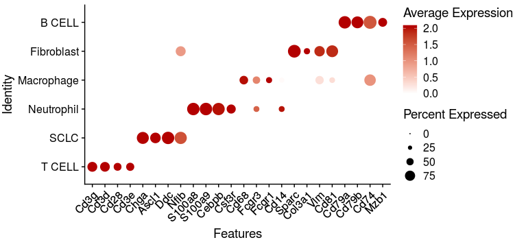

~~~R
aa <- as.data.frame(table(Only_LL_LT$group,Only_LL_LT$v2_Cell_annotation))
aa$Var2 <- factor(aa$Var2,levels=c("Ascl1_SCLC", "Neurod1_SCLC", "T CELL", "B CELL", "Macrophage",  "Neutrophil", "Fibroblast"))
aa <- aa[order(aa$Var2),]
aa$Var1 <- as.character(aa$Var1)
aa_all <- c()
for (i in unique(aa$Var1)){
  group_sel <- subset(aa,Var1==i)
  group_sel$sum_number <- sum(group_sel$Freq)
  group_sel$normal_ratio <- (group_sel$Freq/sum(group_sel$sum_number))*100
  group_sel$normal_ratio <- round(group_sel$normal_ratio,2)
  aa_all <- rbind(aa_all,group_sel)
}
library(ggalluvial)
aa_all$Var1 <- factor(aa_all$Var1,levels=c("LL","LT"))
aa_all <- aa_all[order(aa_all$Var1),]
p2 <- ggplot(aa_all, aes(x = Var1, y = normal_ratio, fill = Var2, 
    stratum = Var2, alluvium = Var2)) +
geom_stratum() +  #代替 geom_col() 绘制堆叠柱形图
geom_flow(alpha = 0.5) +  #绘制同类别之间的连接线
theme_classic() +
labs(x = '', y = 'Relative Abundance(%)',title="LL -> LT")
ggsave("/mnt/data/user_data/xiangyu/workshop/scRNA/SCLC/metastasisi/merge_all/Figure_making/v2_percentage_summary.svg", plot=p2,width = 6, height = 4,dpi=1080)
~~~

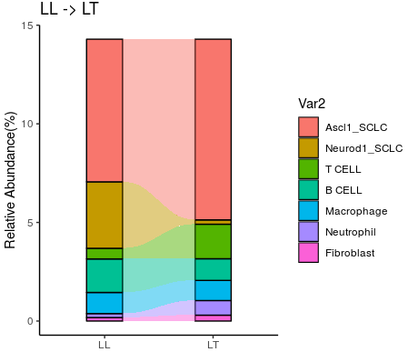

# Part4. Extract the Ascl1+ SCLC populations to re-analysis followed by Seurat workflow

~~~R
# Extract the Ascl1+ SCLC populations to re-analysis
Only_LL_LT <- mcreadRDS("/mnt/data/user_data/xiangyu/workshop/scRNA/SCLC/metastasisi/merge_all/all_merge_by_nothing_Only_LL_LT.rds", mc.cores = 20)
Idents(Only_LL_LT) <- Only_LL_LT$v2_Cell_annotation
ASCL1_Lineage <- subset(Only_LL_LT,idents="Ascl1_SCLC")
sel_colors <- c("#F2673A","#C878B2","#72C8F1","#359945","#4AC2C5","#4858A7")
names_clu <- c("SCLC", "T CELL", "B CELL", "Macrophage",  "Neutrophil", "Fibroblast")
col <- sel_colors
names(col) <- names_clu
col <- c(col,"#efefef")
names(col)[length(col)] <- "OTS"
XY_DimPlot(ASCL1_Lineage, reduction = 'openTSNE', label = FALSE,repel=TRUE, pt.size = .5,group.by="Cell_annotation",cols=col[levels(Only_LL_LT$Cell_annotation)]) + labs(title="LL & LT")

library(reticulate)
library(ReductionWrappers)
library(s2a)
ASCL1_Lineage1 <- ASCL1_Lineage %>%
    NormalizeData(verbose = FALSE) %>%
    FindVariableFeatures(selection.method = "vst", nfeatures = 4000) %>% 
#   ScaleData(verbose = TRUE,vars.to.regress = c("nCount_RNA")) %>% 
    ScaleData(verbose = TRUE) %>% 
    RunPCA(pc.genes = ASCL1_Lineage1@var.genes, npcs = 30, verbose = FALSE)
ASCL1_Lineage1 <- ASCL1_Lineage1 %>% 
    RunUMAP(dims = 1:20) %>% 
    RunTSNE(dims = 1:20) %>% 
    FindNeighbors(dims = 1:20) %>% 
    FindClusters(resolution = c(0.1,0.2,1)) %>%
    DoopenTSNE(reduction_save = "openTSNE",dims_use = 1:20) %>% 
    DoForceAtlas2(reduction_save = "fa2",dims_use = 1:20) %>% 
    DoPHATE(reduction_save = "phate",dims_use = 1:20)
ASCL1_Lineage1 <- XY_RunURD_DM(ASCL1_Lineage1,assay = "RNA",key = "URDDM",sigma=20,visua_group="group")
ASCL1_Lineage1 <- DoPhenoGraph(ASCL1_Lineage1,reduction_use = "pca", k = 800,prefix = "PhenoGraph")
table(ASCL1_Lineage1$PhenoGraph300)
ASCL1_Lineage1 <- DoPhenoGraph(ASCL1_Lineage1,reduction_use = "pca", k = 900,prefix = "PhenoGraph")
table(ASCL1_Lineage1$PhenoGraph400)
ASCL1_Lineage1 <- DoPhenoGraph(ASCL1_Lineage1,reduction_use = "pca", k = 1000,prefix = "PhenoGraph")
table(ASCL1_Lineage1$PhenoGraph500)
ASCL1_Lineage1 <- DoPhenoGraph(ASCL1_Lineage1,reduction_use = "pca", k = 1200,prefix = "PhenoGraph")
table(ASCL1_Lineage1$PhenoGraph600)
ASCL1_Lineage1 <- DoPhenoGraph(ASCL1_Lineage1,reduction_use = "pca", k = 1400,prefix = "PhenoGraph")
table(ASCL1_Lineage1$PhenoGraph700)
p1 <- DimPlot(object = ASCL1_Lineage1, reduction = "tsne",group.by="PhenoGraph1400",label=TRUE) +NoLegend()+labs(title="20_tsne")
p2 <- DimPlot(object = ASCL1_Lineage1, reduction = "fa2",group.by="PhenoGraph1400",label=TRUE) +NoLegend()+labs(title="20_fa2")
p3 <- DimPlot(object = ASCL1_Lineage1, reduction = "openTSNE",group.by="PhenoGraph1400",label=TRUE) +NoLegend()+labs(title="20_openTSNE")
p4 <- DimPlot(object = ASCL1_Lineage1, reduction = "phate",group.by="PhenoGraph1400",label=TRUE) +NoLegend()+labs(title="20_phate")
p5 <- DimPlot(object = ASCL1_Lineage1, reduction = "urd",group.by="PhenoGraph1400",label=TRUE) +NoLegend()+labs(title="20_urd")
p6 <- DimPlot(object = ASCL1_Lineage1, reduction = "umap",group.by="PhenoGraph1400",label=TRUE) +NoLegend()+labs(title="20_umap")
plot_grid(p1,p2,p3,p4,p5,p6,ncol=3)
mcsaveRDS(ASCL1_Lineage1,"/mnt/data/user_data/xiangyu/workshop/scRNA/SCLC/metastasisi/merge_all/ASCL1_Lineage1_sigma_20.rds", mc.cores = 20)
~~~

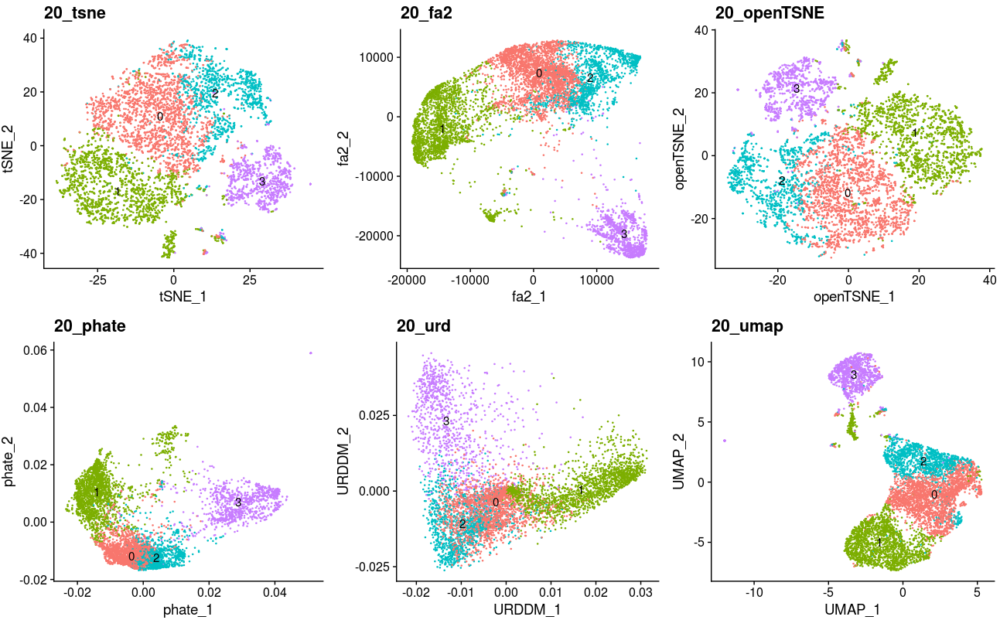

~~~R
# Then, we need to filter some mixed-status cells that we cannot explain on biology knowledge. And also, we hope future bioinformatics could help us figure them out that explore what’s these cells , what’s their function and why they are here.
ASCL1_Lineage <- mcreadRDS("/mnt/data/user_data/xiangyu/workshop/scRNA/SCLC/metastasisi/merge_all/ASCL1_Lineage1_sigma_20.rds",mc.cores=20)
ASCL1_Lineage <- FindClusters(ASCL1_Lineage, resolution = c(0.1))
filter_cells <- rownames(subset(ASCL1_Lineage@meta.data,RNA_snn_res.0.1!=1 & PhenoGraph1400==1))
ASCL1_Lineage_REMIND <- subset(ASCL1_Lineage,cells=setdiff(colnames(ASCL1_Lineage),filter_cells))
mcsaveRDS(ASCL1_Lineage_REMIND,"/mnt/data/user_data/xiangyu/workshop/scRNA/SCLC/metastasisi/merge_all/ASCL1_Lineage1_sigma_20_remind.rds",mc.cores=20)

ASCL1_Lineage_REMIND <- mcreadRDS("/mnt/data/user_data/xiangyu/workshop/scRNA/SCLC/metastasisi/merge_all/ASCL1_Lineage1_sigma_20_remind.rds",mc.cores=20)
ASCL1_Lineage_REMIND$PhenoGraph1400 <- as.character(ASCL1_Lineage_REMIND$PhenoGraph1400)
ASCL1_Lineage_REMIND$new_clu <- as.character(ASCL1_Lineage_REMIND$PhenoGraph1400)
ASCL1_Lineage_REMIND$new_clu <- gsub("0","2",ASCL1_Lineage_REMIND$new_clu)
ASCL1_Lineage_REMIND$new_clu <- as.factor(ASCL1_Lineage_REMIND$new_clu)
DimPlot(object = ASCL1_Lineage_REMIND, reduction = "urd",group.by="new_clu",label=TRUE) +NoLegend()+labs(title="ASCL1_Lineage_REMIND_urd")
~~~

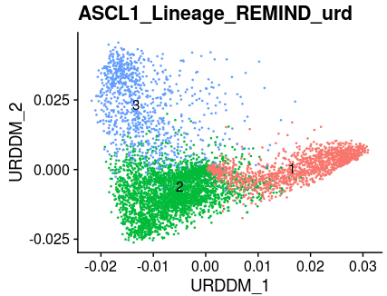

~~~R
# To check the batch effect on URD map
DimPlot(object = ASCL1_Lineage_REMIND, reduction = "urd",group.by="new_clu",label=TRUE,split.by="group") +NoLegend()+labs(title="ASCL1_Lineage_REMIND_urd")
~~~

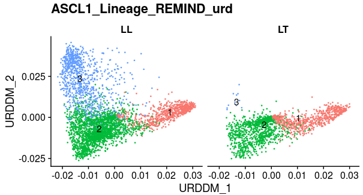

~~~R
# Calculate the metastasis SCLC patients sigantrues scores in each single cell
CCLE_RNAseq_reads_count_normalised <- readRDS("/mnt/data/user_data/xiangyu/workshop/DATABASE/CCLE/CCLE_RNAseq_reads_count_normalised.rds")
library(org.Hs.eg.db)
library(AnnotationDbi)
CCLE_RNAseq_reads_count_normalised$SYMBOL <- mapIds(x = org.Hs.eg.db,
                        keys = as.character(rownames(CCLE_RNAseq_reads_count_normalised)),
            keytype ="ENSEMBL",
            column ="SYMBOL",
            multiVals="first")
CCLE_RNAseq_reads_count_normalised <- na.omit(CCLE_RNAseq_reads_count_normalised)
CCLE_RNAseq_reads_count_normalised <- CCLE_RNAseq_reads_count_normalised[!duplicated(CCLE_RNAseq_reads_count_normalised$SYMBOL),]
rownames(CCLE_RNAseq_reads_count_normalised) <- CCLE_RNAseq_reads_count_normalised$SYMBOL
CCLE_RNAseq_reads_count_normalised <- CCLE_RNAseq_reads_count_normalised[,-ncol(CCLE_RNAseq_reads_count_normalised)]
sample_info <- fread("/mnt/data/user_data/xiangyu/workshop/DATABASE/CCLE/sample_info.csv")
sample_info <- as.data.frame(sample_info)
rownames(sample_info) <- sample_info$DepMap_ID
sample_info_SCLC <- subset(sample_info,lineage_subtype=="SCLC")
rownames(sample_info_SCLC) <- gsub("-",".",rownames(sample_info_SCLC))
both_id <- intersect(rownames(sample_info_SCLC),colnames(CCLE_RNAseq_reads_count_normalised))
sample_info_SCLC <- sample_info_SCLC[both_id,]
CCLE_RNAseq_reads_count_normalised <- CCLE_RNAseq_reads_count_normalised[,both_id]

Metastasis <- CCLE_RNAseq_reads_count_normalised[,colnames(CCLE_RNAseq_reads_count_normalised) %in% rownames(subset(sample_info_SCLC,primary_or_metastasis=="Metastasis"))]
Primary <- CCLE_RNAseq_reads_count_normalised[,colnames(CCLE_RNAseq_reads_count_normalised) %in% rownames(subset(sample_info_SCLC,primary_or_metastasis=="Primary"))]
logFC <- log2((rowMeans(Metastasis)+1) / (rowMeans(Primary)+1))
p_values <- future_lapply(seq(1,nrow(Metastasis)), function(x){
  res <- t.test(x = t(Metastasis[x,])[,1], y = t(Primary[x,])[,1])
  res$p.value
})
p <- unlist(p_values)
p.adj <- p.adjust(p, method = "fdr")
genelist <- as.data.frame(logFC)
genelist$p_values <- p
genelist$p_adj <- p.adj
genelist$SYMBOL <- rownames(genelist)
library(iTALK)
library(nichenetr)
library(tidyr)
genelist <- genelist %>% mutate(from = convert_human_to_mouse_symbols(SYMBOL)) %>% drop_na()
genelist_meta <- subset(genelist,logFC>0 & p_values < 0.05)
Metastasis_UP <- subset(genelist_meta, logFC > 0.2)
write.csv(Metastasis_UP,"/mnt/data/user_data/xiangyu/workshop/scRNA/SCLC/metastasisi/merge_all/CCLE_Metastasis_UP_genes.csv")
Lineage_marker <- as.character(Metastasis_UP$from)
Lineage_marker <- intersect(rownames(GetAssayData(object = ASCL1_Lineage_REMIND, slot = "data")),Lineage_marker)
speci_raw <- FetchData(object = ASCL1_Lineage_REMIND, vars = Lineage_marker,slot="data")
ASCL1_Lineage_REMIND[["CCLE_Metastasis_UP"]] <- (rowSums(speci_raw))/length(Lineage_marker)
p1 <- XY_FeaturePlot(object = ASCL1_Lineage_REMIND, features = c("CCLE_Metastasis_UP"),pt.size=.5,ncol=2,reduction="urd",label=FALSE,
    cols = jdb_palette("solar_flare", 50, type = c("continuous"))) + labs(title="CCLE_Metastasis_UP")
SCLC_META_VS_PRIM.markers <- mcreadRDS("/mnt/data/user_data/xiangyu/workshop/DATABASE/SCLC_Patient_data/SCLC_CTC/SCrna/CTX_Metastasis_UP.rds",mc.cores=20)
library(iTALK)
library(nichenetr)
library(tidyr)
SCLC_META_VS_PRIM.markers <- SCLC_META_VS_PRIM.markers %>% mutate(from = convert_human_to_mouse_symbols(gene)) %>% drop_na()
Metastasis_UP <- subset(SCLC_META_VS_PRIM.markers,cluster=="metastasis" & p_val_adj < 0.05 & pct.2 < 0.6 & avg_logFC > 0.15)
write.csv(Metastasis_UP,"/mnt/data/user_data/xiangyu/workshop/scRNA/SCLC/metastasisi/merge_all/CDX_Metastasis_UP_genes.csv")
Lineage_marker <- Metastasis_UP$from
Lineage_marker <- intersect(rownames(GetAssayData(object = ASCL1_Lineage_REMIND, slot = "data")),Lineage_marker)
length(Lineage_marker)
speci_raw <- FetchData(object = ASCL1_Lineage_REMIND, vars = Lineage_marker,slot="data")
ASCL1_Lineage_REMIND[["CDX_Metastasis_UP"]] <- (rowSums(speci_raw))/length(Lineage_marker)
p2 <-  XY_FeaturePlot(object = ASCL1_Lineage_REMIND, features = c("CTX_Metastasis_UP"),pt.size=.5,ncol=2,reduction="urd",label=FALSE,
    cols = jdb_palette("solar_flare", 50, type = c("continuous"))) + labs(title="CTX_Metastasis_UP")
plot_grid(p1,p2)
mcsaveRDS(ASCL1_Lineage_REMIND,"/mnt/data/user_data/xiangyu/workshop/scRNA/SCLC/metastasisi/merge_all/ASCL1_Lineage1_sigma_20_remind.rds", mc.cores = 20)

~~~

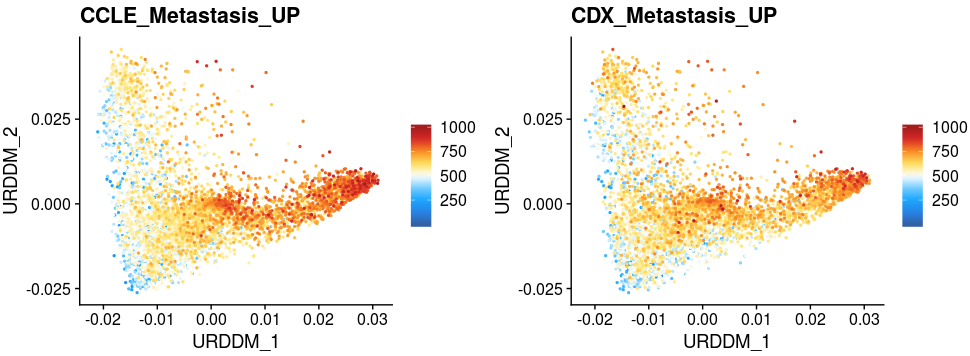

~~~R
# We want to use our signatures to predict the stage of SCLC patients
ALL_merge_data_sub.markers <- mcreadRDS("/mnt/data/user_data/xiangyu/workshop/scRNA/SCLC/metastasisi/merge_all/ASCL1_Lineage1_sigma_20_remind_Metastasis_vs_primary.rds")
ALL_merge_data_sub.markers1 <- subset(ALL_merge_data_sub.markers,p_val_adj < 0.05 & pct.2 < 0.5)
table(ALL_merge_data_sub.markers1$cluster)
pri <- subset(ALL_merge_data_sub.markers1,cluster=="LL_Metastasis")
met <- subset(ALL_merge_data_sub.markers1,cluster=="Metastasis")
library(iTALK)
library(nichenetr)
library(tidyr)
pri = pri %>% mutate(from = convert_mouse_to_human_symbols(gene)) %>% drop_na()
met = met %>% mutate(from = convert_mouse_to_human_symbols(gene)) %>% drop_na()

library("survival")
library("survminer")
SCLC_Nature_RNA <- fread("/mnt/data/user_data/xiangyu/workshop/DATABASE/SCLC_Patient_data/SCLC_Nature_RNA.csv")
SCLC_Nature_RNA <- as.data.frame(SCLC_Nature_RNA)
SCLC_Nature_RNA <- SCLC_Nature_RNA[!duplicated(SCLC_Nature_RNA$gene),]
rownames(SCLC_Nature_RNA) <- SCLC_Nature_RNA$gene
SCLC_Nature_RNA <- SCLC_Nature_RNA[,c(-1,-2)]
SCLC_Nature_Clinical <- fread("/mnt/data/user_data/xiangyu/workshop/DATABASE/SCLC_Patient_data/SCLC_Nature_Clinical.csv")
SCLC_Nature_Clinical <- as.data.frame(SCLC_Nature_Clinical)
rownames(SCLC_Nature_Clinical) <- SCLC_Nature_Clinical$'Sample-ID'
both_id <- intersect(colnames(SCLC_Nature_RNA),rownames(SCLC_Nature_Clinical))
SCLC_Nature_Clinical_SEL <- SCLC_Nature_Clinical[both_id,]
table(SCLC_Nature_Clinical_SEL$'primary tumor/metastasis')
colnames(SCLC_Nature_Clinical_SEL)[21] <- "primary_tumor_metastasis"
SCLC_Nature_RNA <- log(SCLC_Nature_RNA+1,2)
SCLC_Nature_RNA <- as.data.frame(t(SCLC_Nature_RNA))
sel_gene_SCLC_Nature_RNA <- data.frame(pri=as.character(apply(SCLC_Nature_RNA[,intersect(colnames(SCLC_Nature_RNA),unique(pri$from))],1,mean)),
met=as.character(apply(SCLC_Nature_RNA[,intersect(colnames(SCLC_Nature_RNA),unique(met$from))],1,mean)),
row.names=rownames(SCLC_Nature_RNA))
sel_gene_SCLC_Nature_RNA$pri <- as.numeric(as.character(sel_gene_SCLC_Nature_RNA$pri))
sel_gene_SCLC_Nature_RNA$met <- as.numeric(as.character(sel_gene_SCLC_Nature_RNA$met))
library("survival")
library("survminer")
SCLC_Nature_Clinical_SEL1 <- SCLC_Nature_Clinical_SEL[,c("overall_survival (months)","Status (at time of last follow-up)")]
colnames(SCLC_Nature_Clinical_SEL1) <- c("dead_date","status")
all_case_and_info <- cbind(sel_gene_SCLC_Nature_RNA,SCLC_Nature_Clinical_SEL1[,c("dead_date","status")])
all_case_and_info <- na.omit(all_case_and_info)
case_info_ALL <- all_case_and_info
case_info_ALL <- case_info_ALL[order(case_info_ALL$dead_date,decreasing=T),]
event <- gsub("alive",0,case_info_ALL$status)
event <- gsub("dead",1,event)
case_info_ALL$event <- as.numeric(event)

case_info_ALL.cut <- surv_cutpoint(
   case_info_ALL,
   time = "dead_date",
   event = "event",
   variables = c("pri"),
   progressbar=TRUE,
   minprop=0.2
)
summary(case_info_ALL.cut)
plot(case_info_ALL.cut, "pri")
case_info_ALL.cut.cat <- surv_categorize(case_info_ALL.cut) 
library(survival)
fit <- survfit(Surv(dead_date, event) ~ pri, data = case_info_ALL.cut.cat)
aa <- ggsurvplot(fit, data = case_info_ALL.cut.cat,
surv.median.line = "hv",
pval = TRUE,
ggtheme = theme_bw(),
risk.table=TRUE)
ggsave("/mnt/data/user_data/xiangyu/workshop/scRNA/SCLC/metastasisi/merge_all/Figure_making/pri_sig_with_Nature_Patients_survival_clu1.svg", plot=aa$plot,width = 4, height = 4,dpi=1080)
~~~

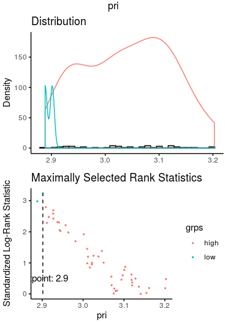

# Part5. Construct the trajectory on Ascl1+ SCLC map

~~~R
library(slingshot, quietly = TRUE)
library(splatter, quietly = TRUE)
sim <- as.SingleCellExperiment(ASCL1_Lineage_REMIND)
colData(sim)$order <- colData(sim)$new_clu
table(colData(sim)$new_clu)
library(RColorBrewer)
colors <- unique(union(brewer.pal(8,'Set3'),brewer.pal(8,'Accent')))
colors <- unique(union(colors,brewer.pal(8,'Set1')))
sce <- slingshot(sim, clusterLabels = 'new_clu', reducedDim = 'URD', start.clus = "3",approx_points=300)
par(mar = rep(2, 4))
plot(reducedDims(sce)$URD[,c(1,2)], col = colors[colData(sim)$order])
lines(SlingshotDataSet(sce), lwd=2, col='black',show.constraints = TRUE)
~~~

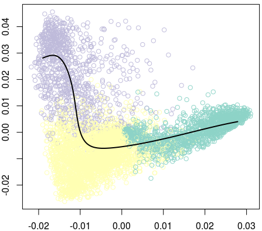

~~~r
plot(reducedDims(sce)$URD[,c(1,2)], col = colors[colData(sim)$order], pch=16, asp = 1)
lines(SlingshotDataSet(sce), lwd=2, type = 'lineages', col = 'black')
~~~

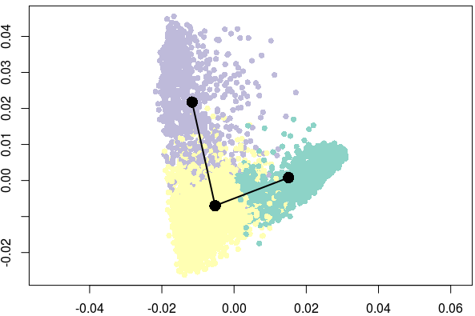

~~~r
all_meta <- ASCL1_Lineage_REMIND[[]]
pseudo <- colData(sce)
pseudo <- pseudo[rownames(all_meta),]
all_meta <- cbind(all_meta,pseudo[,c("slingPseudotime_1")])
ASCL1_Lineage_REMIND@meta.data <- as.data.frame(all_meta)
colnames(ASCL1_Lineage_REMIND@meta.data)[ncol(ASCL1_Lineage_REMIND@meta.data)] <- c("SCLC_Metastasis")
Pesudo_FeaturePlot(object = ASCL1_Lineage_REMIND, features = c("SCLC_Metastasis"),ncol=1,pt.size=.5,reduction="urd",label=T,cols = CustomPalette(low ="#007BBF", mid = "#FFF485",high = "#FF0000")) +NoAxes()
mcsaveRDS(ASCL1_Lineage_REMIND,"/mnt/data/user_data/xiangyu/workshop/scRNA/SCLC/metastasisi/merge_all/ASCL1_Lineage1_sigma_20_remind.rds",mc.cores=20)
~~~

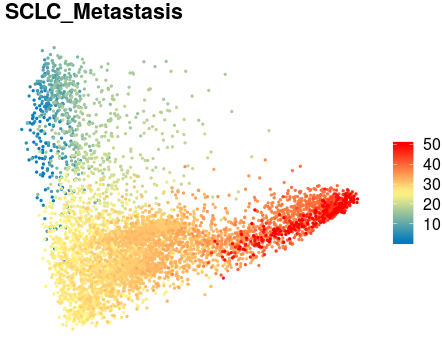

# Part6. Dynamics expression genes identification in Ascl1+ SCLC trajectory 

~~~R
# here, we used principles implemented in monocle to identify the dynamics expression genes based on Ascl1+ SCLC trajectory 
ASCL1_Lineage_REMIND <- mcreadRDS("/mnt/data/user_data/xiangyu/workshop/scRNA/SCLC/metastasisi/merge_all/ASCL1_Lineage1_sigma_20_remind.rds",mc.cores=20)
library(monocle)
seuratX <- ASCL1_Lineage_REMIND
data <- as(as.matrix(seuratX@assays$RNA@data), 'sparseMatrix')
pd <- new('AnnotatedDataFrame', data = seuratX@meta.data)
fData <- data.frame(gene_short_name = row.names(data), row.names = row.names(data))
fd <- new('AnnotatedDataFrame', data = fData)
monocle_obj2 <- newCellDataSet(data,
                              phenoData = pd,
                              featureData = fd,
                              expressionFamily = uninormal())# since I have already normalized, thresholded and scalled in Suerat v3.0.0.9150
pData(monocle_obj2)$Pseudotime <- pData(monocle_obj2)$SCLC_Metastasis

cds_subset <- monocle_obj2
scale_max = 3
scale_min = -3
trend_formula = "~sm.ns(Pseudotime, df=3)"
newdata <- data.frame(Pseudotime = seq(min(pData(cds_subset)$Pseudotime),max(pData(cds_subset)$Pseudotime), length.out = 100))
m <- genSmoothCurves(cds_subset, cores = 30, trend_formula = trend_formula,relative_expr = T, new_data = newdata)
mcsaveRDS(m,file="/mnt/data/user_data/xiangyu/workshop/scRNA/SCLC/metastasisi/merge_all/ASCL1_Lineage1_sigma_20_peudotime_heatmap_All_genes_m.rds",mc.cores=20)
m1 = m[!apply(m, 1, sum) == 0, ]
m1 = log10(m1 + 1)
m1 = m1[!apply(m1, 1, sd) == 0, ]
m1 = Matrix::t(scale(Matrix::t(m1), center = TRUE))
m1 = m1[is.na(row.names(m1)) == FALSE, ]
m1[is.nan(m1)] = 0
m1[m1 > scale_max] = scale_max
m1[m1 < scale_min] = scale_min
mcsaveRDS(m1,file="/mnt/data/user_data/xiangyu/workshop/scRNA/SCLC/metastasisi/merge_all/ASCL1_Lineage1_sigma_20_peudotime_heatmap_All_genes_m_normalised.rds",mc.cores=20)

diff_test_res <- monocle::differentialGeneTest(monocle_obj2,
              fullModelFormulaStr = "~sm.ns(Pseudotime)",
              cores=30)
mcsaveRDS(diff_test_res,file="/mnt/data/user_data/xiangyu/workshop/scRNA/SCLC/metastasisi/merge_all/ASCL1_Lineage1_sigma_20_peudotime_genes.rds",mc.cores=20)

Binner <- function(cds_object,cells_subset,anno_group){
  df <- data.frame(pData(cds_object[,cells_subset]))
  df <- df[,c("Pseudotime", anno_group)]
  colnames(df) <- c("Pseudotime", "State")
  df <- df[order(df$Pseudotime, decreasing = F),]
  len <- length(df$Pseudotime)
  bin <- round(len/100)
  State <- c()
  value <- c()
  for(i in 0:99){
    if(i < 99){
      start <- 1+(bin*i)
      stop <- bin+(bin*i)
      value <- df$State[c(start:stop)][length(df$State[c(start:stop)])/2]
      State <- c(State, value)
    }
    else{
      State <- c(State, value)
    }
  }
  return(as.data.frame(State))
}
bin1 <- Binner(monocle_obj2,colnames(monocle_obj2),"new_clu")
bin2 <- Binner(monocle_obj2,colnames(monocle_obj2),"group")
pData(monocle_obj2)$new_clu2 <- ifelse(pData(monocle_obj2)$new_clu=="3","LL_Metastasis","Metastasis")
bin3 <- Binner(monocle_obj2,colnames(monocle_obj2),"new_clu2")
bin <- do.call(cbind,list(bin1,bin2,bin3))
colnames(bin) <- c("clu","group","new_clu")
bin$clu <- as.character(bin$clu)
bin$group <- as.character(bin$group)
bin$new_clu <- as.character(bin$new_clu)
mcsaveRDS(bin,file="/mnt/data/user_data/xiangyu/workshop/scRNA/SCLC/metastasisi/merge_all/ASCL1_Lineage1_sigma_20_col_bin.rds",mc.cores=20)
diff_test_res <- mcreadRDS(file="/mnt/data/user_data/xiangyu/workshop/scRNA/SCLC/metastasisi/merge_all/ASCL1_Lineage1_sigma_20_peudotime_genes.rds",mc.cores=20)
sig_gene_names <- row.names(subset(diff_test_res, qval < 1e-20))
subset(diff_test_res,gene_short_name=="Kmt2c")
subset(diff_test_res,gene_short_name=="Dnmt3a")
gene_basemean <- as.data.frame(rowMeans(data))
colnames(gene_basemean) <- "Means"
mean(as.numeric(as.character(gene_basemean$Means)))
gene_basemean[grep("Kmt2c",rownames(gene_basemean),value=FALSE),]
remind_genes <- rownames(gene_basemean)[which(as.numeric(as.character(gene_basemean$Means))>mean(as.numeric(as.character(gene_basemean$Means))))]
#remind_genes <- rownames(gene_basemean)[which(as.numeric(as.character(gene_basemean$Means))>0.25)]
sig_gene_names <- intersect(sig_gene_names,remind_genes)
length(sig_gene_names)
which(sig_gene_names=="Kmt2c")
which(sig_gene_names=="Dnmt3a")
cds_subset <- monocle_obj2[sig_gene_names,]
cluster_rows = TRUE
hclust_method = "ward.D2"
num_clusters = 6
hmcols = NULL
show_rownames = FALSE
use_gene_short_name = TRUE
scale_max = 3
scale_min = -3
trend_formula = "~sm.ns(Pseudotime, df=3)"
pseudocount <- 1
annotation_col <- bin
newdata <- data.frame(Pseudotime = seq(min(pData(cds_subset)$Pseudotime),max(pData(cds_subset)$Pseudotime), length.out = 100))
m <- mcreadRDS(file="/mnt/data/user_data/xiangyu/workshop/scRNA/SCLC/metastasisi/merge_all/ASCL1_Lineage1_sigma_20_peudotime_heatmap_m.rds",mc.cores=20)
heatmap_matrix <- mcreadRDS(file="/mnt/data/user_data/xiangyu/workshop/scRNA/SCLC/metastasisi/merge_all/ASCL1_Lineage1_sigma_20_peudotime_heatmap_matrix.rds",mc.cores=20)
row_dist <- as.dist((1 - cor(Matrix::t(heatmap_matrix)))/2)
row_dist[is.na(row_dist)] <- 1
bks <- seq(-3.1, 3.1, by = 0.1)
hmcols <- monocle:::blue2green2red(length(bks) - 1)
aa <- jdb_palette("brewer_celsius")
hmcols <- colorRampPalette(aa)(length(bks) - 1)
ph <- mcreadRDS(file="/mnt/data/user_data/xiangyu/workshop/scRNA/SCLC/metastasisi/merge_all/ASCL1_Lineage1_sigma_20_peudotime_heatmap_anno.rds",mc.cores=20)
cds_subset <- monocle_obj2[sig_gene_names,]
annotation_row <- data.frame(Cluster = factor(cutree(ph$tree_row,6)))
annotation_row$gene <- rownames(annotation_row)
annotation_row <- annotation_row[rownames(heatmap_matrix),]
subset(annotation_row,gene=="Kmt2c")
subset(annotation_row,gene=="Dnmt3a")

annotation_row1 <- do.call(rbind,list(subset(annotation_row,Cluster==5),
  subset(annotation_row,Cluster==1),
  subset(annotation_row,Cluster==4),
  subset(annotation_row,Cluster==3),
  subset(annotation_row,Cluster==2),
  subset(annotation_row,Cluster==6)))
annotation_row1$Cluster2 <- as.numeric(as.character(annotation_row1$Cluster))
annotation_row1$Cluster2[which(annotation_row1$Cluster==5)] <- 1
annotation_row1$Cluster2[which(annotation_row1$Cluster==1)] <- 1
annotation_row1$Cluster2[which(annotation_row1$Cluster==4)] <- 2
annotation_row1$Cluster2[which(annotation_row1$Cluster==3)] <- 2
annotation_row1$Cluster2[which(annotation_row1$Cluster==2)] <- 3
annotation_row1$Cluster2[which(annotation_row1$Cluster==6 )] <- 3
annotation_row1$Cluster <- as.numeric(as.character(annotation_row1$Cluster2))
annotation_row1 <- data.frame(Cluster=as.character(annotation_row1$Cluster),row.names=rownames(annotation_row1))
order <- as.data.frame(table(annotation_row1$Cluster))

heatmap_matrix <- heatmap_matrix[rownames(annotation_row1),]
feature_label <- as.character(fData(cds_subset)[row.names(heatmap_matrix),"gene_short_name"])
feature_label[is.na(feature_label)] <- row.names(heatmap_matrix)
row_ann_labels <- as.character(fData(cds_subset)[row.names(annotation_row1),"gene_short_name"])
row_ann_labels[is.na(row_ann_labels)] <- row.names(annotation_row1)
row.names(heatmap_matrix) <- feature_label
row.names(annotation_row1) <- row_ann_labels
colnames(heatmap_matrix) <- c(1:ncol(heatmap_matrix))
library(pheatmap)

ph_res <- pheatmap(heatmap_matrix[,], useRaster = T, cluster_cols = FALSE,
    cluster_rows = F, show_rownames = show_rownames,
    show_colnames = F, clustering_distance_rows = row_dist,
    clustering_method = NULL, cutree_rows = 0,gaps_row =c(order$Freq[1],order$Freq[1]+order$Freq[2]),
    annotation_row = annotation_row1, annotation_col = annotation_col,
    treeheight_row = 20, breaks = bks, fontsize = 6, color = hmcols,
    border_color = NA, silent = TRUE, filename = NA)
pdf(file="/mnt/data/user_data/xiangyu/workshop/scRNA/SCLC/metastasisi/merge_all/ASCL1_Lineage1_sigma_20_peudotime_with_anno.pdf",width = 10, height = 200)
ph_res
dev.off()
png(file="/mnt/data/user_data/xiangyu/workshop/scRNA/SCLC/metastasisi/merge_all/ASCL1_Lineage1_sigma_20_peudotime_with_anno.png")
ph_res
dev.off()

ph_res <- pheatmap(heatmap_matrix[,], useRaster = T, cluster_cols = FALSE,
    cluster_rows = F, show_rownames = TRUE,
    show_colnames = F, clustering_distance_rows = row_dist,
    clustering_method = NULL, cutree_rows = 0,gaps_row =c(order$Freq[1]),
    annotation_row = annotation_row1, annotation_col = annotation_col,
    treeheight_row = 20, breaks = bks, fontsize = 6, color = hmcols,
    border_color = NA, silent = TRUE, filename = NA)
pdf(file="/mnt/data/user_data/xiangyu/workshop/scRNA/SCLC/metastasisi/merge_all/v3_ASCL1_Lineage1_sigma_20_peudotime_with_anno.pdf",width = 10, height = 200)
ph_res
dev.off()
~~~

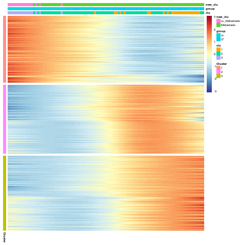

~~~R
annotation_row1 <- mcreadRDS(file="/mnt/data/user_data/xiangyu/workshop/scRNA/SCLC/metastasisi/merge_all/ASCL1_Lineage1_sigma_20_peudotime_annotation_row1_all_v2.rds",mc.cores=20)
heatmap_matrix <- mcreadRDS(file="/mnt/data/user_data/xiangyu/workshop/scRNA/SCLC/metastasisi/merge_all/ASCL1_Lineage1_sigma_20_peudotime_heatmap_matrix.rds",mc.cores=20)
heatmap_matrix1 <- heatmap_matrix
colnames(heatmap_matrix1) <- paste0("order_",colnames(heatmap_matrix))
heatmap_matrix1 <- reshape2::melt(heatmap_matrix1)
heatmap_matrix1$Var1 <- as.character(heatmap_matrix1$Var1)
annotation_row1$Var2 <- paste0("Module_",annotation_row1$Cluster)
heatmap_matrix1$Module <- annotation_row1[heatmap_matrix1$Var1,]$Var2
heatmap_matrix1$Order <- gsub("order_","",heatmap_matrix1$Var2)
heatmap_matrix1$Order <- as.numeric(heatmap_matrix1$Order)
aa <- ggplot(heatmap_matrix1, aes(Order, value,color=Module)) +
  geom_point(alpha=0,size=0)+
  xlab("Pseudotime")+
  theme_classic() + geom_smooth(se=TRUE) + labs(title="All Modules")
ggsave("/mnt/data/user_data/xiangyu/workshop/scRNA/SCLC/metastasisi/merge_all/Figure_making/v2_dynamics_trend.svg", plot=aa,width = 5, height = 4,dpi=1080)
~~~

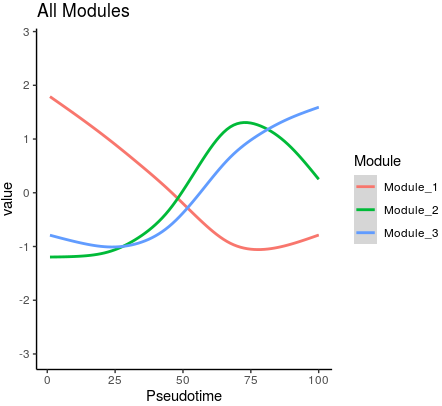

~~~R
# Showed the dynamics relative expression levels of interested genes based on Ascl1+ SCLC trajectory.
All_genes_m <- mcreadRDS(file="/mnt/data/user_data/xiangyu/workshop/scRNA/SCLC/metastasisi/merge_all/ASCL1_Lineage1_sigma_20_peudotime_heatmap_All_genes_m_normalised.rds",mc.cores=20)
All_genes_m <- as.data.frame(All_genes_m)
sel_data <- All_genes_m[c("Nfib","Ascl1","Neurod1","Kmt2c","Sox2","Dnmt3a","Mki67"),]
bin <- mcreadRDS(file="/mnt/data/user_data/xiangyu/workshop/scRNA/SCLC/metastasisi/merge_all/ASCL1_Lineage1_sigma_20_col_bin.rds",mc.cores=20)
colnames(sel_data) <- paste0("Clu_",bin$State)
sel_data <- as.data.frame(t(sel_data))
sel_data$group <- rownames(sel_data)
sel_data$order <- 1:nrow(sel_data)
library(BuenColors)
aa <- jdb_palette("brewer_spectra",type = "continuous")[length(jdb_palette("brewer_spectra",type = "continuous")):1]
p1 <- ggplot(sel_data, aes(order, Nfib,color=group)) +
  geom_point(alpha=0,size=0) +
  geom_rug(alpha = 0.8, position = "jitter",sides="b")+ xlab("Pseudotime")+
  theme_classic() + geom_smooth(colour = "orange",se=TRUE) +NoLegend()+ labs(title="Nfib")
p2 <- ggplot(sel_data, aes(order, Kmt2c,color=group)) +
  geom_point(alpha=0,size=0) +
  geom_rug(alpha = 0.8, position = "jitter",sides="b")+ xlab("Pseudotime")+
  theme_classic() + geom_smooth(colour = "orange",se=TRUE) +NoLegend()+ labs(title="Kmt2c")
p3 <- ggplot(sel_data, aes(order, Dnmt3a,color=group)) +
  geom_point(alpha=0,size=0) +
  geom_rug(alpha = 0.8, position = "jitter",sides="b")+ xlab("Pseudotime")+
  theme_classic() + geom_smooth(colour = "orange",se=TRUE) +NoLegend()+ labs(title="Dnmt3a")
p4 <- ggplot(sel_data, aes(order, Neurod1,color=group)) +
  geom_point(alpha=0,size=0) +
  geom_rug(alpha = 0.8, position = "jitter",sides="b")+ xlab("Pseudotime")+
  theme_classic() + geom_smooth(colour = "orange",se=TRUE) +NoLegend()+ labs(title="Neurod1")
aa <- plot_grid(p1,p2,p3,p4,ncol=4)
ggsave("/mnt/data/user_data/xiangyu/workshop/scRNA/SCLC/metastasisi/merge_all/Figure_making/v2_marker_Neurod1_SCLC_phate.svg", plot=aa,width = 15, height = 4,dpi=1080)
~~~

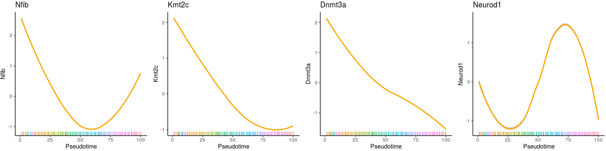

~~~R
# UP till now, we have generated four sub-modules of dynamics expression genes based on Ascl1+ SCLC trajectory.
# We also want to explore the biology meaning in each sub-module by combining clinical information such as survival rates and metastasis status.
annotation_row1 <- mcreadRDS(file="/mnt/data/user_data/xiangyu/workshop/scRNA/SCLC/metastasisi/merge_all/ASCL1_Lineage1_sigma_20_peudotime_annotation_row1_all_v2.rds",mc.cores=20)
annotation_row1$gene <- rownames(annotation_row1)
clu1 <- subset(annotation_row1,Cluster==1)
clu2 <- subset(annotation_row1,Cluster==2)
clu3 <- subset(annotation_row1,Cluster==3)
#clu4 <- subset(annotation_row1,Cluster==4)
library(iTALK)
library(nichenetr)
library(tidyr)
clu1 = clu1 %>% mutate(from = convert_mouse_to_human_symbols(gene), to = convert_mouse_to_human_symbols(gene)) %>% drop_na()
clu2 = clu2 %>% mutate(from = convert_mouse_to_human_symbols(gene), to = convert_mouse_to_human_symbols(gene)) %>% drop_na()
clu3 = clu3 %>% mutate(from = convert_mouse_to_human_symbols(gene), to = convert_mouse_to_human_symbols(gene)) %>% drop_na()

CDX_META_INFO <- read.csv("/mnt/data/user_data/xiangyu/workshop/DATABASE/SCLC_Patient_data/SCLC_CTC/bulk_RNA/counts_table/CDX_META_INFO.csv")
CDX_META_INFO$CDX.No. <- paste0("CDX",CDX_META_INFO$CDX.No.)
CDX_META_INFO$CDX.No. <- gsub("CDX33P","CDX33/33P",CDX_META_INFO$CDX.No.)
all_tmp_data <- future_lapply(CDX_META_INFO$CDX.No.,function(x){
  sel_meta <- subset(CDX_META_INFO,CDX.No.==x)
  id_t <- unlist(strsplit(sel_meta$CDX.No.,split="/"))
  if (length(id_t)==1) {
    sel_meta <- do.call(rbind,list(sel_meta,sel_meta,sel_meta,sel_meta,sel_meta,sel_meta))
    sel_meta$id <- c(rep(id_t[1],6))
    sel_meta$new_id <- paste0(sel_meta$CDX.No.,c("",".1",".2",".3",".4",".5"))
  } else {
    sel_meta <- do.call(rbind,list(sel_meta,sel_meta,sel_meta,sel_meta,sel_meta,sel_meta,
      sel_meta,sel_meta,sel_meta,sel_meta,sel_meta,sel_meta))
    sel_meta$id <- c(rep(id_t[1],6),rep(paste0("CDX",id_t[2]),6))
    sel_meta$new_id <- c(paste0(id_t[1],c("",".1",".2",".3",".4",".5")),paste0("CDX",id_t[2],c("",".1",".2",".3",".4",".5")))
  }
  return(sel_meta)
  })
all_tmp <- do.call(rbind,all_tmp_data)
all_tmp$new_id <- gsub("CDX0","CDX",all_tmp$new_id)
all_tmp$id <- gsub("CDX0","CDX",all_tmp$id)
rownames(all_tmp) <- all_tmp$new_id

names <- c("CDX8","CDX38","CDX8P","CDX29","CDX25","CDX17P","CDX17","CDX30P","CDX33","CDX33P","CDX15P","CDX20P","CDX7","CDX12","CDX45","CDX18P","CDX15PP","CDX46","CDX3","CDX3P","CDX14P","CDX22P","CDX42","CDX32P","CDX4","CDX42P","CDX18","CDX34","CDX10","CDX35","CDX9","CDX26","CDX40","CDX2","CDX1","CDX20","CDX39P","CDX41P","CDX13")
names <- gsub("CDX0","CDX",names)
group <- c("NEUROD1","ASCL1","NEUROD1","NEUROD1","ATOH1","ATOH1","ATOH1","ATOH1","ASCL1","ASCL1","ASCL1","ASCL1","ASCL1","ASCL1","ASCL1","ASCL1","ASCL1","ASCL1","ASCL1","ASCL1","ASCL1","ASCL1","ASCL1","ASCL1","ASCL1","ASCL1","ASCL1","ASCL1","ASCL1","ASCL1","ASCL1","ASCL1","ASCL1","ASCL1","ASCL1","ASCL1","ASCL1","ASCL1","POU2F3")
names(group) <- names
all_tmp$Type <- group[all_tmp$id]
all_tmp$Type <- paste0(all_tmp$Type," + SCLC")

CDXData <- read.csv("/mnt/data/user_data/xiangyu/workshop/DATABASE/SCLC_Patient_data/SCLC_CTC/bulk_RNA/counts_table/FinalCDXDataTable.csv")
CDXData <- CDXData[!duplicated(CDXData$gene_name),]
rownames(CDXData) <- CDXData$gene_name
CDXData <- CDXData[,-c(1,2,3)]
CDXData <- log(CDXData+1,2)
CDXData <- as.data.frame(t(CDXData))
rownames(CDXData) <- gsub("CDX","CDX",rownames(CDXData))
both_id <- intersect(rownames(CDXData),rownames(all_tmp))
all_tmp <- all_tmp[both_id,]
CDXData <- CDXData[both_id,]
sel_gene_CDXData <- data.frame(clu1=as.character(apply(CDXData[,intersect(colnames(CDXData),unique(clu1$from))],1,mean)),
clu2=as.character(apply(CDXData[,intersect(colnames(CDXData),unique(clu2$from))],1,mean)),
clu3=as.character(apply(CDXData[,intersect(colnames(CDXData),unique(clu3$from))],1,mean)),
#clu4=as.character(apply(CDXData[,intersect(colnames(CDXData),unique(clu4$from))],1,mean)),
SOX2=as.character(CDXData[,"SOX2"]),
ASCL1=as.character(CDXData[,"ASCL1"]),
row.names=rownames(CDXData))
sel_gene_CDXData_g <- sel_gene_CDXData
sel_gene_CDXData$clu1 <- as.numeric(as.character(scale(as.numeric(as.character(sel_gene_CDXData$clu1)))))
sel_gene_CDXData$clu2 <- as.numeric(as.character(scale(as.numeric(as.character(sel_gene_CDXData$clu2)))))
sel_gene_CDXData$clu3 <- as.numeric(as.character(scale(as.numeric(as.character(sel_gene_CDXData$clu3)))))
#sel_gene_CDXData$clu4 <- as.numeric(as.character(scale(as.numeric(as.character(sel_gene_CDXData$clu4)))))
sel_gene_CDXData$SOX2 <- as.numeric(as.character(scale(as.numeric(as.character(sel_gene_CDXData$SOX2)))))
sel_gene_CDXData$ASCL1 <- as.numeric(as.character(scale(as.numeric(as.character(sel_gene_CDXData$ASCL1)))))
sel_gene_CDXData <- sel_gene_CDXData[,c(1:3)]
sel_gene_CDXData$group <- unlist(future_lapply(1:nrow(sel_gene_CDXData),function(x){
    sel_tmp <- sel_gene_CDXData[x,]
    group_n <- colnames(sel_tmp)[which(sel_tmp==max(sel_tmp))]
    return(group_n)
    }))

chonglai_zscore_1 <- t(apply(sel_gene_CDXData[,-ncol(sel_gene_CDXData)], 1, function(x) (x-mean(x))/sd(x)))
chonglai_zscore_1[chonglai_zscore_1>1] <- 1
chonglai_zscore_1[chonglai_zscore_1< -1] <- -1
bks <- seq(-1, 1, by = 0.1)
library(scales)
library(BuenColors)
library(pheatmap)
aa <- jdb_palette("solar_extra",, type = c("continuous"))[1:length(jdb_palette("solar_extra",, type = c("continuous")))]
hmcols <- colorRampPalette(aa)(length(bks) - 1)
annotation_col <- data.frame(group=sel_gene_CDXData[,ncol(sel_gene_CDXData)],
  Gender=all_tmp$Gender,
  SCLC.Stage=all_tmp$SCLC.Stage,
  Site.of.Metastases=all_tmp$Site.s..of.Metastases,
  Treatment=all_tmp$X1st.Line.Treatment,
  Treatment.Response=all_tmp$Treatment.Response,
  Survival.months=all_tmp$Survival..months.,
  Type=all_tmp$Type,
  row.names=rownames(sel_gene_CDXData))
annotation_col1 <- annotation_col[order(annotation_col$group),]
order <- as.data.frame(table(annotation_col1$group))
chonglai_zscore_1 <- chonglai_zscore_1[rownames(annotation_col1),]
ph_res <- pheatmap(t(chonglai_zscore_1), useRaster = T, cluster_cols = FALSE,
    cluster_rows = F, show_rownames = TRUE,
    show_colnames = FALSE,
    clustering_method = NULL, cutree_rows = 0,gaps_col =c(order$Freq[1],order$Freq[1]+order$Freq[2]),
    annotation_col = annotation_col1, 
    treeheight_row = 20, breaks = bks, color = hmcols,
    border_color = NA, silent = TRUE, filename = NA)
write.csv(annotation_col,"/mnt/data/user_data/xiangyu/workshop/scRNA/SCLC/metastasisi/merge_all/ASCL1_Lineage1_sigma_20_SCLC_classification.csv")
annotation_col <- read.csv("/mnt/data/user_data/xiangyu/workshop/scRNA/SCLC/metastasisi/merge_all/ASCL1_Lineage1_sigma_20_SCLC_classification.csv")
annotation_col$group1 <- ifelse(annotation_col$group=="clu1", "Module I Like",
  ifelse(annotation_col$group=="clu2", "Module II Like","Module III Like"))
write.csv(annotation_col,"/mnt/data/user_data/xiangyu/workshop/scRNA/SCLC/metastasisi/merge_all/ASCL1_Lineage1_sigma_20_SCLC_classification.csv")
~~~

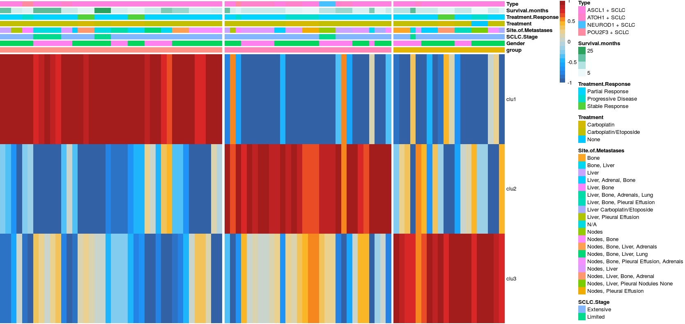

~~~R
summar_group <- as.data.frame(table(annotation_col$Treatment.Response,annotation_col$group))
summar_group <- do.call(rbind,future_lapply(unique(summar_group$Var1),function(x){
  tmp_s <- subset(summar_group,Var1==x)
  tmp_s$normalized_Freq <- round(100*(tmp_s$Freq)/sum(tmp_s$Freq),2)
  return(tmp_s)
  }))

library(ggalluvial)
summar_group$Var1 <- factor(summar_group$Var1,levels=c("Stable Response","Partial Response","Progressive Disease"))
summar_group$Var2 <- factor(summar_group$Var2,levels=c("clu3","clu2","clu1"))
p1 <- ggplot(summar_group, aes(x = Var1, y = normalized_Freq, fill = Var2, 
    stratum = Var2, alluvium = Var2)) +
geom_stratum() +  #代替 geom_col() 绘制堆叠柱形图
geom_flow(alpha = 0.5) +  #绘制同类别之间的连接线
labs(x = '', y = 'Relative Abundance(%)',title="Treatment.Response")
 
summar_group <- as.data.frame(table(annotation_col$SCLC.Stage,annotation_col$group))
summar_group <- do.call(rbind,future_lapply(unique(summar_group$Var1),function(x){
  tmp_s <- subset(summar_group,Var1==x)
  tmp_s$normalized_Freq <- round(100*(tmp_s$Freq)/sum(tmp_s$Freq),2)
  return(tmp_s)
  }))
library(ggalluvial)
summar_group$Var1 <- factor(summar_group$Var1,levels=c("Limited","Extensive"))
summar_group$Var2 <- factor(summar_group$Var2,levels=c("clu3","clu2","clu1"))
p2 <- ggplot(summar_group, aes(x = Var1, y = normalized_Freq, fill = Var2, 
    stratum = Var2, alluvium = Var2)) +
geom_stratum() +  #代替 geom_col() 绘制堆叠柱形图
geom_flow(alpha = 0.5) +  #绘制同类别之间的连接线
labs(x = '', y = 'Relative Abundance(%)',title="SCLC.Stage")
plot_grid(p1,p2)
~~~

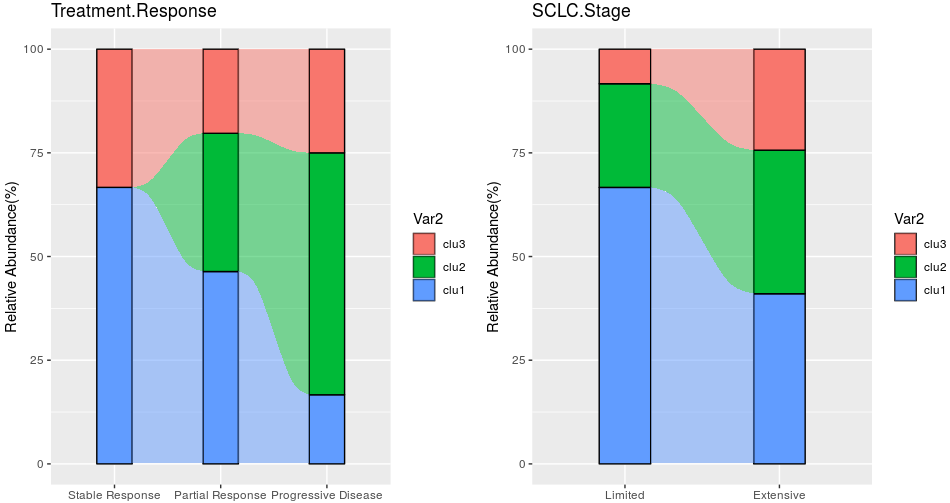

~~~R
library("survival")
library("survminer")
SCLC_Nature_RNA <- fread("/mnt/data/user_data/xiangyu/workshop/DATABASE/SCLC_Patient_data/SCLC_Nature_RNA.csv")
SCLC_Nature_RNA <- as.data.frame(SCLC_Nature_RNA)
SCLC_Nature_RNA <- SCLC_Nature_RNA[!duplicated(SCLC_Nature_RNA$gene),]
rownames(SCLC_Nature_RNA) <- SCLC_Nature_RNA$gene
SCLC_Nature_RNA <- SCLC_Nature_RNA[,c(-1,-2)]
SCLC_Nature_Clinical <- fread("/mnt/data/user_data/xiangyu/workshop/DATABASE/SCLC_Patient_data/SCLC_Nature_Clinical.csv")
SCLC_Nature_Clinical <- as.data.frame(SCLC_Nature_Clinical)
rownames(SCLC_Nature_Clinical) <- SCLC_Nature_Clinical$'Sample-ID'
both_id <- intersect(colnames(SCLC_Nature_RNA),rownames(SCLC_Nature_Clinical))
SCLC_Nature_Clinical_SEL <- SCLC_Nature_Clinical[both_id,]
table(SCLC_Nature_Clinical_SEL$'primary tumor/metastasis')
colnames(SCLC_Nature_Clinical_SEL)[21] <- "primary_tumor_metastasis"
SCLC_Nature_RNA <- log(SCLC_Nature_RNA+1,2)
SCLC_Nature_RNA <- as.data.frame(t(SCLC_Nature_RNA))
annotation_row1 <- mcreadRDS(file="/mnt/data/user_data/xiangyu/workshop/scRNA/SCLC/metastasisi/merge_all/ASCL1_Lineage1_sigma_20_peudotime_annotation_row1_all_v2.rds",mc.cores=20)
annotation_row1$gene <- rownames(annotation_row1)
clu1 <- subset(annotation_row1,Cluster==1)
clu2 <- subset(annotation_row1,Cluster==2)
clu3 <- subset(annotation_row1,Cluster==3)
#clu4 <- subset(annotation_row1,Cluster==4)
library(iTALK)
library(nichenetr)
library(tidyr)
clu1 = clu1 %>% mutate(from = convert_mouse_to_human_symbols(gene), to = convert_mouse_to_human_symbols(gene)) %>% drop_na()
clu2 = clu2 %>% mutate(from = convert_mouse_to_human_symbols(gene), to = convert_mouse_to_human_symbols(gene)) %>% drop_na()
clu3 = clu3 %>% mutate(from = convert_mouse_to_human_symbols(gene), to = convert_mouse_to_human_symbols(gene)) %>% drop_na()
sel_gene_SCLC_Nature_RNA <- data.frame(clu1=as.character(apply(SCLC_Nature_RNA[,intersect(colnames(SCLC_Nature_RNA),unique(clu1$from))],1,mean)),
clu2=as.character(apply(SCLC_Nature_RNA[,intersect(colnames(SCLC_Nature_RNA),unique(clu2$from))],1,mean)),
clu3=as.character(apply(SCLC_Nature_RNA[,intersect(colnames(SCLC_Nature_RNA),unique(clu3$from))],1,mean)),
row.names=rownames(SCLC_Nature_RNA))
sel_gene_SCLC_Nature_RNA$clu1 <- as.numeric(as.character(scale(as.numeric(as.character(sel_gene_SCLC_Nature_RNA$clu1)))))
sel_gene_SCLC_Nature_RNA$clu2 <- as.numeric(as.character(scale(as.numeric(as.character(sel_gene_SCLC_Nature_RNA$clu2)))))
sel_gene_SCLC_Nature_RNA$clu3 <- as.numeric(as.character(scale(as.numeric(as.character(sel_gene_SCLC_Nature_RNA$clu3)))))

library("survival")
library("survminer")
SCLC_Nature_Clinical_SEL1 <- SCLC_Nature_Clinical_SEL[,c("overall_survival (months)","Status (at time of last follow-up)")]
colnames(SCLC_Nature_Clinical_SEL1) <- c("dead_date","status")
all_case_and_info <- cbind(sel_gene_SCLC_Nature_RNA,SCLC_Nature_Clinical_SEL1[,c("dead_date","status")])
all_case_and_info <- na.omit(all_case_and_info)
case_info_ALL <- all_case_and_info
case_info_ALL <- case_info_ALL[order(case_info_ALL$dead_date,decreasing=T),]
event <- gsub("alive",0,case_info_ALL$status)
event <- gsub("dead",1,event)
case_info_ALL$event <- as.numeric(event)

sel_gene_SCLC_Nature_RNA$group <- unlist(future_lapply(1:nrow(sel_gene_SCLC_Nature_RNA),function(x){
    sel_tmp <- sel_gene_SCLC_Nature_RNA[x,]
    group_n <- colnames(sel_tmp)[which(sel_tmp==max(sel_tmp))]
    return(group_n)
    }))
all_case_and_info <- cbind(sel_gene_SCLC_Nature_RNA,SCLC_Nature_Clinical_SEL1)
all_case_and_info <- na.omit(all_case_and_info)
case_info_ALL <- all_case_and_info
case_info_ALL <- case_info_ALL[order(case_info_ALL$dead_date,decreasing=T),]
event <- gsub("alive",0,case_info_ALL$status)
event <- gsub("dead",1,event)
case_info_ALL$event <- as.numeric(event)
case_info_ALL$group <- factor(case_info_ALL$group,levels=c("clu3","clu2","clu1"))
fit <- survfit(Surv(dead_date, event) ~ group, data = case_info_ALL)
ggsurvplot(fit, data = case_info_ALL,
surv.median.line = "hv",
pval = TRUE,
ggtheme = theme_bw(),
risk.table=TRUE)

case_info_ALL.cut <- surv_cutpoint(
   case_info_ALL,
   time = "dead_date",
   event = "event",
   variables = c("clu1"),
   progressbar=TRUE,
   minprop=0.2
)
summary(case_info_ALL.cut)
plot(case_info_ALL.cut, "clu1")
case_info_ALL.cut.cat <- surv_categorize(case_info_ALL.cut) 
library(survival)
fit <- survfit(Surv(dead_date, event) ~ clu1, data = case_info_ALL.cut.cat)
aa <- ggsurvplot(fit, data = case_info_ALL.cut.cat,
surv.median.line = "hv",
pval = TRUE,
ggtheme = theme_bw(),
risk.table=TRUE)
ggsave("/mnt/data/user_data/xiangyu/workshop/scRNA/SCLC/metastasisi/merge_all/Figure_making/v2_SCLC_ASCL1_pseudotime_with_Nature_Patients_survival_clu1.svg", plot=aa$plot,width = 4, height = 4,dpi=1080)
~~~

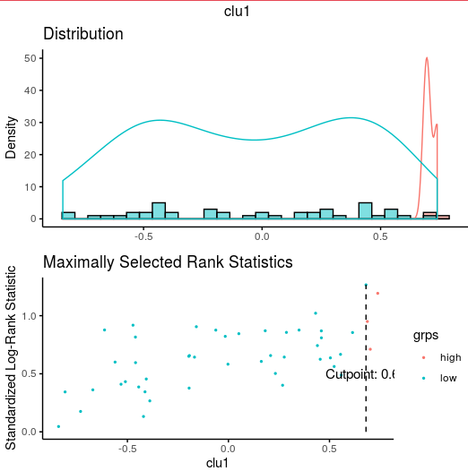

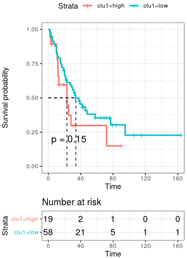

# Part7. Pathways enrichments

~~~R
annotation_row1 <- mcreadRDS(file="/mnt/data/user_data/xiangyu/workshop/scRNA/SCLC/metastasisi/merge_all/ASCL1_Lineage1_sigma_20_peudotime_annotation_row1_all_v2.rds",mc.cores=20)
col_genes <- annotation_row1
col_genes$gene <- rownames(col_genes)
info <- col_genes[,c("Cluster","gene")]
top_marker <- c()
number.group <- length(unique(info$Cluster))
for (i in c(1:number.group)){
  y <- info$Cluster
  marker <- info[with(info,y==i),]
  top_marker[[i]] <- marker
  names(top_marker)[i] <- paste("clu",i,sep="_")
}
gcSampl <- c()
for (i in c(1:length(top_marker))){
t <- top_marker[[i]]
symbol <- as.character(t$gene)
DD <- symbol
t$entrez <- mapIds(x = org.Mm.eg.db,
                        keys = DD,
            keytype ="SYMBOL",
            column ="ENTREZID",
            multiVals="first")
names <- na.omit(t)
entrez <- as.character(names$entrez)
gcSampl[[i]] <- entrez
names(gcSampl)[i] <- names(top_marker)[i]
print(paste(names(top_marker)[i],"is done",sep = " "))
}
HLH_T1_OFF_HIGH_KEGG <- compareCluster(geneCluster = gcSampl, fun = "enrichKEGG",organism="mouse",
  use_internal_data=TRUE, minGSSize = 5)
HLH_T1_OFF_HIGH_GO <- compareCluster(geneCluster = gcSampl, fun = "enrichGO",OrgDb="org.Mm.eg.db",keyType = "ENTREZID", ont = "BP",readable = TRUE,
  minGSSize = 5)
mcsaveRDS(HLH_T1_OFF_HIGH_GO,file="/mnt/data/user_data/xiangyu/workshop/scRNA/SCLC/metastasisi/merge_all/ASCL1_Lineage1_sigma_20_peudotime_annotation_row1_GO_v2.rds",mc.cores=20) 

SE_all_clu1 <- as.data.frame(HLH_T1_OFF_HIGH_GO)
SE_all_clu1 <- SE_all_clu1[order(SE_all_clu1$Cluster,(SE_all_clu1$p.adjust)),]
SE_all_clu1[grep("hist",SE_all_clu1$Description,value=FALSE),]
SE_all_clu1[grep("Dnmt3a",SE_all_clu1$geneID,value=FALSE),]
sel_path <- c(c(subset(SE_all_clu1,Cluster=="clu_1")$Description[c(11,12,20,23)],"positive regulation of histone modification"),
  c("histone modification","histone lysine methylation",subset(SE_all_clu1,Cluster=="clu_2")$Description[1:3]),
  subset(SE_all_clu1,Cluster=="clu_3")$Description[1:5],
  subset(SE_all_clu1,Cluster=="clu_4")$Description[c(1,5,9,12,17)])
SE_all_clu1 <- XY_subset(SE_all_clu1,"Description",sel_path)
SE_all_clu1 <- SE_all_clu1[order(SE_all_clu1$Cluster,(SE_all_clu1$p.adjust)),]

SE_all_clu1$ID <- paste0(SE_all_clu1$ID,1:nrow(SE_all_clu1))
rownames(SE_all_clu1) <- SE_all_clu1$ID
geneSets <- as(SE_all_clu1[, "ID"], "list")
names(geneSets) <- SE_all_clu1[, "ID"]
rownames(SE_all_clu1) <- SE_all_clu1$ID
data_sel <- new("compareClusterResult", compareClusterResult = SE_all_clu1, geneClusters = gcSampl,fun = "enrichKEGG")
aa <- dotplot(data_sel,showCategory=5,includeAll=FALSE) + 
  theme(axis.text.x  = element_text(angle=45, vjust=1,size=8,hjust = 1)) + labs(title = "GO BP")
ggsave("/mnt/data/user_data/xiangyu/workshop/scRNA/SCLC/metastasisi/merge_all/Figure_making/v2_Neurod1_Lineage_tranje_GO_BP.svg", plot=aa,width = 6, height = 5,dpi=1080)

~~~

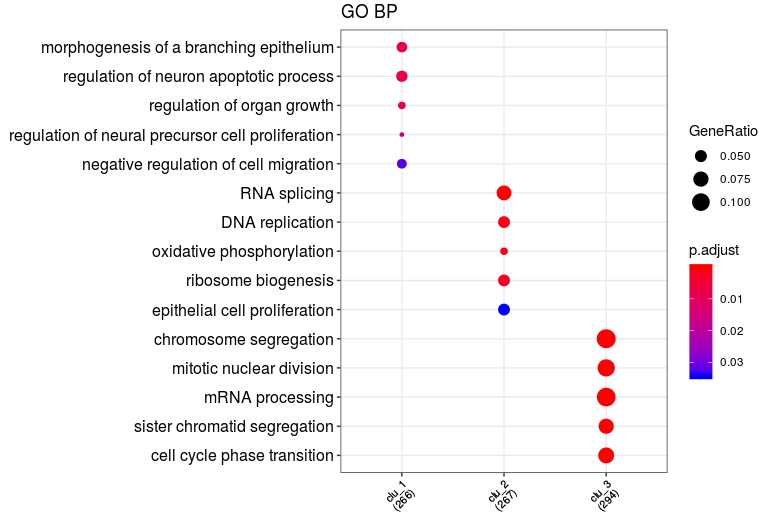

