# scRNA-seq analysis in SCLC with primary samples and metastasis samples

In this pipeline, we showed the detail codes of scRNA-seq analyzing in SCLC with primary samples and metastasis samples, including quality control, dimension reducing, population clustering, differentiation genes expression identifying, trajectory constructing, dynamics expression genes identification and pathways enrichments. To make reproducible results from our code, the raw data and processed data were totally submitted. Besides, we generate Markdowns files to record all steps. 

# Part1. we should load the packages we need for following analysis

~~~R
suppressPackageStartupMessages({
  library(dplyr)
  library(Seurat)
  library(Matrix)
  library(proxy)
  library(gplots)
  library(Rtsne)
  library(densityClust)
  library(irlba)
  library(monocle)
  library(plyr)
  library(DOSE)
  library(clusterProfiler)
  library(topGO)
  library(pathview)
  library(AnnotationDbi)
  library(cowplot)
  library(ggplot2)
  library(velocyto.R)
  library(trqwe)
  library(Rsamtools)
  library(GenomicFeatures)
  library(GenomicAlignments)
  library(BiocParallel)
  library(pheatmap)
  library(RColorBrewer)
  library(PoiClaClu)
  library(org.Mm.eg.db)
  library(org.Hs.eg.db)
  library(DESeq2)
  library(data.table)
  library(stringr)
  library(iTALK)
  library(nichenetr)
  library(tidyr)
})
source("./modified_codes/MyBestFunction_scRNA.R")# modified methods by our effort
library(future)
library(future.apply)
options(future.globals.maxSize = 300 * 1024^3)
plan("multiprocess", workers = 15)
plan()
library(scales)
library(BuenColors)
~~~

# Part2. Load counts data into Seurat workflow

~~~R
# To Load counts with barcode information in Seurat workflow
dir.create("./LL")
setwd("./LL")
left_lung.data <- XY_Read10X("./LL/outs/filtered_feature_bc_matrix")
LL <- CreateSeuratObject(counts = left_lung.data, project = "left_lung", min.cells = 3, min.features = 200)
LL[["percent.mt"]] <- PercentageFeatureSet(LL, pattern = "^mt-")
LL <- subset(LL, subset = nFeature_RNA < 6000 & percent.mt < 10)
LL <- NormalizeData(object = LL)
LL <- FindVariableFeatures(object = LL)
length(x = VariableFeatures(object = LL))
LL <- ScaleData(object = LL, features = rownames(x = LL), vars.to.regress = c("nCount_RNA","percent.mito"))
LL <- RunPCA(object = LL, features = VariableFeatures(object = LL))
LL <- ProjectDim(object = LL)
ElbowPlot(object = LL)
LL <- FindNeighbors(object = LL, dims = 1:15)
LL <- FindClusters(object = LL, resolution = 0.6)
LL <- RunTSNE(object = LL, dims = 1:15)
LL <- RunUMAP(object = LL, dims = 1:15)
saveRDS(LL,"./LL/LL_all_cells.rds")

dir.create("./LT")
setwd("./LT")
liver_tumor.data <- XY_Read10X("./LT/outs/filtered_feature_bc_matrix")
LT <- CreateSeuratObject(counts = liver_tumor.data, project = "liver_tumor", min.cells = 3, min.features = 200)
LT[["percent.mt"]] <- PercentageFeatureSet(LT, pattern = "^mt-")
LT <- subset(LT, subset = nFeature_RNA < 6000 & percent.mt < 10)
LT <- NormalizeData(object = LT)
LT <- FindVariableFeatures(object = LT)
length(x = VariableFeatures(object = LT))
LT <- ScaleData(object = LT, features = rownames(x = LT), vars.to.regress = c("nCount_RNA","percent.mito"))
LT <- RunPCA(object = LT, features = VariableFeatures(object = LT))
LT <- ProjectDim(object = LT)
ElbowPlot(object = LT)
LT <- FindNeighbors(object = LT, dims = 1:15)
LT <- FindClusters(object = LT, resolution = 0.6)
LT <- RunTSNE(object = LT, dims = 1:15)
LT <- RunUMAP(object = LT, dims = 1:15)
saveRDS(LT,"./LT/LT_all_cells.rds")

dir.create("./AN")
setwd("./AN")
Abdominal_lymphomanode.data <- XY_Read10X("./AN/outs/filtered_feature_bc_matrix")
AN <- CreateSeuratObject(counts = Abdominal_lymphomanode.data, project = "Abdominal_lymphomanode", min.cells = 3, min.features = 200)
AN[["percent.mt"]] <- PercentageFeatureSet(AN, pattern = "^mt-")
AN <- subset(AN, subset = nFeature_RNA < 6000 & percent.mt < 10)
AN <- NormalizeData(object = AN)
AN <- FindVariableFeatures(object = AN)
length(x = VariableFeatures(object = AN))
AN <- ScaleData(object = AN, features = rownames(x = AN), vars.to.regress = c("nCount_RNA","percent.mito"))
AN <- RunPCA(object = AN, features = VariableFeatures(object = AN))
AN <- ProjectDim(object = AN)
ElbowPlot(object = AN)
AN <- FindNeighbors(object = AN, dims = 1:15)
AN <- FindClusters(object = AN, resolution = 0.6)
AN <- RunTSNE(object = AN, dims = 1:15)
AN <- RunUMAP(object = AN, dims = 1:15)
saveRDS(AN,"./AN/AN_all_cells.rds")

dir.create("./TN")
setwd("./TN")
Thoracic_lymphomanode.data <- XY_Read10X("./TN/outs/filtered_feature_bc_matrix")
TN <- CreateSeuratObject(counts = Thoracic_lymphomanode.data, project = "Thoracic_lymphomanode", min.cells = 3, min.features = 200)
TN[["percent.mt"]] <- PercentageFeatureSet(TN, pattern = "^mt-")
TN <- subset(TN, subset = nFeature_RNA < 6000 & percent.mt < 10)
TN <- NormalizeData(object = TN)
TN <- FindVariableFeatures(object = TN)
length(x = VariableFeatures(object = TN))
TN <- ScaleData(object = TN, features = rownames(x = TN), vars.to.regress = c("nCount_RNA","percent.mito"))
TN <- RunPCA(object = TN, features = VariableFeatures(object = TN))
TN <- ProjectDim(object = TN)
ElbowPlot(object = TN)
TN <- FindNeighbors(object = TN, dims = 1:15)
TN <- FindClusters(object = TN, resolution = 0.6)
TN <- RunTSNE(object = TN, dims = 1:15)
TN <- RunUMAP(object = TN, dims = 1:15)
saveRDS(TN,"./TN/TN_all_cells.rds")
~~~

# Part3. Mere multiple seurat obj and more analysis 

~~~R
# To Merge multiple seurat obj based on Seurat workflow
LL <- mcreadRDS("./LL/LL_all_cells.rds",mc.cores=20)
LT <- mcreadRDS("./LT/LT_all_cells.rds",mc.cores=20)
AN <- mcreadRDS("./AN/AN_all_cells.rds",mc.cores=20)
TN <- mcreadRDS("./TN/TN_all_cells.rds",mc.cores=20)
LL$group <- "LL"
LT$group <- "LT"
AN$group <- "AN"
TN$group <- "TN"
all_data <- merge(x = LL, y = c(LT,AN,TN))
all_merge <- all_data %>%
    Seurat::NormalizeData(verbose = FALSE) %>%
    FindVariableFeatures(selection.method = "vst", nfeatures = 4000) %>% 
    ScaleData(verbose = TRUE, vars.to.regress = c("nCount_RNA")) %>% 
    RunPCA(pc.genes = all_merge@var.genes, npcs = 30, verbose = FALSE)
all_merge <- ProjectDim(all_merge)
ElbowPlot(object = all_merge)
all_merge <- all_merge %>% 
    RunUMAP(dims = 1:30) %>% 
    RunTSNE(dims = 1:30) %>% 
    FindNeighbors(dims = 1:30) %>% 
    FindClusters(resolution = 0.6) %>% 
    identity()
mcsaveRDS(all_merge,"./merge_all/all_merge_by_nothing.rds")

merge_by_nothing_tumor <- mcreadRDS("./merge_all/all_merge_by_nothing.rds")
Idents(object = merge_by_nothing_tumor) <- c("RNA_snn_res.0.6")
new.cluster.ids <- c("Metastasis1","Metastasis1","B CELL","Metastasis1","primary1","Metastasis1","T CELL",
    "Metastasis1","macro","primary2","SCLC","T CELL","Metastasis1","Metastasis1",
    "Metastasis2","netro","B CELL","macro","stromal","primary3","endo",
    "endo","T CELL")
names(new.cluster.ids) <- levels(merge_by_nothing_tumor)
merge_by_nothing_tumor <- RenameIdents(merge_by_nothing_tumor, new.cluster.ids)
merge_by_nothing_tumor$new_anno <- Idents(object = merge_by_nothing_tumor)
merge_by_nothing_tumor$new_anno2 <- as.character(merge_by_nothing_tumor$new_anno)
merge_by_nothing_tumor@meta.data[grep("*Metastasis",merge_by_nothing_tumor$new_anno),]$new_anno2 <- "Metastasis"
merge_by_nothing_tumor@meta.data[grep("*primary",merge_by_nothing_tumor$new_anno),]$new_anno2 <- "primary"
p1 <- DimPlot(object = merge_by_nothing_tumor, reduction = "tsne",label=TRUE) +labs(title="new_anno")
p2 <- DimPlot(object = merge_by_nothing_tumor, reduction = "tsne",label=TRUE,group.by="new_anno2") +labs(title="new_anno")
plot_grid(p1,p2)
mcsaveRDS(merge_by_nothing_tumor,"./merge_all/all_merge_by_nothing.rds")
~~~

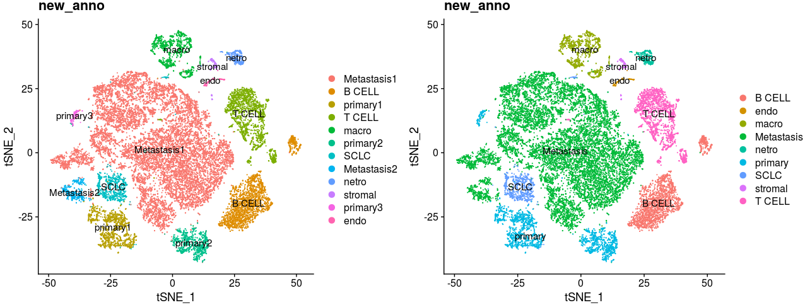

~~~R
# project prior molecular signatures on t-SNE map
merge_by_nothing_tumor <- mcreadRDS("./merge_all/all_merge_by_nothing.rds",mc.cores=20)
aa <- XY_FeaturePlot(object = merge_by_nothing_tumor, features = c("LUCI2LTR","Ascl1","Neurod1",
  "Ddc","Stmn3","Chga","Uchl1","Ncam1","Dll3","Sox2"),pt.size=.1,ncol=5,reduction="tsne",label=F,
  cols = jdb_palette("brewer_celsius", 100, type = c("continuous")))
~~~

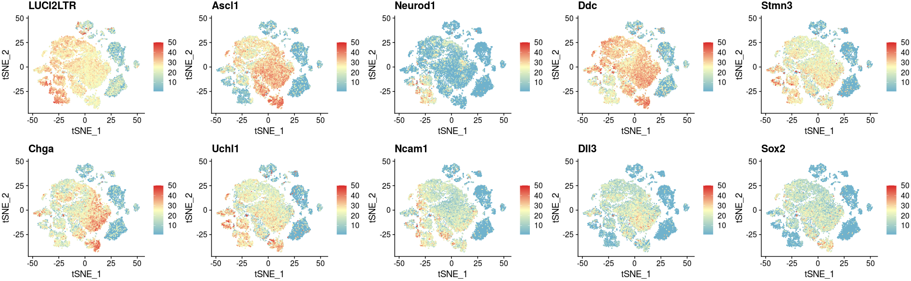

~~~R
# Re-identify each cells cluster by prior molecular signatures
merge_by_nothing_tumor$new_group <- ifelse(merge_by_nothing_tumor$group=="LL","Primary","Metastasis")
merge_by_nothing_tumor$new_anno4 <- merge_by_nothing_tumor$new_anno
merge_by_nothing_tumor$new_anno4 <- gsub("SCLC","SCLC",merge_by_nothing_tumor$new_anno4)
merge_by_nothing_tumor$new_anno4 <- gsub("Metastasis1","SCLC",merge_by_nothing_tumor$new_anno4)
merge_by_nothing_tumor$new_anno4 <- gsub("primary2","SCLC",merge_by_nothing_tumor$new_anno4)
merge_by_nothing_tumor$new_anno4 <- gsub("Metastasis1","SCLC",merge_by_nothing_tumor$new_anno4)
merge_by_nothing_tumor$new_anno4 <- gsub("primary3","SCLC",merge_by_nothing_tumor$new_anno4)
merge_by_nothing_tumor$new_anno4 <- gsub("primary1","SCLC",merge_by_nothing_tumor$new_anno4)
merge_by_nothing_tumor$new_anno4 <- gsub("Metastasis2","SCLC",merge_by_nothing_tumor$new_anno4)
sel_colors <- c("#F2673A","#C878B2","#72C8F1","#359945","#4AC2C5","#4858A7")
names_clu <- c("SCLC", "T CELL", "B CELL", "macro",  "netro", "fibrab")
col <- sel_colors
names(col) <- names_clu
merge_by_nothing_tumor$new_anno4 <- factor(merge_by_nothing_tumor$new_anno4,levels=names_clu)
aa <- DimPlot(object = merge_by_nothing_tumor, reduction = "tsne",
  label=FALSE,pt.size=.5,
  group.by="new_anno4",
  cols=col[unique(merge_by_nothing_tumor$new_anno4)]) +labs(title="tsne")
ggsave("./merge_all/Figure_making/SCLC_map.png", plot=aa,width = 8, height = 6,dpi=1080)
~~~

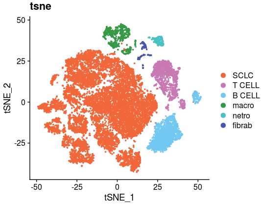

~~~R
# To check the batch effect on t-SNE map
library(scales)
sel_colors <- c("#F2673A","#C878B2","#72C8F1","#359945","#4AC2C5","#4858A7")
names_clu <- c("SCLC", "T CELL", "B CELL", "macro",  "netro", "fibrab")
col <- sel_colors
names(col) <- names_clu
col <- c(col,"#efefef")
names(col)[length(col)] <- "OTS"
merge_by_nothing_tumor$new_anno5 <- merge_by_nothing_tumor$new_anno4
merge_by_nothing_tumor$new_anno5 <- as.character(merge_by_nothing_tumor$new_anno5)
merge_by_nothing_tumor$new_anno5[which(merge_by_nothing_tumor$group!="LL")] <- "OTS"
merge_by_nothing_tumor$new_anno5 <- factor(merge_by_nothing_tumor$new_anno5,levels=c("OTS","SCLC", "T CELL", "B CELL", "macro",  "netro", "fibrab"))
p1 <- XY_DimPlot(merge_by_nothing_tumor, reduction = 'tsne', label = FALSE,repel=TRUE, pt.size = .1,group.by="new_anno5",cols=col[levels(merge_by_nothing_tumor$new_anno5)]) + labs(title="LL")
merge_by_nothing_tumor$new_anno5 <- merge_by_nothing_tumor$new_anno4
merge_by_nothing_tumor$new_anno5 <- as.character(merge_by_nothing_tumor$new_anno5)
merge_by_nothing_tumor$new_anno5[which(merge_by_nothing_tumor$group!="AN")] <- "OTS"
merge_by_nothing_tumor$new_anno5 <- factor(merge_by_nothing_tumor$new_anno5,levels=c("OTS","SCLC", "T CELL", "B CELL", "macro",  "netro", "fibrab"))
p2 <- XY_DimPlot(merge_by_nothing_tumor, reduction = 'tsne', label = FALSE,repel=TRUE, pt.size = .1,group.by="new_anno5",cols=col[levels(merge_by_nothing_tumor$new_anno5)]) + labs(title="AN")
merge_by_nothing_tumor$new_anno5 <- merge_by_nothing_tumor$new_anno4
merge_by_nothing_tumor$new_anno5 <- as.character(merge_by_nothing_tumor$new_anno5)
merge_by_nothing_tumor$new_anno5[which(merge_by_nothing_tumor$group!="TN")] <- "OTS"
merge_by_nothing_tumor$new_anno5 <- factor(merge_by_nothing_tumor$new_anno5,levels=c("OTS","SCLC", "T CELL", "B CELL", "macro",  "netro", "fibrab"))
p3 <- XY_DimPlot(merge_by_nothing_tumor, reduction = 'tsne', label = FALSE,repel=TRUE, pt.size = .1,group.by="new_anno5",cols=col[levels(merge_by_nothing_tumor$new_anno5)]) + labs(title="TN")
merge_by_nothing_tumor$new_anno5 <- merge_by_nothing_tumor$new_anno4
merge_by_nothing_tumor$new_anno5 <- as.character(merge_by_nothing_tumor$new_anno5)
merge_by_nothing_tumor$new_anno5[which(merge_by_nothing_tumor$group!="LT")] <- "OTS"
merge_by_nothing_tumor$new_anno5 <- factor(merge_by_nothing_tumor$new_anno5,levels=c("OTS","SCLC", "T CELL", "B CELL", "macro",  "netro", "fibrab"))
p4 <- XY_DimPlot(merge_by_nothing_tumor, reduction = 'tsne', label = FALSE,repel=TRUE, pt.size = .1,group.by="new_anno5",cols=col[levels(merge_by_nothing_tumor$new_anno5)]) + labs(title="LT")
a <- plot_grid(p1,p2,p3,p4,nrow=1)
ggsave("./merge_all/Figure_making/batch_effect_all_cells.png", plot=a,width = 30, height = 4,dpi=1080)
~~~

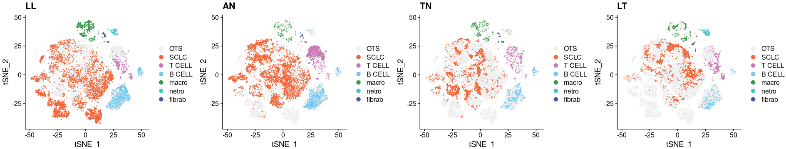

~~~R
# Display signatures genes in each cells subtypes
Idents(merge_by_nothing_tumor) <- merge_by_nothing_tumor$new_anno4
merge_by_nothing_tumor.markers <- FindAllMarkers(object = merge_by_nothing_tumor, only.pos = TRUE, min.pct = 0.25,thresh.use = 0.25)
mcsaveRDS(merge_by_nothing_tumor.markers,"./merge_all/All_cells_markes.rds")

merge_by_nothing_tumor.markers <- mcreadRDS("./merge_all/All_cells_markes.rds")
top50 <- merge_by_nothing_tumor.markers %>% group_by(cluster) %>% top_n(n = 50, wt = avg_logFC)
top50 <- as.data.frame(top50)
top50$cluster <- factor(top50$cluster,levels=c("SCLC","B CELL","macro","T CELL","fibrab","netro"))
top50 <- top50[order(top50$cluster),]
top5 <- merge_by_nothing_tumor.markers %>% group_by(cluster) %>% top_n(n = 5, wt = avg_logFC)
top5 <- as.data.frame(top5)
top5$cluster <- factor(top5$cluster,levels=c("SCLC","B CELL","macro","T CELL","fibrab","netro"))
top5 <- top5[order(top5$cluster),]
merge_by_nothing_tumor$new_anno4 <- factor(merge_by_nothing_tumor$new_anno4,levels=c("SCLC","B CELL","macro","T CELL","fibrab","netro"))
aa <- DotPlot(merge_by_nothing_tumor, features = top5$gene,group.by="new_anno4") + 
RotatedAxis() + scale_colour_gradientn(colours = jdb_palette("ocean_brick")[1:length(jdb_palette("ocean_brick"))])
ggsave("./merge_all/Figure_making/all_genes_signatures.svg", plot=aa,width = 9, height = 6,dpi=1080)
~~~

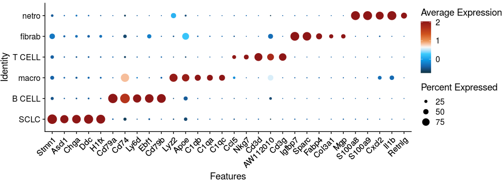

~~~R
# Identify the metastasis signatures in murine SCLC
merge_by_nothing_tumor1 <- subset(merge_by_nothing_tumor,cells=c(rownames(merge_by_nothing_tumor@meta.data[grep("*Ascl1_SCLC",merge_by_nothing_tumor$new_anno3),]),
  rownames(merge_by_nothing_tumor@meta.data[grep("*Neruod1_SCLC",merge_by_nothing_tumor$new_anno3),])))
merge_by_nothing_tumor1$new_anno2 <- gsub("SCLC","Metastasis",merge_by_nothing_tumor1$new_anno2)
merge_by_nothing_tumor1$new_anno2 <- factor(merge_by_nothing_tumor1$new_anno2 ,levels=c("primary","Metastasis"))
Idents(merge_by_nothing_tumor1) <- merge_by_nothing_tumor1$new_anno2
ALL_merge_data_sub.markers <- mcreadRDS("./merge_all/final_Metastasis_vs_primary.rds")

top5 <- ALL_merge_data_sub.markers %>% group_by(cluster) %>% top_n(n = 5, wt = avg_logFC)
top5 <- as.data.frame(top5)
library(BuenColors)
library(ggpubr)
mark_gene <- unique(c(top5$gene,"Ascl1","Neurod1","Kmt2c","Rbl2","Trp73","Kmt2a","Kmt2b","Crebbp","Ep300","Utx",
  "Myc","Nfib","Ezh2","Chga","Ddc","Dll3","Sox1","Ina","Stmn3","Calca","Syp","Uchl1","Ncam1",
  "Dll4","Mycl","Sox2","Ccne1","E2f2","Dll1","Sox2","Sox9","Kmt2a","Kmt2b","Kmt2c","Kmt2d","Kmt2e","Dnmt3a","Dnmt3b","Dll1"))
ALL_merge_data_sub.markers <- ALL_merge_data_sub.markers[order(ALL_merge_data_sub.markers$cluster,ALL_merge_data_sub.markers$avg_logFC,decreasing=TRUE),]
aa <- jdb_palette("wolfgang_basic",type="continuous")[1:length(jdb_palette("wolfgang_basic",type="continuous"))]
pdf(file="./merge_all/DGE_Meta_Prima_heatmap.pdf",width = 5, height = 6)
XY_heatmap(seurat_obj=subset(merge_by_nothing_tumor1,downsample=100),group="new_anno2",genes=ALL_merge_data_sub.markers$gene,all_num=FALSE,new_names=NULL,labels_rot=90,
  assay_sel="RNA",color=aa,min_and_max_cut=2,show_row_names=FALSE,mark_gene=mark_gene,label_size=0)
dev.off()
~~~

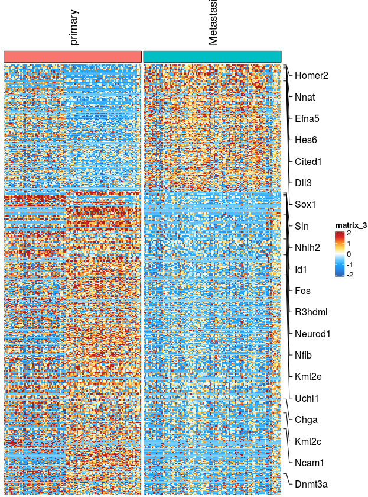

~~~R
# Calculate the correlation between mouse models and patients by cox-regressing in SCLC patients
ALL_merge_data_sub.markers <- mcreadRDS("./merge_all/final_Metastasis_vs_primary.rds")
library(iTALK)
library(nichenetr)
library(tidyr)
Metastasis_UP <- subset(ALL_merge_data_sub.markers,cluster=="Metastasis")
primary_UP <- subset(ALL_merge_data_sub.markers,cluster=="primary")

library("survival")
library("survminer")
SCLC_Nature_RNA <- fread("./SCLC_Patient_data/SCLC_Nature_RNA.csv")
SCLC_Nature_RNA <- as.data.frame(SCLC_Nature_RNA)
SCLC_Nature_RNA <- SCLC_Nature_RNA[!duplicated(SCLC_Nature_RNA$gene),]
rownames(SCLC_Nature_RNA) <- SCLC_Nature_RNA$gene
SCLC_Nature_RNA <- SCLC_Nature_RNA[,c(-1,-2)]
SCLC_Nature_Clinical <- fread("./SCLC_Patient_data/SCLC_Nature_Clinical.csv")
SCLC_Nature_Clinical <- as.data.frame(SCLC_Nature_Clinical)
rownames(SCLC_Nature_Clinical) <- SCLC_Nature_Clinical$'Sample-ID'
both_id <- intersect(colnames(SCLC_Nature_RNA),rownames(SCLC_Nature_Clinical))
SCLC_Nature_Clinical_SEL <- SCLC_Nature_Clinical[both_id,]
table(SCLC_Nature_Clinical_SEL$'primary tumor/metastasis')
colnames(SCLC_Nature_Clinical_SEL)[21] <- "primary_tumor_metastasis"
SCLC_Nature_RNA <- log(SCLC_Nature_RNA+1,2)

primary_UP = primary_UP %>% mutate(from = convert_mouse_to_human_symbols(gene), to = convert_mouse_to_human_symbols(gene)) %>% drop_na()
Metastasis_UP = Metastasis_UP %>% mutate(from = convert_mouse_to_human_symbols(gene), to = convert_mouse_to_human_symbols(gene)) %>% drop_na()
SCLC_TMP <- data.frame(
  primary_UP=apply(SCLC_Nature_RNA[intersect(rownames(SCLC_Nature_RNA),unique(primary_UP$to)),],2,mean),
  Metastasis_UP=apply(SCLC_Nature_RNA[intersect(rownames(SCLC_Nature_RNA),unique(Metastasis_UP$to)),],2,mean)
  )
SCLC_TMP <- SCLC_TMP[rownames(SCLC_Nature_Clinical_SEL),]
SCLC_Nature_Clinical_SEL <- SCLC_Nature_Clinical_SEL[,c("overall_survival (months)","Status (at time of last follow-up)")]
colnames(SCLC_Nature_Clinical_SEL) <- c("dead_date","status")
all_case_and_info <- cbind(SCLC_TMP,SCLC_Nature_Clinical_SEL)
all_case_and_info <- all_case_and_info[,c("dead_date","status","primary_UP","Metastasis_UP")] 
all_case_and_info <- na.omit(all_case_and_info)
case_info_ALL <- all_case_and_info
case_info_ALL <- case_info_ALL[order(case_info_ALL$dead_date,decreasing=T),]
event <- gsub("alive",0,case_info_ALL$status)
event <- gsub("dead",1,event)
case_info_ALL$event <- as.numeric(event)
coxph_result <- coxph(formula = Surv(dead_date, event) ~ primary_UP+Metastasis_UP , data = case_info_ALL)
summary(coxph_result,data=case_info_ALL)
aa <- ggforest(coxph_result, data =case_info_ALL, 
         main = "Hazard ratio",
         cpositions = c(0.10, 0.22, 0.4), 
         fontsize = 1.0, 
         refLabel = "1", noDigits = 1)
ggsave("./merge_all/Figure_making/cox_meta_vs_prima.svg", plot=aa,width = 6, height = 4,dpi=1080)
~~~

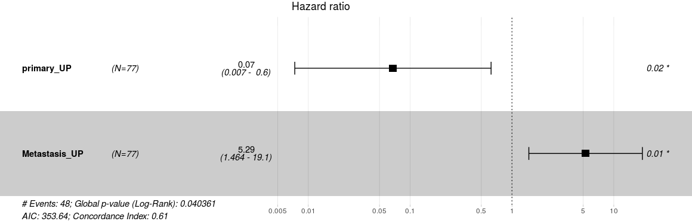

# Part4. Extract the Ascl1+ SCLC populations to re-analysis followed by Seurat workflow

~~~R
# Extract the Ascl1+ SCLC populations to re-analysis
mcsaveRDS(all_merge_by_nothing_ASCL12,"./merge_all/Ascl1_pos_SCLC.rds",mc.cores=20)
all_merge_by_nothing_ASCL1 <- only_ASCL1_epi %>%
    Seurat::NormalizeData(verbose = FALSE) %>%
    FindVariableFeatures(selection.method = "vst", nfeatures = 4000) %>% 
    ScaleData(verbose = TRUE, vars.to.regress = c("nCount_RNA")) %>% 
    RunPCA(pc.genes = all_merge_by_nothing_ASCL1@var.genes, npcs = 30, verbose = FALSE)
all_merge_by_nothing_ASCL1 <- ProjectDim(all_merge_by_nothing_ASCL1)
ElbowPlot(object = all_merge_by_nothing_ASCL1)
all_merge_by_nothing_ASCL1 <- all_merge_by_nothing_ASCL1 %>% 
    RunUMAP(dims = 1:15) %>% 
    RunTSNE(dims = 1:15) %>% 
    FindNeighbors(dims = 1:15) %>% 
    FindClusters(resolution = 0.1) %>% 
    identity()
only_ASCL1_epi$group <- factor(only_ASCL1_epi$group,levels=c("LL","AN","TN","LT"))
DimPlot(object = only_ASCL1_epi, reduction = "tsne",label=TRUE,group.by="new_anno",split.by="group") +labs(title="new_anno")
library(scExtras)
library(plotly)
all_merge_by_nothing_ASCL1 <- RunDiffusion(all_merge_by_nothing_ASCL1,dims = 1:15)
mcsaveRDS(all_merge_by_nothing_ASCL1,"./merge_all/V2_all_merge_by_nothing1.rds")

# Try to use more methods to reduce dimension in Ascl1+ SCLC cells.
# Here, we appreciate the wonderful packages 'reticulate' and 'ReductionWrappers'
library(reticulate)
library(ReductionWrappers)
library(s2a)
all_merge_by_nothing_ASCL1 <- mcreadRDS("./merge_all/V2_all_merge_by_nothing1.rds",mc.cores=20)
all_merge_by_nothing_ASCL1 <- DoForceAtlas2(all_merge_by_nothing_ASCL1, reduction_use = "pca", reduction_save = "fa2",dims_use = 1:15)
all_merge_by_nothing_ASCL1 <- DoopenTSNE(all_merge_by_nothing_ASCL1, reduction_use = "pca", reduction_save = "openTSNE",dims_use = 1:15)
all_merge_by_nothing_ASCL1 <- DoPHATE(all_merge_by_nothing_ASCL1, reduction_use = "pca", reduction_save = "phate",dims_use = 1:15)
py_config()
all_merge_by_nothing_ASCL1 <- DooptSNE(all_merge_by_nothing_ASCL1, reduction_use = "pca", reduction_save = "optsne",dims_use = 1:15)
all_merge_by_nothing_ASCL1 <- XY_RunURD_DM(all_merge_by_nothing_ASCL1,assay = "RNA",key = "URDDM",sigma=15,visua_group="group")
mcsaveRDS(all_merge_by_nothing_ASCL1,"./merge_all/V2_all_merge_by_nothing1.rds",mc.cores=20)

# Now, we could visualize the results of dimension reducing.
p1 <- DimPlot(object = all_merge_by_nothing_ASCL1, reduction = "tsne",label=TRUE,group.by="group") +labs(title="tsne")
p2 <- DimPlot(object = all_merge_by_nothing_ASCL1, reduction = "optsne",label=TRUE,group.by="group") +labs(title="optsne")
p3 <- DimPlot(object = all_merge_by_nothing_ASCL1, reduction = "openTSNE",label=TRUE,group.by="group") +labs(title="openTSNE")
p4 <- DimPlot(object = all_merge_by_nothing_ASCL1, reduction = "phate",label=TRUE,group.by="group") +labs(title="phate")
p5 <- DimPlot(object = all_merge_by_nothing_ASCL1, reduction = "fa2",label=TRUE,group.by="group") +labs(title="ForceAtlas2")
p6 <- DimPlot(object = all_merge_by_nothing_ASCL1, reduction = "umap",label=TRUE,group.by="group") +labs(title="umap")
p7 <- DimPlot(object = all_merge_by_nothing_ASCL1, reduction = "dm",label=TRUE,group.by="group") +labs(title="Diffusion DM")
p8 <- DimPlot(object = all_merge_by_nothing_ASCL1, reduction = "urd",label=TRUE,group.by="group") +labs(title="URD DM")
p9 <- DimPlot(object = all_merge_by_nothing_ASCL1, reduction = "pca",label=TRUE,group.by="group") +labs(title="PCA")
plot_grid(p1,p2,p3,p4,p5,p6,p7,p8,p9,nrow=3)
~~~

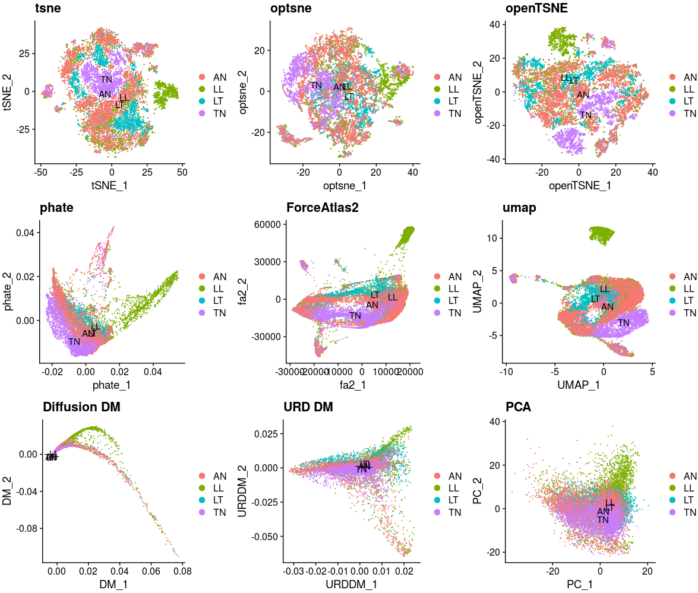

~~~R
all_merge_by_nothing_ASCL1 <- FindClusters(all_merge_by_nothing_ASCL1,resolution = 0.2)
p1 <- DimPlot(object = all_merge_by_nothing_ASCL1, reduction = "tsne",label=TRUE,group.by="RNA_snn_res.0.2") +labs(title="tsne")
p2 <- DimPlot(object = all_merge_by_nothing_ASCL1, reduction = "optsne",label=TRUE,group.by="RNA_snn_res.0.2") +labs(title="optsne")
p3 <- DimPlot(object = all_merge_by_nothing_ASCL1, reduction = "openTSNE",label=TRUE,group.by="RNA_snn_res.0.2") +labs(title="openTSNE")
p4 <- DimPlot(object = all_merge_by_nothing_ASCL1, reduction = "phate",label=TRUE,group.by="RNA_snn_res.0.2") +labs(title="phate")
p5 <- DimPlot(object = all_merge_by_nothing_ASCL1, reduction = "fa2",label=TRUE,group.by="RNA_snn_res.0.2") +labs(title="ForceAtlas2")
p6 <- DimPlot(object = all_merge_by_nothing_ASCL1, reduction = "umap",label=TRUE,group.by="RNA_snn_res.0.2") +labs(title="umap")
p7 <- DimPlot(object = all_merge_by_nothing_ASCL1, reduction = "dm",label=TRUE,group.by="RNA_snn_res.0.2") +labs(title="Diffusion DM")
p8 <- DimPlot(object = all_merge_by_nothing_ASCL1, reduction = "urd",label=TRUE,group.by="RNA_snn_res.0.2") +labs(title="URD DM")
p9 <- DimPlot(object = all_merge_by_nothing_ASCL1, reduction = "pca",label=TRUE,group.by="RNA_snn_res.0.2") +labs(title="PCA")
plot_grid(p1,p2,p3,p4,p5,p6,p7,p8,p9,nrow=3)
~~~

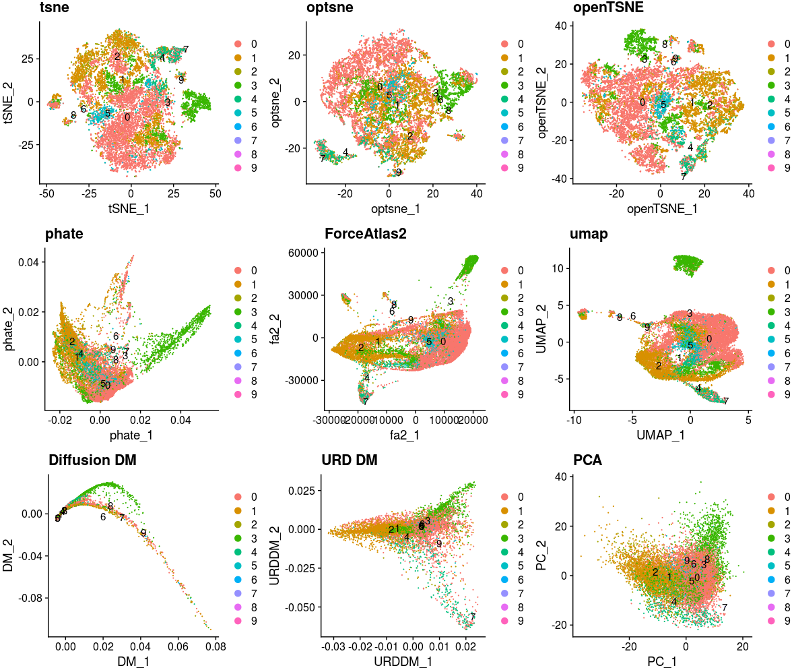

~~~R
# Then, we need to filter some cells that we cannot explain on biology knowledge. And also, we hope future bioinformatics could help us figure them out that explore what’s these cells , what’s their function and why they are here.
plot <- DimPlot(all_merge_by_nothing_ASCL1, reduction = "phate")
all_merge_by_nothing_ASCL12 <- CellSelector(plot = plot, object = all_merge_by_nothing_ASCL1, ident = "selected")
all_merge_by_nothing_ASCL12 <- subset(all_merge_by_nothing_ASCL12,idents=c(0:8))

all_merge_by_nothing_ASCL12$new_anno2 <- gsub("Metastasis1","Metastasis",all_merge_by_nothing_ASCL12$new_anno)
all_merge_by_nothing_ASCL12$new_anno2 <- gsub("primary2","primary",all_merge_by_nothing_ASCL12$new_anno2)
all_merge_by_nothing_ASCL12$new_anno2 <- factor(all_merge_by_nothing_ASCL12$new_anno2,levels=c("primary","Metastasis"))
sel_colors <- c("#3F96B7","#ED5F85")
names_clu <- c("primary","Metastasis")
col <- sel_colors
names(col) <- names_clu
p1 <- XY_DimPlot(all_merge_by_nothing_ASCL12, reduction = 'phate', label = FALSE,repel=TRUE, pt.size = 0.2,
  group.by="new_anno2",cols=col[levels(all_merge_by_nothing_ASCL12$new_anno2)])+NoLegend()
ggsave("./merge_all/Figure_making/Ascl1_Lineage_tranje.png", plot=p1,width = 8, height = 4,dpi=1080)
~~~

~~~R
# To check the batch effect on PHATE map
library(scales)
sel_colors <- c("#3F96B7","#ED5F85")
names_clu <- c("primary","Metastasis")
col <- sel_colors
names(col) <- names_clu
col <- c(col,"#efefef")
names(col)[length(col)] <- "OTS"
all_merge_by_nothing_ASCL12$new_anno5 <- all_merge_by_nothing_ASCL12$new_anno2
all_merge_by_nothing_ASCL12$new_anno5 <- as.character(all_merge_by_nothing_ASCL12$new_anno5)
all_merge_by_nothing_ASCL12$new_anno5[which(all_merge_by_nothing_ASCL12$group!="LL")] <- "OTS"
all_merge_by_nothing_ASCL12$new_anno5 <- factor(all_merge_by_nothing_ASCL12$new_anno5,levels=c("OTS","primary","Metastasis"))
p1 <- XY_DimPlot(all_merge_by_nothing_ASCL12, reduction = 'phate', label = FALSE,repel=TRUE, pt.size = .1,group.by="new_anno5",cols=col[levels(all_merge_by_nothing_ASCL12$new_anno5)]) + labs(title="LL")
all_merge_by_nothing_ASCL12$new_anno5 <- all_merge_by_nothing_ASCL12$new_anno2
all_merge_by_nothing_ASCL12$new_anno5 <- as.character(all_merge_by_nothing_ASCL12$new_anno5)
all_merge_by_nothing_ASCL12$new_anno5[which(all_merge_by_nothing_ASCL12$group!="AN")] <- "OTS"
all_merge_by_nothing_ASCL12$new_anno5 <- factor(all_merge_by_nothing_ASCL12$new_anno5,levels=c("OTS","primary","Metastasis"))
p2 <- XY_DimPlot(all_merge_by_nothing_ASCL12, reduction = 'phate', label = FALSE,repel=TRUE, pt.size = .1,group.by="new_anno5",cols=col[levels(all_merge_by_nothing_ASCL12$new_anno5)]) + labs(title="AN")
all_merge_by_nothing_ASCL12$new_anno5 <- all_merge_by_nothing_ASCL12$new_anno2
all_merge_by_nothing_ASCL12$new_anno5 <- as.character(all_merge_by_nothing_ASCL12$new_anno5)
all_merge_by_nothing_ASCL12$new_anno5[which(all_merge_by_nothing_ASCL12$group!="TN")] <- "OTS"
all_merge_by_nothing_ASCL12$new_anno5 <- factor(all_merge_by_nothing_ASCL12$new_anno5,levels=c("OTS","primary","Metastasis"))
p3 <- XY_DimPlot(all_merge_by_nothing_ASCL12, reduction = 'phate', label = FALSE,repel=TRUE, pt.size = .1,group.by="new_anno5",cols=col[levels(all_merge_by_nothing_ASCL12$new_anno5)]) + labs(title="TN")
all_merge_by_nothing_ASCL12$new_anno5 <- all_merge_by_nothing_ASCL12$new_anno2
all_merge_by_nothing_ASCL12$new_anno5 <- as.character(all_merge_by_nothing_ASCL12$new_anno5)
all_merge_by_nothing_ASCL12$new_anno5[which(all_merge_by_nothing_ASCL12$group!="LT")] <- "OTS"
all_merge_by_nothing_ASCL12$new_anno5 <- factor(all_merge_by_nothing_ASCL12$new_anno5,levels=c("OTS","primary","Metastasis"))
p4 <- XY_DimPlot(all_merge_by_nothing_ASCL12, reduction = 'phate', label = FALSE,repel=TRUE, pt.size = .1,group.by="new_anno5",cols=col[levels(all_merge_by_nothing_ASCL12$new_anno5)]) + labs(title="LT")
a <- plot_grid(p1,p2,p3,p4,nrow=1)
ggsave("./merge_all/Figure_making/Ascl1_Lineage_tranje_split.png", plot=a,width = 30, height = 4,dpi=1080)

~~~

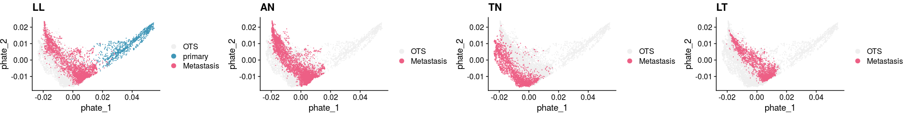

~~~R
# Calculate the metastasis SCLC patients sigantrues scores in each single cell
SCLC_META_VS_PRIM.markers <- mcreadRDS("./SCLC_Patient_data/SCLC_CTC/SCrna/CTX_Metastasis_UP.rds",mc.cores=20)
library(iTALK)
library(nichenetr)
library(tidyr)
SCLC_META_VS_PRIM.markers <- SCLC_META_VS_PRIM.markers %>% mutate(from = convert_human_to_mouse_symbols(gene)) %>% drop_na()
Metastasis_UP <- subset(SCLC_META_VS_PRIM.markers,cluster=="metastasis" & p_val_adj < 0.05 & pct.2 < 0.6)
diff_test_Malignant <- mcreadRDS(file="./merge_all/only_sub_sc1_both_lineage.rds",mc.cores=20)
sig_gene_names_all <- row.names(subset(diff_test_Malignant, qval < 1e-18))
Metastasis_UP <- intersect(Metastasis_UP$from,sig_gene_names_all)
Lineage_marker <- Metastasis_UP
Lineage_marker <- intersect(rownames(GetAssayData(object = all_merge_by_nothing_ASCL12, slot = "data")),Lineage_marker)
speci_raw <- FetchData(object = all_merge_by_nothing_ASCL12, vars = Lineage_marker,slot="data")
all_merge_by_nothing_ASCL12[["CTX_Metastasis_UP"]] <- (rowSums(speci_raw))/length(Lineage_marker)
aa <- XY_FeaturePlot(object = all_merge_by_nothing_ASCL12, features = c("CTX_Metastasis_UP"),pt.size=.1,ncol=2,reduction="phate",label=T,
  cols = jdb_palette("solar_flare", 50, type = c("continuous")))
ggsave("./merge_all/Figure_making/CTX_Metastasis_UP_map.png", plot=aa,width = 8, height = 4,dpi=1080)
~~~

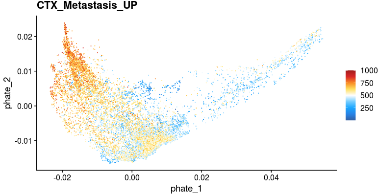

# Part5. Construct the trajectory on Ascl1+ SCLC map

~~~R
# We used sligshot to construct the trajectory on Ascl1+ SCLC map
library(slingshot, quietly = TRUE)
library(splatter, quietly = TRUE)
sim <- as.SingleCellExperiment(all_merge_by_nothing_ASCL12)
colData(sim)$order <- colData(sim)$new_anno
table(colData(sim)$new_anno)
library(RColorBrewer)
colors <- unique(union(brewer.pal(8,'Set3'),brewer.pal(8,'Accent')))
colors <- unique(union(colors,brewer.pal(8,'Set1')))[c(1:length(unique(colData(sim)$order)))]
names(colors) <- unique(colData(sim)$order)
sce <- slingshot(sim, clusterLabels = 'new_anno', reducedDim = 'PHATE', start.clus = c("primary2"),approx_points=300)
plot(reducedDims(sce)$PHATE[,c(1,2)], col = colors[colData(sim)$order])
lines(SlingshotDataSet(sce), lwd=2, col='black',show.constraints = TRUE)
~~~

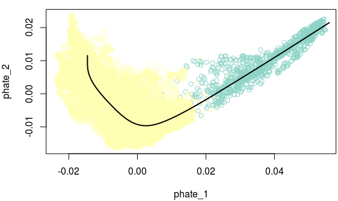

~~~R
# We export the trajectory into seurat meta info
all_meta <- all_merge_by_nothing_ASCL12[[]]
pseudo <- colData(sce)
pseudo <- pseudo[rownames(all_meta),]
all_meta <- cbind(all_meta,pseudo[,c("slingPseudotime_1")])
colnames(all_meta)[c(ncol(all_meta))] <- c("SEL_only_epi")
all_merge_by_nothing_ASCL12@meta.data <- as.data.frame(all_meta)
Pesudo_FeaturePlot(object = all_merge_by_nothing_ASCL12, features = c("SEL_only_epi"),
  ncol=1,pt.size=.5,reduction="phate",label=T,cols = CustomPalette(low ="#007BBF", mid = "#FFF485",high = "#FF0000")) +NoAxes()
~~~

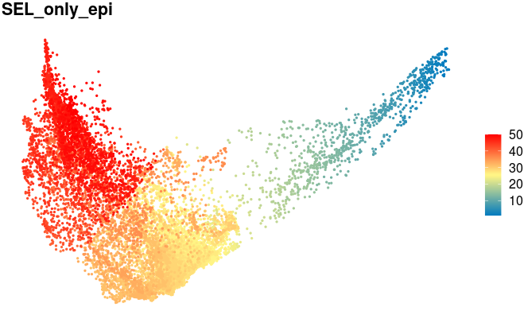

# Part6. Dynamics expression genes identification in Ascl1+ SCLC trajectory 

~~~R
# here, we used principles implemented in monocle to identify the dynamics expression genes based on Ascl1+ SCLC trajectory 
SEL_only_epi <- mcreadRDS(file="./merge_all/1_Metastasis1_path.rds",mc.cores=20)
library(monocle)
seuratX <- SEL_only_epi
data <- as(as.matrix(seuratX@assays$RNA@data), 'sparseMatrix')
pd <- new('AnnotatedDataFrame', data = seuratX@meta.data)
fData <- data.frame(gene_short_name = row.names(data), row.names = row.names(data))
fd <- new('AnnotatedDataFrame', data = fData)
monocle_obj2 <- newCellDataSet(data,
                              phenoData = pd,
                              featureData = fd,
                              expressionFamily = uninormal())# since I have already normalized, thresholded and scalled in Suerat v3.0.0.9150
pData(monocle_obj2)$Pseudotime <- pData(monocle_obj2)$SEL_only_epi
diff_test_res <- monocle::differentialGeneTest(monocle_obj2,
              fullModelFormulaStr = "~sm.ns(Pseudotime)",
              cores=30)
mcsaveRDS(diff_test_res,file="./merge_all/SCLC_ASCL1_peudotime_genes.rds",mc.cores=20)

Binner <- function(cds_object,cells_subset,anno_group){
  df <- data.frame(pData(cds_object[,cells_subset]))
  df <- df[,c("Pseudotime", anno_group)]
  colnames(df) <- c("Pseudotime", "State")
  df <- df[order(df$Pseudotime, decreasing = F),]
  len <- length(df$Pseudotime)
  bin <- round(len/100)
  State <- c()
  value <- c()
  for(i in 0:99){
    if(i < 99){
      start <- 1+(bin*i)
      stop <- bin+(bin*i)
      value <- df$State[c(start:stop)][length(df$State[c(start:stop)])/2]
      State <- c(State, value)
    }
    else{
      State <- c(State, value)
    }
  }
  return(as.data.frame(State))
}
bin <- Binner(monocle_obj2,colnames(monocle_obj2),"new_anno")
diff_test_res <- mcreadRDS(file="./merge_all/SCLC_ASCL1_peudotime_genes.rds",mc.cores=20)
sig_gene_names <- row.names(subset(diff_test_res, qval < 1e-50))

t <- plot_pseudotime_heatmap(monocle_obj2[sig_gene_names,],
                num_clusters = 6,
                cores = 30,
                add_annotation_col = bin,
                show_rownames = T, return_heatmap=TRUE)
mcsaveRDS(t,file="./merge_all/SCLC_ASCL1_pseudotime_heatmap_anno.rds",mc.cores=20)

t <- mcreadRDS(file="./merge_all/SCLC_ASCL1_pseudotime_heatmap_anno.rds",mc.cores=20)
cds_subset <- monocle_obj2[sig_gene_names,]
cluster_rows = TRUE
hclust_method = "ward.D2"
num_clusters = 6
hmcols = NULL
show_rownames = FALSE
use_gene_short_name = TRUE
scale_max = 3
scale_min = -3
trend_formula = "~sm.ns(Pseudotime, df=3)"
pseudocount <- 1
annotation_col <- bin
newdata <- data.frame(Pseudotime = seq(min(pData(cds_subset)$Pseudotime),max(pData(cds_subset)$Pseudotime), length.out = 100))
m <- genSmoothCurves(cds_subset, cores = 30, trend_formula = trend_formula,relative_expr = T, new_data = newdata)
m = m[!apply(m, 1, sum) == 0, ]
m = log10(m + pseudocount)
m = m[!apply(m, 1, sd) == 0, ]
m = Matrix::t(scale(Matrix::t(m), center = TRUE))
m = m[is.na(row.names(m)) == FALSE, ]
m[is.nan(m)] = 0
m[m > scale_max] = scale_max
m[m < scale_min] = scale_min
heatmap_matrix <- m
row_dist <- as.dist((1 - cor(Matrix::t(heatmap_matrix)))/2)
row_dist[is.na(row_dist)] <- 1
bks <- seq(-3.1, 3.1, by = 0.1)
hmcols <- monocle:::blue2green2red(length(bks) - 1)

ph <- mcreadRDS(file="./merge_all/SCLC_ASCL1_pseudotime_heatmap_anno.rds",mc.cores=20)
cds_subset <- monocle_obj2[sig_gene_names,]
annotation_row <- data.frame(Cluster = factor(cutree(ph$tree_row,6)))
annotation_row$gene <- rownames(annotation_row)
annotation_row <- annotation_row[rownames(heatmap_matrix),]

annotation_row1 <- do.call(rbind,list(subset(annotation_row,Cluster==4),
  subset(annotation_row,Cluster==1),
  subset(annotation_row,Cluster==2),
  subset(annotation_row,Cluster==6),
  subset(annotation_row,Cluster==3),
  subset(annotation_row,Cluster==5)))
annotation_row1$Cluster2 <- as.numeric(as.character(annotation_row1$Cluster))
annotation_row1$Cluster2[which(annotation_row1$Cluster==4)] <- 1
annotation_row1$Cluster2[which(annotation_row1$Cluster==1)] <- 1
annotation_row1$Cluster2[which(annotation_row1$Cluster==2)] <- 2
annotation_row1$Cluster2[which(annotation_row1$Cluster==6)] <- 3
annotation_row1$Cluster2[which(annotation_row1$Cluster==3)] <- 3
annotation_row1$Cluster2[which(annotation_row1$Cluster==5 )] <- 4
annotation_row1$Cluster <- as.numeric(as.character(annotation_row1$Cluster2))
annotation_row1 <- data.frame(Cluster=as.character(annotation_row1$Cluster),row.names=rownames(annotation_row1))
mcsaveRDS(annotation_row1,file="./merge_all/SCLC_ASCL1_pseudotime_annotation_row1.rds",mc.cores=20)
order <- as.data.frame(table(annotation_row1$Cluster))

heatmap_matrix <- mcreadRDS(file="./merge_all/SCLC_ASCL1_pseudotime_heatmap_matrix.rds",mc.cores=20)
heatmap_matrix <- heatmap_matrix[rownames(annotation_row1),]
feature_label <- as.character(fData(cds_subset)[row.names(heatmap_matrix),"gene_short_name"])
feature_label[is.na(feature_label)] <- row.names(heatmap_matrix)
row_ann_labels <- as.character(fData(cds_subset)[row.names(annotation_row1),"gene_short_name"])
row_ann_labels[is.na(row_ann_labels)] <- row.names(annotation_row1)
row.names(heatmap_matrix) <- feature_label
row.names(annotation_row1) <- row_ann_labels
colnames(heatmap_matrix) <- c(1:ncol(heatmap_matrix))
library(pheatmap)
ph_res <- pheatmap(heatmap_matrix[,], useRaster = T, cluster_cols = FALSE,
    cluster_rows = F, show_rownames = show_rownames,
    show_colnames = F, clustering_distance_rows = row_dist,
    clustering_method = NULL, cutree_rows = 0,gaps_row =c(order$Freq[1],(order$Freq[1]+order$Freq[2]),(order$Freq[1]+order$Freq[2]+order$Freq[3])),
    annotation_row = annotation_row1, annotation_col = annotation_col,
    treeheight_row = 20, breaks = bks, fontsize = 6, color = hmcols,
    border_color = NA, silent = TRUE, filename = NA)
mcsaveRDS(heatmap_matrix,file="./merge_all/SCLC_ASCL1_pseudotime_heatmap_matrix.rds",mc.cores=20)

ph_res <- pheatmap(heatmap_matrix[,], useRaster = T, cluster_cols = FALSE,
    cluster_rows = F, show_rownames = TRUE,
    show_colnames = F, clustering_distance_rows = row_dist,
    clustering_method = NULL, cutree_rows = 0,gaps_row =c(order$Freq[1],(order$Freq[1]+order$Freq[2]),(order$Freq[1]+order$Freq[2]+order$Freq[3])),
    annotation_row = annotation_row1, annotation_col = annotation_col,
    treeheight_row = 20, breaks = bks, fontsize = 6, color = hmcols,
    border_color = NA, silent = TRUE, filename = NA)
pdf(file="./merge_all/SCLC_ASCL1_pseudotime_with_anno.pdf",width = 10, height = 200)
ph_res
dev.off()
~~~

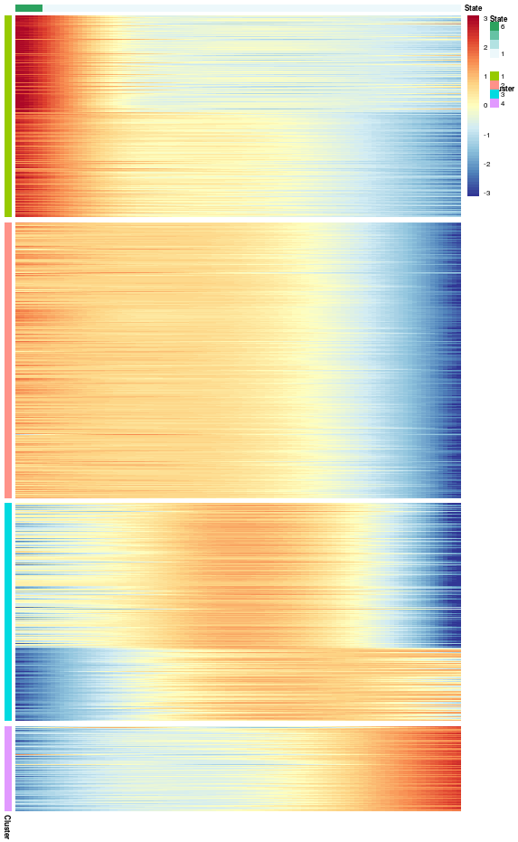

~~~R
# UP till now, we have generated four sub-modules of dynamics expression genes based on Ascl1+ SCLC trajectory.
# We also want to explore the biology meaning in each sub-module by combining clinical information such as survival rates and metastasis status.
annotation_row1 <- mcreadRDS(file="./merge_all/SCLC_ASCL1_pseudotime_annotation_row1.rds",mc.cores=20)
annotation_row1$gene <- rownames(annotation_row1)
clu1 <- subset(annotation_row1,Cluster==1)
clu2 <- subset(annotation_row1,Cluster==2)
clu3 <- subset(annotation_row1,Cluster==3)
clu4 <- subset(annotation_row1,Cluster==4)
library(iTALK)
library(nichenetr)
library(tidyr)
clu1 = clu1 %>% mutate(from = convert_mouse_to_human_symbols(gene), to = convert_mouse_to_human_symbols(gene)) %>% drop_na()
clu2 = clu2 %>% mutate(from = convert_mouse_to_human_symbols(gene), to = convert_mouse_to_human_symbols(gene)) %>% drop_na()
clu3 = clu3 %>% mutate(from = convert_mouse_to_human_symbols(gene), to = convert_mouse_to_human_symbols(gene)) %>% drop_na()
clu4 = clu4 %>% mutate(from = convert_mouse_to_human_symbols(gene), to = convert_mouse_to_human_symbols(gene)) %>% drop_na()

CDX_META_INFO <- read.csv("./SCLC_Patient_data/SCLC_CTC/bulk_RNA/counts_table/CDX_META_INFO.csv")
CDX_META_INFO$CDX.No. <- paste0("CDX",CDX_META_INFO$CDX.No.)
CDX_META_INFO$CDX.No. <- gsub("CDX33P","CDX33/33P",CDX_META_INFO$CDX.No.)
all_tmp_data <- future_lapply(CDX_META_INFO$CDX.No.,function(x){
  sel_meta <- subset(CDX_META_INFO,CDX.No.==x)
  id_t <- unlist(strsplit(sel_meta$CDX.No.,split="/"))
  if (length(id_t)==1) {
    sel_meta <- do.call(rbind,list(sel_meta,sel_meta,sel_meta,sel_meta,sel_meta,sel_meta))
    sel_meta$id <- c(rep(id_t[1],6))
    sel_meta$new_id <- paste0(sel_meta$CDX.No.,c("",".1",".2",".3",".4",".5"))
  } else {
    sel_meta <- do.call(rbind,list(sel_meta,sel_meta,sel_meta,sel_meta,sel_meta,sel_meta,
      sel_meta,sel_meta,sel_meta,sel_meta,sel_meta,sel_meta))
    sel_meta$id <- c(rep(id_t[1],6),rep(paste0("CDX",id_t[2]),6))
    sel_meta$new_id <- c(paste0(id_t[1],c("",".1",".2",".3",".4",".5")),paste0("CDX",id_t[2],c("",".1",".2",".3",".4",".5")))
  }
  return(sel_meta)
  })
all_tmp <- do.call(rbind,all_tmp_data)
all_tmp$new_id <- gsub("CDX0","CDX",all_tmp$new_id)
all_tmp$id <- gsub("CDX0","CDX",all_tmp$id)
rownames(all_tmp) <- all_tmp$new_id

names <- c("CDX8","CDX38","CDX8P","CDX29","CDX25","CDX17P","CDX17","CDX30P","CDX33","CDX33P","CDX15P","CDX20P","CDX7","CDX12","CDX45","CDX18P","CDX15PP","CDX46","CDX3","CDX3P","CDX14P","CDX22P","CDX42","CDX32P","CDX4","CDX42P","CDX18","CDX34","CDX10","CDX35","CDX9","CDX26","CDX40","CDX2","CDX1","CDX20","CDX39P","CDX41P","CDX13")
names <- gsub("CDX0","CDX",names)
group <- c("NEUROD1","ASCL1","NEUROD1","NEUROD1","ATOH1","ATOH1","ATOH1","ATOH1","ASCL1","ASCL1","ASCL1","ASCL1","ASCL1","ASCL1","ASCL1","ASCL1","ASCL1","ASCL1","ASCL1","ASCL1","ASCL1","ASCL1","ASCL1","ASCL1","ASCL1","ASCL1","ASCL1","ASCL1","ASCL1","ASCL1","ASCL1","ASCL1","ASCL1","ASCL1","ASCL1","ASCL1","ASCL1","ASCL1","POU2F3")
names(group) <- names
all_tmp$Type <- group[all_tmp$id]
all_tmp$Type <- paste0(all_tmp$Type," + SCLC")

CDXData <- read.csv("./SCLC_Patient_data/SCLC_CTC/bulk_RNA/counts_table/FinalCDXDataTable.csv")
CDXData <- CDXData[!duplicated(CDXData$gene_name),]
rownames(CDXData) <- CDXData$gene_name
CDXData <- CDXData[,-c(1,2,3)]
CDXData <- log(CDXData+1,2)
CDXData <- as.data.frame(t(CDXData))
rownames(CDXData) <- gsub("CDX","CDX",rownames(CDXData))
both_id <- intersect(rownames(CDXData),rownames(all_tmp))
all_tmp <- all_tmp[both_id,]
CDXData <- CDXData[both_id,]
sel_gene_CDXData <- data.frame(clu1=as.character(apply(CDXData[,intersect(colnames(CDXData),unique(clu1$from))],1,mean)),
clu2=as.character(apply(CDXData[,intersect(colnames(CDXData),unique(clu2$from))],1,mean)),
clu3=as.character(apply(CDXData[,intersect(colnames(CDXData),unique(clu3$from))],1,mean)),
clu4=as.character(apply(CDXData[,intersect(colnames(CDXData),unique(clu4$from))],1,mean)),
SOX2=as.character(CDXData[,"SOX2"]),
ASCL1=as.character(CDXData[,"ASCL1"]),
row.names=rownames(CDXData))
sel_gene_CDXData$clu1 <- as.numeric(as.character(scale(as.numeric(as.character(sel_gene_CDXData$clu1)))))
sel_gene_CDXData$clu2 <- as.numeric(as.character(scale(as.numeric(as.character(sel_gene_CDXData$clu2)))))
sel_gene_CDXData$clu3 <- as.numeric(as.character(scale(as.numeric(as.character(sel_gene_CDXData$clu3)))))
sel_gene_CDXData$clu4 <- as.numeric(as.character(scale(as.numeric(as.character(sel_gene_CDXData$clu4)))))
sel_gene_CDXData$SOX2 <- as.numeric(as.character(scale(as.numeric(as.character(sel_gene_CDXData$SOX2)))))
sel_gene_CDXData$ASCL1 <- as.numeric(as.character(scale(as.numeric(as.character(sel_gene_CDXData$ASCL1)))))
sel_gene_CDXData_g <- sel_gene_CDXData
sel_gene_CDXData <- sel_gene_CDXData[,c(1:4)]
sel_gene_CDXData$group <- unlist(future_lapply(1:nrow(sel_gene_CDXData),function(x){
    sel_tmp <- sel_gene_CDXData[x,]
    group_n <- colnames(sel_tmp)[which(sel_tmp==max(sel_tmp))]
    return(group_n)
    }))

chonglai_zscore_1 <- t(apply(sel_gene_CDXData[,-ncol(sel_gene_CDXData)], 1, function(x) (x-mean(x))/sd(x)))
chonglai_zscore_1[chonglai_zscore_1>1] <- 1
chonglai_zscore_1[chonglai_zscore_1< -1] <- -1
bks <- seq(-1, 1, by = 0.1)
library(scales)
library(BuenColors)
library(pheatmap)
aa <- jdb_palette("solar_extra",, type = c("continuous"))[1:length(jdb_palette("solar_extra",, type = c("continuous")))]
hmcols <- colorRampPalette(aa)(length(bks) - 1)
annotation_col <- data.frame(group=sel_gene_CDXData[,ncol(sel_gene_CDXData)],
  Gender=all_tmp$Gender,
  SCLC.Stage=all_tmp$SCLC.Stage,
  Site.of.Metastases=all_tmp$Site.s..of.Metastases,
  Treatment=all_tmp$X1st.Line.Treatment,
  Treatment.Response=all_tmp$Treatment.Response,
  Survival.months=all_tmp$Survival..months.,
  Type=all_tmp$Type,
  row.names=rownames(sel_gene_CDXData))
annotation_col1 <- annotation_col[order(annotation_col$group),]
order <- as.data.frame(table(annotation_col1$group))
chonglai_zscore_1 <- chonglai_zscore_1[rownames(annotation_col1),]
ph_res <- pheatmap(t(chonglai_zscore_1), useRaster = T, cluster_cols = FALSE,
    cluster_rows = F, show_rownames = TRUE,
    show_colnames = FALSE,
    clustering_method = NULL, cutree_rows = 0,gaps_col =c(order$Freq[1],order$Freq[1]+order$Freq[2],order$Freq[1]+order$Freq[2]+order$Freq[3]),
    annotation_col = annotation_col1, 
    treeheight_row = 20, breaks = bks, color = hmcols,
    border_color = NA, silent = TRUE, filename = NA)

~~~

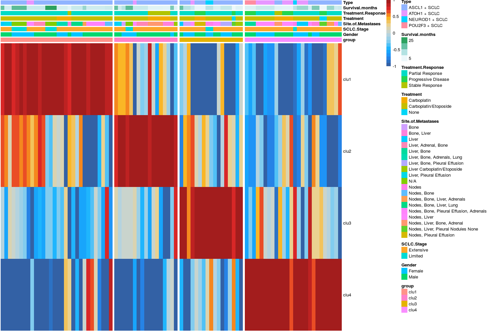

~~~R
summar_group <- as.data.frame(table(annotation_col$Treatment.Response,annotation_col$group))
summar_group <- do.call(rbind,future_lapply(unique(summar_group$Var1),function(x){
  tmp_s <- subset(summar_group,Var1==x)
  tmp_s$normalized_Freq <- round(100*(tmp_s$Freq)/sum(tmp_s$Freq),2)
  return(tmp_s)
  }))

library(ggalluvial)
summar_group$Var1 <- factor(summar_group$Var1,levels=c("Stable Response","Partial Response","Progressive Disease"))
summar_group$Var2 <- factor(summar_group$Var2,levels=c("clu4","clu3","clu2","clu1"))
p1 <- ggplot(summar_group, aes(x = Var1, y = normalized_Freq, fill = Var2, 
    stratum = Var2, alluvium = Var2)) +
geom_stratum() +  #代替 geom_col() 绘制堆叠柱形图
geom_flow(alpha = 0.5) +  #绘制同类别之间的连接线
labs(x = '', y = 'Relative Abundance(%)',title="Treatment.Response")
 
summar_group <- as.data.frame(table(annotation_col$SCLC.Stage,annotation_col$group))
summar_group <- do.call(rbind,future_lapply(unique(summar_group$Var1),function(x){
  tmp_s <- subset(summar_group,Var1==x)
  tmp_s$normalized_Freq <- round(100*(tmp_s$Freq)/sum(tmp_s$Freq),2)
  return(tmp_s)
  }))
library(ggalluvial)
summar_group$Var1 <- factor(summar_group$Var1,levels=c("Limited","Extensive"))
summar_group$Var2 <- factor(summar_group$Var2,levels=c("clu4","clu3","clu2","clu1"))
p2 <- ggplot(summar_group, aes(x = Var1, y = normalized_Freq, fill = Var2, 
    stratum = Var2, alluvium = Var2)) +
geom_stratum() +  #代替 geom_col() 绘制堆叠柱形图
geom_flow(alpha = 0.5) +  #绘制同类别之间的连接线
labs(x = '', y = 'Relative Abundance(%)',title="SCLC.Stage")
aa <- plot_grid(p1,p2)
ggsave("./merge_all/Figure_making/SCLC_ASCL1_pseudotime_with_SCLC_CDX_BARPLOT.svg", plot=aa,width = 6, height = 4,dpi=1080)
~~~

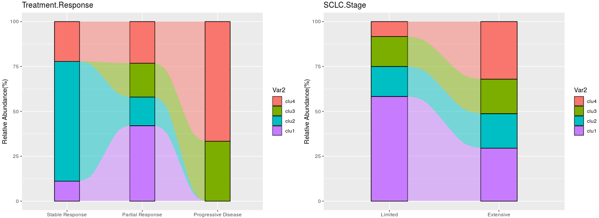

~~~R
library("survival")
library("survminer")
SCLC_Nature_RNA <- fread("./SCLC_Patient_data/SCLC_Nature_RNA.csv")
SCLC_Nature_RNA <- as.data.frame(SCLC_Nature_RNA)
SCLC_Nature_RNA <- SCLC_Nature_RNA[!duplicated(SCLC_Nature_RNA$gene),]
rownames(SCLC_Nature_RNA) <- SCLC_Nature_RNA$gene
SCLC_Nature_RNA <- SCLC_Nature_RNA[,c(-1,-2)]
SCLC_Nature_Clinical <- fread("./SCLC_Patient_data/SCLC_Nature_Clinical.csv")
SCLC_Nature_Clinical <- as.data.frame(SCLC_Nature_Clinical)
rownames(SCLC_Nature_Clinical) <- SCLC_Nature_Clinical$'Sample-ID'
both_id <- intersect(colnames(SCLC_Nature_RNA),rownames(SCLC_Nature_Clinical))
SCLC_Nature_Clinical_SEL <- SCLC_Nature_Clinical[both_id,]
table(SCLC_Nature_Clinical_SEL$'primary tumor/metastasis')
colnames(SCLC_Nature_Clinical_SEL)[21] <- "primary_tumor_metastasis"
SCLC_Nature_RNA <- log(SCLC_Nature_RNA+1,2)
SCLC_Nature_RNA <- as.data.frame(t(SCLC_Nature_RNA))
annotation_row1 <- mcreadRDS(file="./merge_all/SCLC_ASCL1_pseudotime_annotation_row1.rds",mc.cores=20)
annotation_row1$gene <- rownames(annotation_row1)
clu1 <- subset(annotation_row1,Cluster==1)
clu2 <- subset(annotation_row1,Cluster==2)
clu3 <- subset(annotation_row1,Cluster==3)
clu4 <- subset(annotation_row1,Cluster==4)
library(iTALK)
library(nichenetr)
library(tidyr)
clu1 = clu1 %>% mutate(from = convert_mouse_to_human_symbols(gene), to = convert_mouse_to_human_symbols(gene)) %>% drop_na()
clu2 = clu2 %>% mutate(from = convert_mouse_to_human_symbols(gene), to = convert_mouse_to_human_symbols(gene)) %>% drop_na()
clu3 = clu3 %>% mutate(from = convert_mouse_to_human_symbols(gene), to = convert_mouse_to_human_symbols(gene)) %>% drop_na()
clu4 = clu4 %>% mutate(from = convert_mouse_to_human_symbols(gene), to = convert_mouse_to_human_symbols(gene)) %>% drop_na()
sel_gene_SCLC_Nature_RNA <- data.frame(clu1=as.character(apply(SCLC_Nature_RNA[,intersect(colnames(SCLC_Nature_RNA),unique(clu1$from))],1,mean)),
clu2=as.character(apply(SCLC_Nature_RNA[,intersect(colnames(SCLC_Nature_RNA),unique(clu2$from))],1,mean)),
clu3=as.character(apply(SCLC_Nature_RNA[,intersect(colnames(SCLC_Nature_RNA),unique(clu3$from))],1,mean)),
clu4=as.character(apply(SCLC_Nature_RNA[,intersect(colnames(SCLC_Nature_RNA),unique(clu4$from))],1,mean)),
MLL3=as.character(SCLC_Nature_RNA[,"MLL3"]),
row.names=rownames(SCLC_Nature_RNA))
sel_gene_SCLC_Nature_RNA$clu1 <- as.numeric(as.character(scale(as.numeric(as.character(sel_gene_SCLC_Nature_RNA$clu1)))))
sel_gene_SCLC_Nature_RNA$clu2 <- as.numeric(as.character(scale(as.numeric(as.character(sel_gene_SCLC_Nature_RNA$clu2)))))
sel_gene_SCLC_Nature_RNA$clu3 <- as.numeric(as.character(scale(as.numeric(as.character(sel_gene_SCLC_Nature_RNA$clu3)))))
sel_gene_SCLC_Nature_RNA$clu4 <- as.numeric(as.character(scale(as.numeric(as.character(sel_gene_SCLC_Nature_RNA$clu4)))))
sel_gene_SCLC_Nature_RNA$MLL3 <- as.numeric(as.character(scale(as.numeric(as.character(sel_gene_SCLC_Nature_RNA$MLL3)))))

sel_gene_SCLC_Nature_RNA <- data.frame(clu1=as.character(apply(SCLC_Nature_RNA[,intersect(colnames(SCLC_Nature_RNA),unique(clu1$from))],1,mean)),
clu2=as.character(apply(SCLC_Nature_RNA[,intersect(colnames(SCLC_Nature_RNA),unique(clu2$from))],1,mean)),
clu3=as.character(apply(SCLC_Nature_RNA[,intersect(colnames(SCLC_Nature_RNA),unique(clu3$from))],1,mean)),
clu4=as.character(apply(SCLC_Nature_RNA[,intersect(colnames(SCLC_Nature_RNA),unique(clu4$from))],1,mean)),
row.names=rownames(SCLC_Nature_RNA))
sel_gene_SCLC_Nature_RNA$clu1 <- as.numeric(as.character(scale(as.numeric(as.character(sel_gene_SCLC_Nature_RNA$clu1)))))
sel_gene_SCLC_Nature_RNA$clu2 <- as.numeric(as.character(scale(as.numeric(as.character(sel_gene_SCLC_Nature_RNA$clu2)))))
sel_gene_SCLC_Nature_RNA$clu3 <- as.numeric(as.character(scale(as.numeric(as.character(sel_gene_SCLC_Nature_RNA$clu3)))))
sel_gene_SCLC_Nature_RNA$clu4 <- as.numeric(as.character(scale(as.numeric(as.character(sel_gene_SCLC_Nature_RNA$clu4)))))

library("survival")
library("survminer")
SCLC_Nature_Clinical_SEL1 <- SCLC_Nature_Clinical_SEL[,c("overall_survival (months)","Status (at time of last follow-up)")]
colnames(SCLC_Nature_Clinical_SEL1) <- c("dead_date","status")
all_case_and_info <- cbind(sel_gene_SCLC_Nature_RNA,SCLC_Nature_Clinical_SEL1[,c("dead_date","status")])
all_case_and_info <- na.omit(all_case_and_info)
case_info_ALL <- all_case_and_info
case_info_ALL <- case_info_ALL[order(case_info_ALL$dead_date,decreasing=T),]
event <- gsub("alive",0,case_info_ALL$status)
event <- gsub("dead",1,event)
case_info_ALL$event <- as.numeric(event)
all_case_and_info <- cbind(sel_gene_SCLC_Nature_RNA,SCLC_Nature_Clinical_SEL1)
all_case_and_info <- na.omit(all_case_and_info)
case_info_ALL <- all_case_and_info
case_info_ALL <- case_info_ALL[order(case_info_ALL$dead_date,decreasing=T),]
event <- gsub("alive",0,case_info_ALL$status)
event <- gsub("dead",1,event)
case_info_ALL$event <- as.numeric(event)
case_info_ALL.cut <- surv_cutpoint(
   case_info_ALL,
   time = "dead_date",
   event = "event",
   variables = c("clu1"),
   progressbar=TRUE,
   minprop=0.3
)
summary(case_info_ALL.cut)
plot(case_info_ALL.cut, "clu1")
case_info_ALL.cut.cat <- surv_categorize(case_info_ALL.cut) 
library(survival)
fit <- survfit(Surv(dead_date, event) ~ clu1, data = case_info_ALL.cut.cat)
aa <- ggsurvplot(fit, data = case_info_ALL.cut.cat,
surv.median.line = "hv",
pval = TRUE,
ggtheme = theme_bw(),
risk.table=TRUE)
ggsave("./merge_all/Figure_making/SCLC_ASCL1_pseudotime_with_Nature_Patients_survival_clu1.svg", plot=aa$plot,width = 4, height = 4,dpi=1080)

~~~

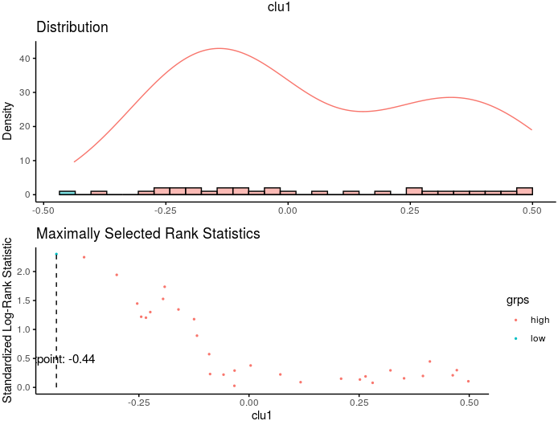

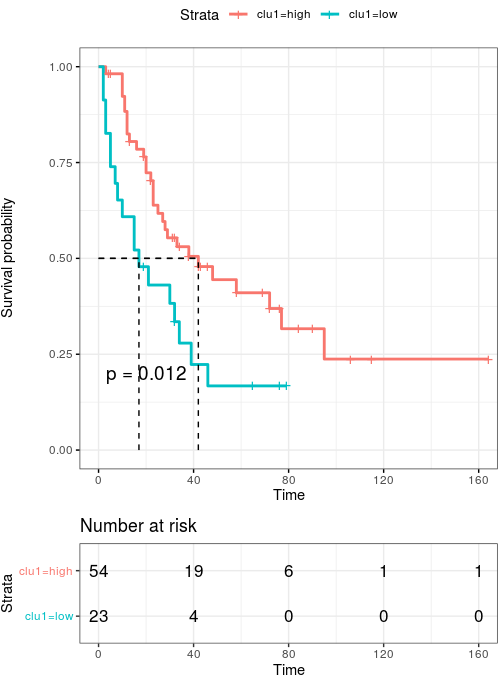

~~~R
case_info_ALL.cut <- surv_cutpoint(
   case_info_ALL,
   time = "dead_date",
   event = "event",
   variables = c("clu2"),
   progressbar=TRUE,
   minprop=0.3
)
summary(case_info_ALL.cut)
plot(case_info_ALL.cut, "clu2")
case_info_ALL.cut.cat <- surv_categorize(case_info_ALL.cut) 
library(survival)
fit <- survfit(Surv(dead_date, event) ~ clu2, data = case_info_ALL.cut.cat)
aa <- ggsurvplot(fit, data = case_info_ALL.cut.cat,
surv.median.line = "hv",
pval = TRUE,
ggtheme = theme_bw(),
risk.table=TRUE)
ggsave("./merge_all/Figure_making/SCLC_ASCL1_pseudotime_with_Nature_Patients_survival_clu2.svg", plot=aa$plot,width = 4, height = 4,dpi=1080)
~~~

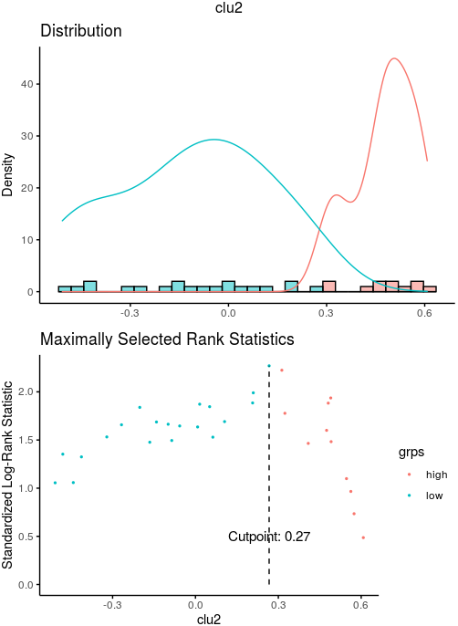

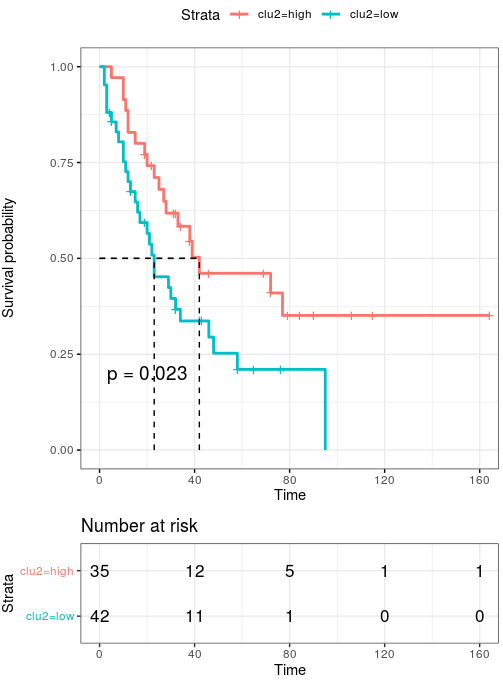

# Part7. Pathways enrichments

~~~R
ph <- mcreadRDS(file="./merge_all/SCLC_Neurod1_pseudotime_heatmap_anno.rds",mc.cores=20)
cds_subset <- monocle_obj2[sig_gene_names,]
annotation_row <- data.frame(Cluster = factor(cutree(ph$tree_row,6)))
annotation_row$gene <- rownames(annotation_row)
annotation_row <- annotation_row[rownames(heatmap_matrix),]

annotation_row1 <- do.call(rbind,list(subset(annotation_row,Cluster==3),
  subset(annotation_row,Cluster==5),
  subset(annotation_row,Cluster==1),
  subset(annotation_row,Cluster==2),
  subset(annotation_row,Cluster==4),
  subset(annotation_row,Cluster==6)))
annotation_row1$Cluster2 <- as.numeric(as.character(annotation_row1$Cluster))
annotation_row1$Cluster2[which(annotation_row1$Cluster==3)] <- 1
annotation_row1$Cluster2[which(annotation_row1$Cluster==5)] <- 1
annotation_row1$Cluster2[which(annotation_row1$Cluster==1)] <- 2
annotation_row1$Cluster2[which(annotation_row1$Cluster==2)] <- 2
annotation_row1$Cluster2[which(annotation_row1$Cluster==4)] <- 3
annotation_row1$Cluster2[which(annotation_row1$Cluster==6 )] <- 3
annotation_row1$Cluster <- as.numeric(as.character(annotation_row1$Cluster2))
annotation_row1 <- data.frame(Cluster=as.character(annotation_row1$Cluster),row.names=rownames(annotation_row1))
col_genes <- annotation_row1
col_genes$gene <- rownames(col_genes)

info <- col_genes[,c("Cluster","gene")]
top_marker <- c()
number.group <- length(unique(info$Cluster))
for (i in c(1:number.group)){
  y <- info$Cluster
  marker <- info[with(info,y==i),]
  top_marker[[i]] <- marker
  names(top_marker)[i] <- paste("clu",i,sep="_")
}
gcSampl <- c()
for (i in c(1:length(top_marker))){
t <- top_marker[[i]]
symbol <- as.character(t$gene)
DD <- symbol
t$entrez <- mapIds(x = org.Mm.eg.db,
                        keys = DD,
            keytype ="SYMBOL",
            column ="ENTREZID",
            multiVals="first")
names <- na.omit(t)
entrez <- as.character(names$entrez)
gcSampl[[i]] <- entrez
names(gcSampl)[i] <- names(top_marker)[i]
print(paste(names(top_marker)[i],"is done",sep = " "))
}

HLH_T1_OFF_HIGH_GO <- mcreadRDS(file="./merge_all/SCLC_Neurod1_pseudotime_GO.rds",mc.cores=20) 
dotplot(HLH_T1_OFF_HIGH_GO,showCategory=5,includeAll=FALSE) + 
  theme(axis.text.x  = element_text(angle=45, vjust=1,size=8,hjust = 1)) + labs(title = "GO BP")

SE_all_clu1 <- as.data.frame(HLH_T1_OFF_HIGH_GO)
SE_all_clu1 <- SE_all_clu1[order(SE_all_clu1$Cluster,(SE_all_clu1$p.adjust)),]
subset(SE_all_clu1,Cluster=="clu_3")$Description[1:50]
sel_path <- c(c("cytoplasmic translation","ribonucleoprotein complex biogenesis","ribosome biogenesis","rRNA processing","rRNA metabolic process"),
  c("regulation of mRNA metabolic process","mRNA processing","RNA splicing","regulation of mRNA processing","mRNA splicing, via spliceosome"),
  c("axonogenesis","axon extension","neuron projection extension","developmental growth involved in morphogenesis","regulation of axonogenesis"))
SE_all_clu1 <- XY_subset(SE_all_clu1,"Description",sel_path)
dedulicate_no <- XY_subset(SE_all_clu1,"Description",setdiff(unique(SE_all_clu1$Description),SE_all_clu1$Description[duplicated(SE_all_clu1$Description)]))
dedulicate <- do.call(rbind,future_lapply(SE_all_clu1$Description[duplicated(SE_all_clu1$Description)],function(x){
  sel_t <- subset(SE_all_clu1,Description==x)
  sel_t <- sel_t[which(sel_t$p.adjust==min(sel_t$p.adjust)),]
  return(sel_t)
  }))
SE_all_clu1 <- rbind(dedulicate_no,dedulicate)
SE_all_clu1 <- SE_all_clu1[order(SE_all_clu1$Cluster,(SE_all_clu1$p.adjust)),]

SE_all_clu1$ID <- paste0(SE_all_clu1$ID,1:nrow(SE_all_clu1))
rownames(SE_all_clu1) <- SE_all_clu1$ID
geneSets <- as(SE_all_clu1[, "ID"], "list")
names(geneSets) <- SE_all_clu1[, "ID"]
data_sel <- new("compareClusterResult", compareClusterResult = SE_all_clu1, geneClusters = gcSampl,fun = "enrichKEGG")
aa <- dotplot(data_sel,showCategory=5,includeAll=FALSE) + 
  theme(axis.text.x  = element_text(angle=45, vjust=1,size=8,hjust = 1)) + labs(title = "GO BP")
ggsave("./merge_all/Figure_making/Neurod1_Lineage_tranje_GO_BP.svg", plot=aa,width = 6, height = 5,dpi=1080)
~~~

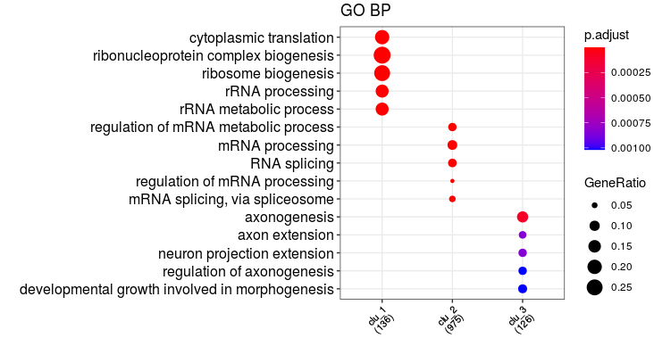

