# scRNA-seq analysis in lung organoids with *Kmt2c* Knocking out

In this pipeline, we showed the detail codes of scRNA-seq analyzing in  lung organoids with *Kmt2c* Knocking out, including quality control, dimension reducing, population clustering, differentiation genes expression identifying, trajectory constructing, dynamics expression genes identification and pathways enrichments. To make reproducible results from our code, the raw data and processed data were totally submitted. Besides, we generate Markdowns files to record all steps. 

# Part1. we should load the packages we need for following analysis

~~~R
suppressPackageStartupMessages({
  library(dplyr)
  library(Seurat)
  library(Matrix)
  library(proxy)
  library(gplots)
  library(Rtsne)
  library(densityClust)
  library(irlba)
  library(monocle)
  library(plyr)
  library(DOSE)
  library(clusterProfiler)
  library(topGO)
  library(pathview)
  library(AnnotationDbi)
  library(cowplot)
  library(ggplot2)
  library(velocyto.R)
  library(trqwe)
  library(Rsamtools)
  library(GenomicFeatures)
  library(GenomicAlignments)
  library(BiocParallel)
  library(pheatmap)
  library(RColorBrewer)
  library(PoiClaClu)
  library(org.Mm.eg.db)
  library(org.Hs.eg.db)
  library(DESeq2)
  library(data.table)
  library(stringr)
  library(iTALK)
  library(nichenetr)
  library(tidyr)
})
source("./modified_codes/MyBestFunction_scRNA.R")# modified methods by our effort
library(future)
library(future.apply)
options(future.globals.maxSize = 300 * 1024^3)
plan("multiprocess", workers = 15)
plan()
library(scales)
library(BuenColors)
~~~

We use the same pipelines as previously mentioned to load counts data into Seurat workflow. Here, we only showed the dimension reducing, cell annotation and visualization of figure making based on .rds files that already be processed followed by standard normalization. Besides, we also showed how we construct the two lineages by slingshot and visualize the dynamic trend of each gene we are interested.

# Part2. Cell annotation and visualization of figure making

~~~R
only_sub_sc1 <- mcreadRDS("./merge_all/only_sub_sc_0123_30_sub.rds",mc.cores=20)
only_sub_sc1$new_clu7 <- gsub("clu1","Cyp2f2_pos_Cells",only_sub_sc1$new_clu6)
only_sub_sc1$new_clu7 <- gsub("clu2","Notch1_pos_Cells",only_sub_sc1$new_clu7)
only_sub_sc1$new_clu7 <- gsub("clu3","Trp63_pos_Cells",only_sub_sc1$new_clu7)
only_sub_sc1$new_clu7 <- gsub("clu4","Mki67_pos_Cells",only_sub_sc1$new_clu7)
umap_pos <- as.data.frame(only_sub_sc1[["umap"]]@cell.embeddings)
sel_cells <- subset(umap_pos,UMAP_1>0,UMAP_2>0)
only_sub_sc1@meta.data[intersect(rownames(subset(only_sub_sc1@meta.data,new_clu7=="Trp63_pos_Cells")),rownames(sel_cells)),]$new_clu7 <- "Mki67_pos_Cells"
only_sub_sc1$new_clu7 <- factor(only_sub_sc1$new_clu7,levels=c("Cyp2f2_pos_Cells","Notch1_pos_Cells","Trp63_pos_Cells","Mki67_pos_Cells"))
aa <- DotPlot(only_sub_sc1, features = c("Cyp2f2","Notch1","Trp63","Mki67"),group.by="new_clu7") + 
  RotatedAxis() + scale_colour_gradientn(colours = jdb_palette("ocean_brick")[1:length(jdb_palette("ocean_brick"))])
~~~

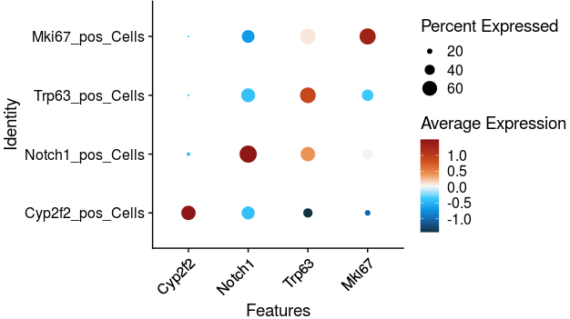

~~~R

umap_pos <- as.data.frame(only_sub_sc1[["umap"]]@cell.embeddings)
umap_pos <- umap_pos[rownames(only_sub_sc1[[]]),]
umap_pos$group <- only_sub_sc1$group
umap_pos$new_clu3 <- only_sub_sc1$new_clu7
umap_pos$new_clu4 <- umap_pos$new_clu3
umap_pos$new_clu4 <- factor(umap_pos$new_clu4,levels=c("Trp63_pos_Cells", "Notch1_pos_Cells", "Cyp2f2_pos_Cells", "Mki67_pos_Cells"))
library(scales)
library(BuenColors)
aa <- jdb_palette("brewer_yes")[length(jdb_palette("brewer_yes")):1]
sp <- ggplot(umap_pos, aes(x=UMAP_1, y=UMAP_2,colour=new_clu3)) + 
  geom_point(alpha=0.5,size=1)+
  scale_color_manual(values = c("#F88D50","#88CFA4","#3F96B7","#DC494C"))+
  facet_wrap(~group)
sp +  geom_density_2d(aes(alpha = ..nlevel..),colour="#BB2933", size = 1) + 
scale_alpha_continuous(range = c(0, 0.8)) + theme_classic()
~~~

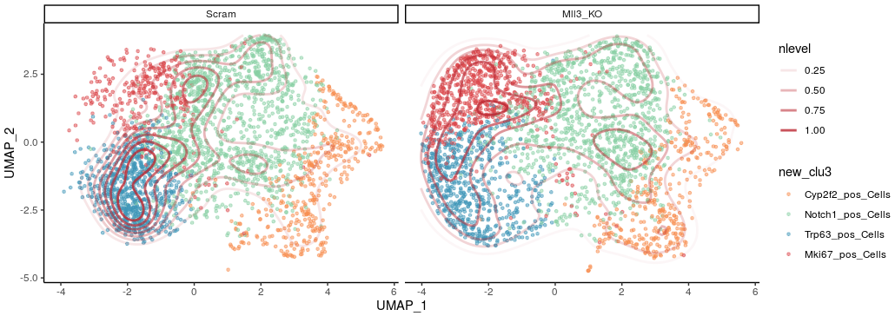

~~~R
aa <- jdb_palette("brewer_yes")[length(jdb_palette("brewer_yes")):1]
sp <- ggplot(umap_pos, aes(x=UMAP_1, y=UMAP_2,colour=new_clu3)) + 
  geom_point(alpha=0.5,size=1)+
  scale_color_manual(values = c("#F88D50","#88CFA4","#3F96B7","#DC494C"))+
  facet_wrap(~group)+ theme_classic()
~~~

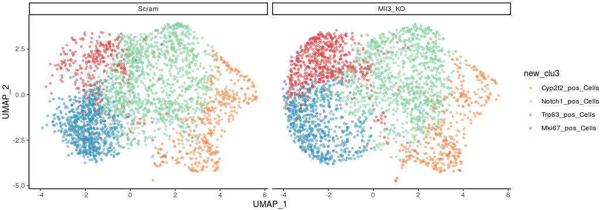

# Part3. Construct the lineages on UMAP plot

~~~R
# Because we have identified two lineages based on our prior biology, we want to construct appropriate trajectories fitted these lineages. We planned to extract each linage cells and construct appropriate trajectory.
Idents(only_sub_sc1) <- only_sub_sc1$new_clu7
only_sub_sc_KI67_P63 <- subset(only_sub_sc1,idents=c("Trp63_pos_Cells","Mki67_pos_Cells"))
Idents(only_sub_sc1) <- only_sub_sc1$new_clu7
only_sub_sc_KI67_Notch_Cyp2f2 <- subset(only_sub_sc1,idents=c("Trp63_pos_Cells","Cyp2f2_pos_Cells","Notch1_pos_Cells"))
p1 <- DimPlot(object = only_sub_sc_KI67_P63, reduction = "umap",group.by="new_clu7",pt.size=.5) +labs(title="new_clu7")
p2 <- DimPlot(object = only_sub_sc_KI67_Notch_Cyp2f2, reduction = "umap",group.by="new_clu7",pt.size=.5) +labs(title="new_clu7")
plot_grid(p1,p2)
~~~

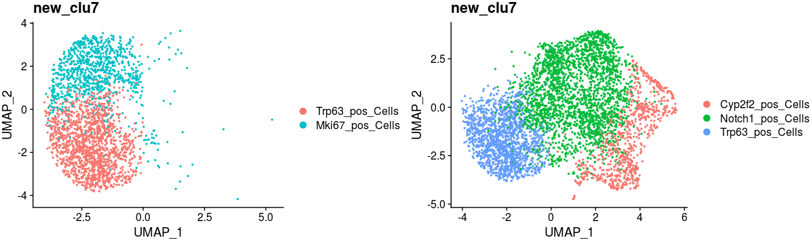

~~~R
library(slingshot, quietly = TRUE)
library(splatter, quietly = TRUE)
sim <- as.SingleCellExperiment(only_sub_sc_KI67_P63)
colData(sim)$new_clu5 <- as.character(colData(sim)$new_clu7)
colData(sim)$order <- colData(sim)$new_clu5
table(colData(sim)$new_clu5)
library(RColorBrewer)
colors <- unique(union(brewer.pal(8,'Set3'),brewer.pal(8,'Accent')))
colors <- unique(union(colors,brewer.pal(8,'Set1')))[c(1:length(unique(colData(sim)$order)))]
names(colors) <- unique(colData(sim)$order)
sce_Malig <- slingshot(sim, clusterLabels = 'new_clu5', reducedDim = 'UMAP', start.clus = "Trp63_pos_Cells",end.clus = "Mki67_pos_Cells",approx_points=300)
plot(reducedDims(sce_Malig)$UMAP[,c(1,2)], col = colors[colData(sim)$order])
lines(SlingshotDataSet(sce_Malig), lwd=2, col='black',show.constraints = TRUE)
~~~

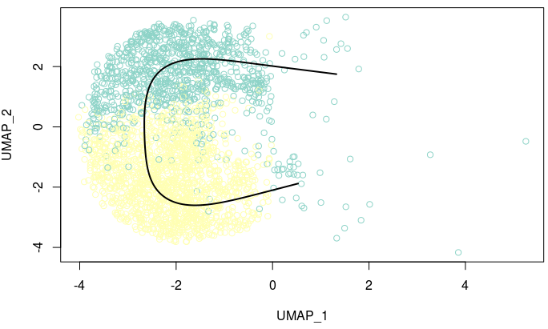

~~~R
all_meta <- only_sub_sc_KI67_P63[[]]
pseudo <- colData(sce_Malig)
pseudo <- pseudo[rownames(all_meta),]
all_meta <- cbind(all_meta,pseudo[,c("slingPseudotime_1")])
colnames(all_meta)[ncol(all_meta)] <- c("Malignant_lineage")
only_sub_sc_KI67_P63@meta.data <- as.data.frame(all_meta)
Pesudo_FeaturePlot(object = only_sub_sc_KI67_P63, features = c("Malignant_lineage"),
  ncol=1,pt.size=.5,reduction="umap",label=T,cols = CustomPalette(low ="#007BBF", mid = "#FFF485",high = "#FF0000")) +NoAxes()
~~~

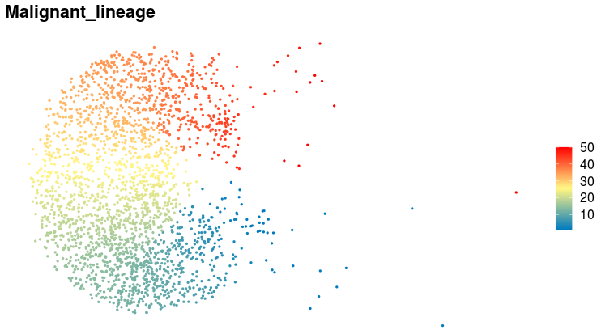

~~~R
library(slingshot, quietly = TRUE)
library(splatter, quietly = TRUE)
sim <- as.SingleCellExperiment(only_sub_sc_KI67_Notch_Cyp2f2)
colData(sim)$new_clu5 <- as.character(colData(sim)$new_clu7)
colData(sim)$order <- colData(sim)$new_clu5
table(colData(sim)$new_clu5)
library(RColorBrewer)
colors <- unique(union(brewer.pal(8,'Set3'),brewer.pal(8,'Accent')))
colors <- unique(union(colors,brewer.pal(8,'Set1')))[c(1:length(unique(colData(sim)$order)))]
names(colors) <- unique(colData(sim)$order)
sce_devlep <- slingshot(sim, clusterLabels = 'new_clu5', reducedDim = 'UMAP', start.clus = "Trp63_pos_Cells",end.clus = "Cyp2f2_pos_Cells",approx_points=300)
plot(reducedDims(sce_devlep)$UMAP[,c(1,2)], col = colors[colData(sim)$order])
lines(SlingshotDataSet(sce_devlep), lwd=2, col='black',show.constraints = TRUE)
~~~

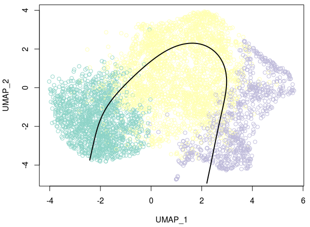

~~~R
all_meta <- only_sub_sc_KI67_Notch_Cyp2f2[[]]
pseudo <- colData(sce_devlep)
pseudo <- pseudo[rownames(all_meta),]
all_meta <- cbind(all_meta,pseudo[,c("slingPseudotime_1")])
colnames(all_meta)[ncol(all_meta)] <- c("develooment_lineage")
only_sub_sc_KI67_Notch_Cyp2f2@meta.data <- as.data.frame(all_meta)
Pesudo_FeaturePlot(object = only_sub_sc_KI67_Notch_Cyp2f2, features = c("develooment_lineage"),
  ncol=1,pt.size=.5,reduction="umap",label=T,cols = CustomPalette(low ="#007BBF", mid = "#FFF485",high = "#FF0000")) +NoAxes()
~~~

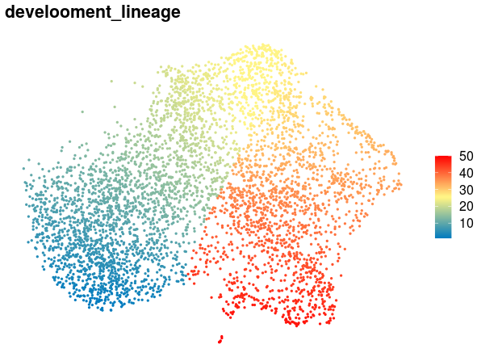

~~~R
only_sub_sc1$Malignant_lineage <- NA
only_sub_sc1$develooment_lineage <- NA
only_sub_sc1@meta.data[rownames(only_sub_sc_KI67_P63@meta.data),]$Malignant_lineage <- only_sub_sc_KI67_P63$Malignant_lineage
only_sub_sc1@meta.data[rownames(only_sub_sc_KI67_Notch_Cyp2f2@meta.data),]$develooment_lineage <- only_sub_sc_KI67_Notch_Cyp2f2$develooment_lineage
p1 <- Pesudo_FeaturePlot(object = only_sub_sc1, features = c("develooment_lineage"),
  ncol=1,pt.size=.5,reduction="umap",label=T,cols = CustomPalette(low ="#007BBF", mid = "#FFF485",high = "#FF0000")) +NoAxes()
p2 <- Pesudo_FeaturePlot(object = only_sub_sc1, features = c("Malignant_lineage"),
  ncol=1,pt.size=.5,reduction="umap",label=T,cols = CustomPalette(low ="#007BBF", mid = "#FFF485",high = "#FF0000")) +NoAxes()
plot_grid(p1,p2)
~~~

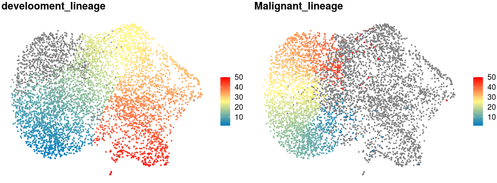

# Part4. Dynamics expression gene identification

To better predict the most variable dynamics expression genes based on malignant linage and development lineage, we plan to integrate two linages into an continuous trajectory that we could use the principles implemented in monocle to identify all the dynamics expression genes. 

~~~R
sel_meta <- only_sub_sc1@meta.data
sel_meta <- sel_meta[order(sel_meta$Malignant_lineage,decreasing=TRUE),]
sel_meta$Malignant_lineage[is.na(sel_meta$Malignant_lineage)] <- 0
sel_meta <- sel_meta[order(sel_meta$develooment_lineage,decreasing=TRUE),]
sel_meta$develooment_lineage <- (-1)*sel_meta$develooment_lineage
sel_meta$develooment_lineage[is.na(sel_meta$develooment_lineage)] <- 0
sel_meta$merge_all <- sel_meta$develooment_lineage+sel_meta$Malignant_lineage
only_sub_sc1$merge_all_order <- sel_meta[rownames(only_sub_sc1[[]]),]$merge_all
Pesudo_FeaturePlot(object = only_sub_sc1, features = c("merge_all_order"),
  ncol=1,pt.size=.5,reduction="umap",label=T,cols = CustomPalette(low ="#007BBF", mid = "#FFF485",high = "#FF0000")) +NoAxes()
mcsaveRDS(only_sub_sc1,"./merge_all/only_sub_sc_0123_30_sub.rds",mc.cores=20)
~~~

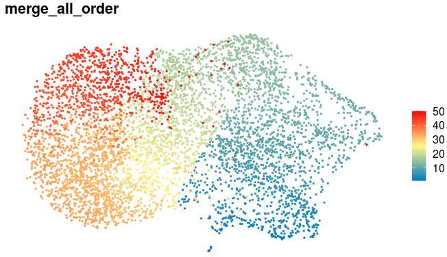

~~~R
llibrary(monocle)
Idents(only_sub_sc1) <- only_sub_sc1$group
seuratX_all <- only_sub_sc1
meta_tmp <- seuratX_all@meta.data
meta_tmp$new_clu7 <- factor(meta_tmp$new_clu7,levels=c("Trp63_pos_Cells","Notch1_pos_Cells","Cyp2f2_pos_Cells","Mki67_pos_Cells"))
data <- as(as.matrix(seuratX_all@assays$RNA@data), 'sparseMatrix')
pd <- new('AnnotatedDataFrame', data = seuratX_all@meta.data)
fData <- data.frame(gene_short_name = row.names(data), row.names = row.names(data))
fd <- new('AnnotatedDataFrame', data = fData)
monocle_obj2_all_both <- newCellDataSet(data,
                              phenoData = pd,
                              featureData = fd,
                              expressionFamily = uninormal())# since I have already normalized, thresholded and scalled in Suerat v3.0.0.9150
pData(monocle_obj2_all_both)$Pseudotime <- pData(monocle_obj2_all_both)$merge_all_order
diff_test_res_all <- monocle::differentialGeneTest(monocle_obj2_all_both,
              fullModelFormulaStr = "~sm.ns(Pseudotime)",
              cores=30)
mcsaveRDS(diff_test_res_all,file="./merge_all/only_sub_sc1_both_lineage.rds",mc.cores=20)

diff_test_Malignant <- mcreadRDS(file="./merge_all/only_sub_sc1_both_lineage.rds",mc.cores=20)
sig_gene_names_both <- row.names(subset(diff_test_Malignant, qval < 0.01))
#both_id <- intersect(sig_gene_names_devel,sig_gene_names_both)
length(sig_gene_names_both)
which(sig_gene_names_both=="Trp63")
which(sig_gene_names_both=="Mki67")
which(sig_gene_names_both=="Notch1")
which(sig_gene_names_both=="Cyp2f2")

Binner <- function(cds_object,cells_subset,anno_group){
  df <- data.frame(pData(cds_object[,cells_subset]))
  df <- df[,c("Pseudotime", anno_group)]
  colnames(df) <- c("Pseudotime", "State")
  df$State <- as.character(df$State)
  df <- df[order(df$Pseudotime, decreasing = F),]
  len <- length(df$Pseudotime)
  bin <- round(len/100)
  State <- c()
  value <- c()
  for(i in 0:99){
    if(i < 99){
      start <- 1+(bin*i)
      stop <- bin+(bin*i)
      value <- df$State[c(start:stop)][length(df$State[c(start:stop)])/2]
      State <- c(State, value)
    }
    else{
      State <- c(State, value)
    }
  }
  return(as.data.frame(State))
}
bin <- Binner(monocle_obj2_all_both,colnames(monocle_obj2_all_both),"new_clu7")
bin1 <- Binner(monocle_obj2_all_both,colnames(monocle_obj2_all_both),"group")
bin <- cbind(bin,bin1)
colnames(bin) <- c("State","group")

t <- plot_pseudotime_heatmap(monocle_obj2_all_both[sig_gene_names_both,],
                num_clusters = 6,
                cores = 30,
                add_annotation_col = bin,
                show_rownames = T, return_heatmap=TRUE)
mcsaveRDS(t,file="./merge_all/only_sub_sc_both_pseudotime_heatmap_anno_all.rds",mc.cores=20)

t <- mcreadRDS(file="./merge_all/only_sub_sc_both_pseudotime_heatmap_anno_all.rds",mc.cores=20)
cds_subset <- monocle_obj2_all_both[sig_gene_names_both,]
cluster_rows = TRUE
hclust_method = "ward.D2"
num_clusters = 6
hmcols = NULL
show_rownames = FALSE
use_gene_short_name = TRUE
scale_max = 3
scale_min = -3
trend_formula = "~sm.ns(Pseudotime, df=3)"
pseudocount <- 1
annotation_col <- bin
newdata <- data.frame(Pseudotime = seq(min(pData(cds_subset)$Pseudotime),max(pData(cds_subset)$Pseudotime), length.out = 100))
m <- genSmoothCurves(cds_subset, cores = 30, trend_formula = trend_formula,relative_expr = T, new_data = newdata)
m = m[!apply(m, 1, sum) == 0, ]
m = log10(m + pseudocount)
m = m[!apply(m, 1, sd) == 0, ]
m = Matrix::t(scale(Matrix::t(m), center = TRUE))
m = m[is.na(row.names(m)) == FALSE, ]
m[is.nan(m)] = 0
m[m > scale_max] = scale_max
m[m < scale_min] = scale_min
heatmap_matrix <- m
row_dist <- as.dist((1 - cor(Matrix::t(heatmap_matrix)))/2)
row_dist[is.na(row_dist)] <- 1
bks <- seq(-3.1, 3.1, by = 0.1)
hmcols <- monocle:::blue2green2red(length(bks) - 1)

ph <- mcreadRDS(file="./merge_all/only_sub_sc_both_pseudotime_heatmap_anno_all.rds",mc.cores=20)
cds_subset <- monocle_obj2_all_both[sig_gene_names_both,]
annotation_row <- data.frame(Cluster = factor(cutree(ph$tree_row,6)))
annotation_row$gene <- rownames(annotation_row)
annotation_row <- annotation_row[rownames(heatmap_matrix),]

annotation_row1 <- do.call(rbind,list(subset(annotation_row,Cluster==3),
  subset(annotation_row,Cluster==6),
  subset(annotation_row,Cluster==5),
  subset(annotation_row,Cluster==2),
  subset(annotation_row,Cluster==4),
  subset(annotation_row,Cluster==1)))

annotation_row1$Cluster2 <- as.numeric(as.character(annotation_row1$Cluster))
annotation_row1$Cluster2[which(annotation_row1$Cluster==3)] <- 1
annotation_row1$Cluster2[which(annotation_row1$Cluster==6)] <- 1
annotation_row1$Cluster2[which(annotation_row1$Cluster==5)] <- 2
annotation_row1$Cluster2[which(annotation_row1$Cluster==2)] <- 3
annotation_row1$Cluster2[which(annotation_row1$Cluster==4)] <- 4
annotation_row1$Cluster2[which(annotation_row1$Cluster==1 )] <- 5
annotation_row1$Cluster <- as.numeric(as.character(annotation_row1$Cluster2))
annotation_row1 <- data.frame(Cluster=as.character(annotation_row1$Cluster),row.names=rownames(annotation_row1))
order <- as.data.frame(table(annotation_row1$Cluster))

heatmap_matrix <- heatmap_matrix[rownames(annotation_row1),]
feature_label <- as.character(fData(cds_subset)[row.names(heatmap_matrix),"gene_short_name"])
feature_label[is.na(feature_label)] <- row.names(heatmap_matrix)
row_ann_labels <- as.character(fData(cds_subset)[row.names(annotation_row1),"gene_short_name"])
row_ann_labels[is.na(row_ann_labels)] <- row.names(annotation_row1)
row.names(heatmap_matrix) <- feature_label
row.names(annotation_row1) <- row_ann_labels
colnames(heatmap_matrix) <- c(1:ncol(heatmap_matrix))
library(pheatmap)
library(BuenColors)
library(PNWColors)
pal <- jdb_palette("wolfgang_extra")[length(jdb_palette("wolfgang_extra")):1]
hmcols <- grDevices::colorRampPalette(as.character(pal))(c(length(bks) - 1))
ph_res <- pheatmap(heatmap_matrix[,], useRaster = T, cluster_cols = FALSE,
    cluster_rows = F, show_rownames = show_rownames,
    show_colnames = F, clustering_distance_rows = row_dist,
    clustering_method = NULL, cutree_rows = 0,gaps_row =c(order$Freq[1],
      (order$Freq[1]+order$Freq[2]),
      (order$Freq[1]+order$Freq[2]+order$Freq[3]),
      (order$Freq[1]+order$Freq[2]+order$Freq[3]+order$Freq[4])),
    annotation_row = annotation_row1, annotation_col = annotation_col,
    treeheight_row = 20, breaks = bks, fontsize = 6, color = hmcols,
    border_color = NA, silent = TRUE, filename = NA)
mcsaveRDS(heatmap_matrix,file="./merge_all/only_sub_sc_both_pseudotime_heatmap_matrix_all.rds",mc.cores=20)
pdf(file="./merge_all/only_sub_sc_both_pseudotime_all1.pdf",width = 10, height = 15)
ph_res
dev.off()
~~~

The dynamics expression gene heatmap were displayed that was optimized by Adobe illustrators. And the top enriched pathways results were generated by the same method as previously mentioned in Chapter1. All the results were integrated into one figure as following:

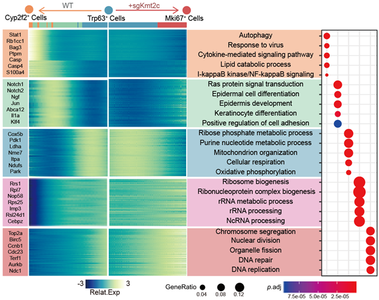

# Part5. Calculation, quantification and visualization of signatures in each cell

~~~R
diff_test_Malignant <- mcreadRDS(file="./merge_all/only_sub_sc1_both_lineage.rds",mc.cores=20)
sig_gene_names_all <- row.names(subset(diff_test_Malignant, qval < 1e-18))
SCLC_META_VS_PRIM.markers <- mcreadRDS("./CTX_Metastasis_UP.rds",mc.cores=20)
library(iTALK)
library(nichenetr)
library(tidyr)
SCLC_META_VS_PRIM.markers <- SCLC_META_VS_PRIM.markers %>% mutate(from = convert_human_to_mouse_symbols(gene)) %>% drop_na()
Metastasis_UP <- subset(SCLC_META_VS_PRIM.markers,cluster=="metastasis" & p_val_adj < 0.05 & pct.2 < 0.6)
Metastasis_UP <- intersect(Metastasis_UP$from,sig_gene_names_all)
Lineage_marker <- Metastasis_UP
Lineage_marker <- intersect(rownames(GetAssayData(object = only_sub_sc1, slot = "data")),Lineage_marker)
speci_raw <- FetchData(object = only_sub_sc1, vars = Lineage_marker,slot="data")
only_sub_sc1[["CTX_Metastasis_UP"]] <- (rowSums(speci_raw))/length(Lineage_marker)

speci_raw <- FetchData(object = only_sub_sc1, vars = c("Notch1","Dnmt3a","Trp63","Cyp2f2","Kmt2c","Mki67","merge_all_order","group","new_clu4","new_clu7","SCLC_high","CTX_Metastasis_UP"),slot="data")
speci_raw$SCLC_high <- scale((speci_raw$SCLC_high-min(speci_raw$SCLC_high))/(max(speci_raw$SCLC_high)-min(speci_raw$SCLC_high)))
speci_raw$CTX_Metastasis_UP <- scale((speci_raw$CTX_Metastasis_UP-min(speci_raw$CTX_Metastasis_UP))/(max(speci_raw$CTX_Metastasis_UP)-min(speci_raw$CTX_Metastasis_UP)))
speci_raw$Dnmt3a <- scale((speci_raw$Dnmt3a-min(speci_raw$Dnmt3a))/(max(speci_raw$Dnmt3a)-min(speci_raw$Dnmt3a)))
speci_raw$Kmt2c <- scale((speci_raw$Kmt2c-min(speci_raw$Kmt2c))/(max(speci_raw$Kmt2c)-min(speci_raw$Kmt2c)))
speci_raw$Notch1 <- scale((speci_raw$Notch1-min(speci_raw$Notch1))/(max(speci_raw$Notch1)-min(speci_raw$Notch1)))
speci_raw$Trp63 <- scale((speci_raw$Trp63-min(speci_raw$Trp63))/(max(speci_raw$Trp63)-min(speci_raw$Trp63)))
speci_raw$Cyp2f2 <- scale((speci_raw$Cyp2f2-min(speci_raw$Cyp2f2))/(max(speci_raw$Cyp2f2)-min(speci_raw$Cyp2f2)))
speci_raw$Mki67 <- scale((speci_raw$Mki67-min(speci_raw$Mki67))/(max(speci_raw$Mki67)-min(speci_raw$Mki67)))
speci_raw$group <- factor(speci_raw$group,levels=c("Scram","Mll3_KO"))
#speci_raw <- speci_raw[order(speci_raw$new_clu7,speci_raw$merge_all_order),]
speci_raw <- speci_raw[order(speci_raw$merge_all_order),]
speci_raw$order <- 1:nrow(speci_raw)
speci_raw_WT <- subset(speci_raw,group=="Scram")
speci_raw_KO <- subset(speci_raw,group=="Mll3_KO")
speci_raw_WT <- speci_raw_WT[order(speci_raw_WT$merge_all_order),]
speci_raw_KO <- speci_raw_KO[order(speci_raw_KO$merge_all_order),]
speci_raw_WT$order <- 1:nrow(speci_raw_WT)
speci_raw_KO$order <- 1:nrow(speci_raw_KO)
speci_raw_new <- rbind(speci_raw_WT,speci_raw_KO)
aa <- jdb_palette("brewer_spectra",type = "continuous")
p1 <- ggplot(speci_raw_new, aes(order, CTX_Metastasis_UP,color=new_clu7)) +
  geom_point(alpha=0.3,size=0) +scale_color_manual(values = c("#F88D50","#88CFA4","#3F96B7","#DC494C"))+
  geom_rug(alpha = 0.1, position = "jitter",sides="b")+ xlab("Pseudotime")+
  theme_classic() + geom_smooth(colour = "orange",se=TRUE) +NoLegend()+ labs(title="CTX_Metastasis_UP")
p2 <- ggplot(speci_raw_new, aes(order, SCLC_high,color=new_clu7)) +
  geom_point(alpha=0.3,size=0) +scale_color_manual(values = c("#F88D50","#88CFA4","#3F96B7","#DC494C"))+
  geom_rug(alpha = 0.1, position = "jitter",sides="b")+ xlab("Pseudotime")+
  theme_classic() + geom_smooth(colour = "orange",se=TRUE) +NoLegend()+ labs(title="SCLC_high")
aa <- plot_grid(p1,p2,nrow=1)
~~~

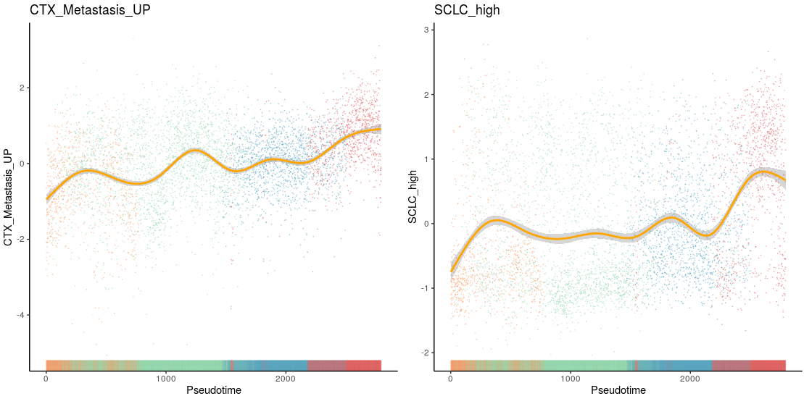

~~~R
# For Calculation, quantification and visualization of specific gene
p1 <- ggplot(speci_raw_new, aes(order, Dnmt3a,color=new_clu7)) +
  geom_point(alpha=0.3,size=0) +scale_color_manual(values = c("#F88D50","#88CFA4","#3F96B7","#DC494C"))+
  geom_rug(alpha = 0.1, position = "jitter",sides="b")+ xlab("Pseudotime")+
  theme_classic() + geom_smooth(colour = "orange",se=TRUE) +NoLegend()+ labs(title="Dnmt3a")
p2 <- ggplot(speci_raw_new, aes(order, Notch1,color=new_clu7)) +
  geom_point(alpha=0.3,size=0) +scale_color_manual(values = c("#F88D50","#88CFA4","#3F96B7","#DC494C"))+
  geom_rug(alpha = 0.1, position = "jitter",sides="b")+ xlab("Pseudotime")+
  theme_classic() + geom_smooth(colour = "orange",se=TRUE) +NoLegend()+ labs(title="Notch1")
p3 <- ggplot(speci_raw_new, aes(order, Cyp2f2,color=new_clu7)) +
  geom_point(alpha=0.3,size=0) +scale_color_manual(values = c("#F88D50","#88CFA4","#3F96B7","#DC494C"))+
  geom_rug(alpha = 0.1, position = "jitter",sides="b")+ xlab("Pseudotime")+
  theme_classic() + geom_smooth(colour = "orange",se=TRUE) +NoLegend()+ labs(title="Cyp2f2")
p4 <- ggplot(speci_raw_new, aes(order, Mki67,color=new_clu7)) +
  geom_point(alpha=0.3,size=0) +scale_color_manual(values = c("#F88D50","#88CFA4","#3F96B7","#DC494C"))+
  geom_rug(alpha = 0.1, position = "jitter",sides="b")+ xlab("Pseudotime")+
  theme_classic() + geom_smooth(colour = "orange",se=TRUE) +NoLegend()+ labs(title="Mki67")
p5 <- ggplot(speci_raw_new, aes(order, Trp63,color=new_clu7)) +
  geom_point(alpha=0.3,size=0) +scale_color_manual(values = c("#F88D50","#88CFA4","#3F96B7","#DC494C"))+
  geom_rug(alpha = 0.1, position = "jitter",sides="b")+ xlab("Pseudotime")+
  theme_classic() + geom_smooth(colour = "orange",se=TRUE) +NoLegend()+ labs(title="Trp63")
aa <- plot_grid(p1,p2,p3,p4,p5,nrow=1)
~~~

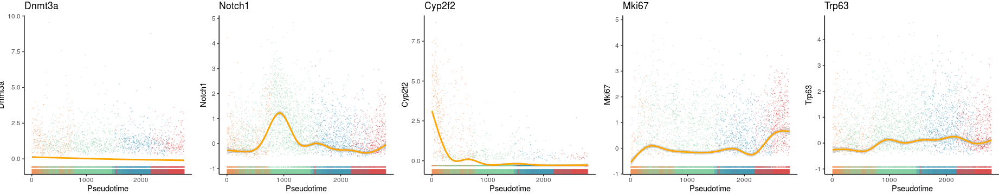